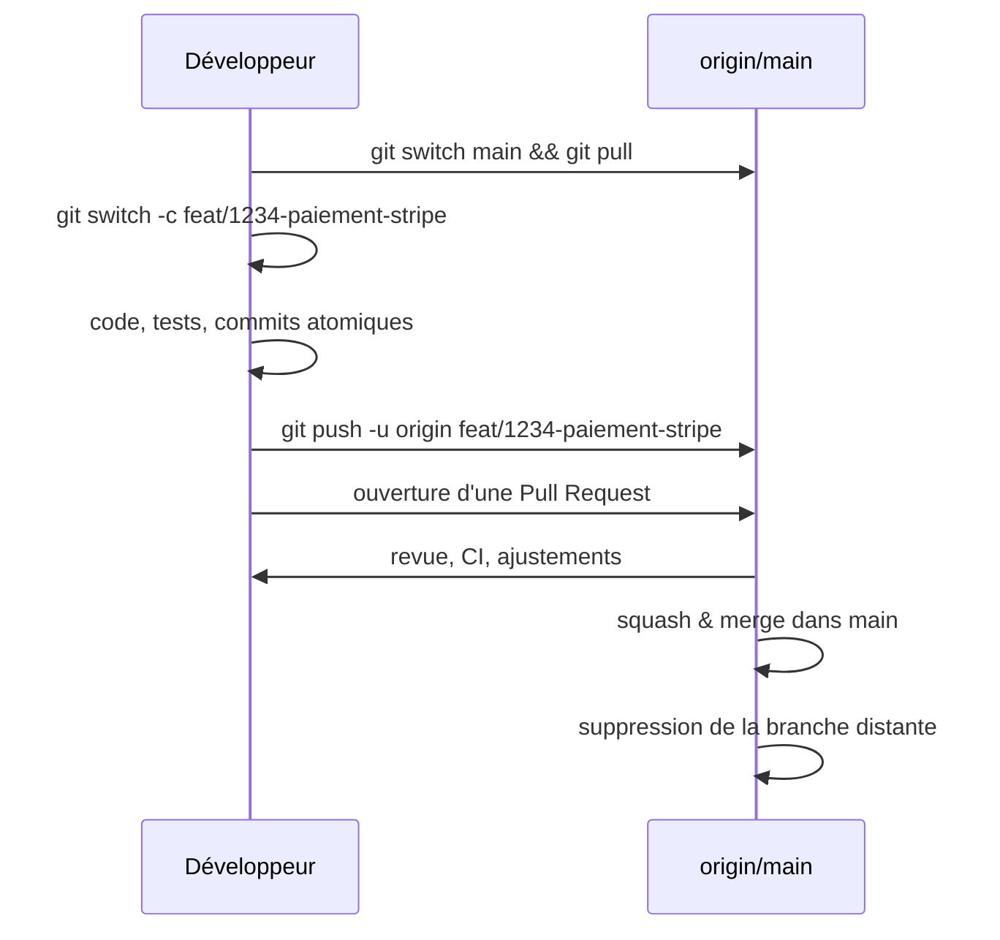

# [Tansoftware](https://www.tansoftware.com) - Bonnes pratiques Git [](README.md)

[](LICENSE) [](#) [](https://git-scm.com/) [](https://www.markdownguide.org/)

## Table des matières

* [Introduction](#introduction)
* [Glossaire express](#glossaire-express)
* [Modèle mental : ce que Git stocke réellement](#modèle-mental--ce-que-git-stocke-réellement)
* [Configuration initiale](#configuration-initiale)
* [Messages de commit](#messages-de-commit)
* [Branches et stratégie de branchement](#branches-et-stratégie-de-branchement)
* [Gestion des conflits](#gestion-des-conflits)
* [Rebase ou merge ?](#rebase-ou-merge-)
* [Tags et versionnage](#tags-et-versionnage)
* [Commits et tags signés](#commits-et-tags-signés)
* [Squash](#squash)
* [Réécrire l'historique en sécurité](#réécrire-lhistorique-en-sécurité)
* [Cherry-pick, revert, reset : choisir le bon outil](#cherry-pick-revert-reset--choisir-le-bon-outil)
* [Stash : mettre de côté du travail en cours](#stash--mettre-de-côté-du-travail-en-cours)
* [Bisect : retrouver le commit fautif](#bisect--retrouver-le-commit-fautif)
* [Reflog : la machine à remonter le temps](#reflog--la-machine-à-remonter-le-temps)
* [Fichiers sensibles](#fichiers-sensibles)
* [Le fichier .gitignore](#le-fichier-gitignore)
* [Le fichier .gitattributes](#le-fichier-gitattributes)
* [Hooks Git](#hooks-git)
* [Pull Requests : la revue comme garde-fou](#pull-requests--la-revue-comme-garde-fou)
* [Pièges classiques et comment s'en sortir](#pièges-classiques-et-comment-sen-sortir)
* [Antisèche des commandes](#antisèche-des-commandes)
* [Pour aller plus loin](#pour-aller-plus-loin)

## Introduction

Ce dépôt rassemble les pratiques que l'on retient en équipe pour qu'un dépôt Git reste lisible, sûr et auditable. La référence canonique est le livre [Pro Git](https://git-scm.com/book/fr/v2) de Scott Chacon et Ben Straub, librement consultable.

Le mémo s'adresse à un public débutant à intermédiaire. Chaque notion technique est définie à sa première apparition, dans un encadré **Définition** dédié, puis approfondie dans la section correspondante. Les exemples sont donnés en Bash ; ils fonctionnent à l'identique dans Git Bash sous Windows, dans WSL, ou dans un terminal macOS / Linux.

> Conventions adoptées dans ce mémo : la branche d'intégration s'appelle `main` (renommage par défaut sur GitHub depuis 2020) ; les messages de commit suivent [Conventional Commits](https://www.conventionalcommits.org/fr/) ; les commandes sont exécutées dans un terminal compatible Bash ; on suppose un dépôt distant nommé `origin`.

[Retour en haut de page](#table-des-matières)

## Glossaire express

Ce glossaire fixe le vocabulaire utilisé dans tout le document. Les sections suivantes y reviennent en détail ; gardez-le sous la main lors d'une première lecture.

| Terme | Définition courte |
|-------|-------------------|
| **Commit** | Instantané (snapshot) de l'arborescence du projet à un instant donné, accompagné d'un message, d'un auteur et d'un identifiant SHA-1 (ou SHA-256). |
| **Branche** | Pointeur mobile vers un commit. Avancer une branche, c'est déplacer ce pointeur. |
| **HEAD** | Pointeur spécial désignant l'endroit où Git écrira le prochain commit (généralement la branche courante). |
| **Fast-forward** | Type de fusion où la branche cible n'a pas divergé : Git se contente d'avancer le pointeur, sans créer de commit de fusion. |
| **Merge (fusion)** | Intégration d'une branche dans une autre, créant un commit de fusion à deux parents lorsque les branches ont divergé. |
| **Three-way merge** | Algorithme de fusion à trois points : la base commune (ancêtre), la branche A et la branche B. |
| **Rebase** | Réécriture de l'historique consistant à rejouer les commits d'une branche au sommet d'une autre. Produit de nouveaux SHA. |
| **Squash** | Fusion de plusieurs commits en un seul, généralement à la fin d'une fonctionnalité. |
| **Cherry-pick** | Réapplication d'un commit isolé sur une autre branche. |
| **Bisect** | Recherche dichotomique automatisée du commit qui a introduit une régression. |
| **Stash** | Pile de modifications temporairement mises de côté pour libérer le répertoire de travail. |
| **Reflog** | Journal local des mouvements de `HEAD` et des branches ; permet de retrouver des commits qui ne sont plus référencés par aucune branche. |
| **Dangling commit** | Commit orphelin, plus pointé par aucune branche ni aucun tag, en sursis avant garbage collection. |
| **Hook** | Script déclenché automatiquement par un événement Git (avant commit, avant push, etc.). |
| **`.gitignore`** | Fichier listant les motifs de chemins à ne pas suivre dans Git. |
| **`.gitattributes`** | Fichier qui attache des attributs aux chemins (fins de ligne, diff personnalisé, fichiers binaires, LFS). |
| **Commit signé** | Commit accompagné d'une signature cryptographique GPG, SSH ou S/MIME prouvant l'identité de l'auteur. |
| **Tag** | Étiquette pointant sur un commit, immuable par convention, qui matérialise une version. |
| **Pull Request (PR) / Merge Request (MR)** | Demande d'intégration d'une branche dans une autre, support de la revue de code. |

[Retour en haut de page](#table-des-matières)

## Modèle mental : ce que Git stocke réellement

Comprendre la structure de stockage évite la majorité des malentendus. Git n'est pas un système de différentiels (« delta ») mais une base d'objets adressés par leur empreinte (SHA-1 par défaut, SHA-256 dans les dépôts récents).

Quatre types d'objets composent la base :

| Objet | Rôle |
|-------|------|
| **Blob** | Contenu d'un fichier (sans nom ni chemin). |
| **Tree** | Répertoire : table associant des noms à des blobs ou à d'autres trees. |
| **Commit** | Pointeur vers un tree (l'instantané), un ou plusieurs commits parents, un auteur, un committer, une date, un message. |
| **Tag annoté** | Pointeur signé vers un commit, avec auteur, date et message. |

À côté des objets, des *références* (refs) servent de poignées humaines : `refs/heads/main` (une branche), `refs/tags/v1.0.0` (un tag), `refs/remotes/origin/main` (la dernière position connue d'une branche distante).

Conséquences pratiques :

- Une branche est *bon marché* : un fichier de 41 octets contenant un SHA.
- Un commit n'efface jamais les précédents ; il en ajoute un nouveau qui pointe vers eux.
- Tant qu'une référence (branche, tag, reflog, stash) garde un commit accessible, ses données ne disparaissent pas, même après un `reset` agressif.

[Retour en haut de page](#table-des-matières)

## Configuration initiale

Une configuration soignée évite des heures de débogage de fins de ligne, d'auteurs erronés ou de pulls hasardeux.

```bash
# Identité (obligatoire pour tout commit)
git config --global user.name  "Prénom Nom"
git config --global user.email "prenom.nom@example.com"

# Branche par défaut sur les nouveaux dépôts
git config --global init.defaultBranch main

# Pull = rebase par défaut (évite les commits de fusion parasites sur main)
git config --global pull.rebase true

# Push = pousse seulement la branche courante
git config --global push.default current

# Garde-fou contre les force-push catastrophiques
git config --global push.useForceIfIncludes true

# Détection automatique des renommages dans les diffs
git config --global diff.renames copies

# Couleurs et UTF-8 dans les logs
git config --global core.quotepath false
git config --global color.ui auto

# Cache d'authentification HTTPS (15 minutes par défaut)
git config --global credential.helper cache
```

Sous Windows, ajouter :

```bash
git config --global core.autocrlf true
```

Sous macOS / Linux :

```bash
git config --global core.autocrlf input
```

Voir aussi la section [.gitattributes](#le-fichier-gitattributes) pour aller au-delà de `core.autocrlf`.

[Retour en haut de page](#table-des-matières)

## Messages de commit

Un message de commit s'adresse au futur lecteur (vous, dans six mois) qui essaie de comprendre **pourquoi** une modification a été faite. La spécification [Conventional Commits](https://www.conventionalcommits.org/fr/) impose un format machine-lisible utile pour générer des changelogs et déclencher des releases sémantiques.

### Format

```text
<type>(<portée optionnelle>): <description impérative à la 1re ligne, 50 caractères max>

<corps optionnel : pourquoi, alternatives écartées, lien vers l'issue>

<pied optionnel : BREAKING CHANGE, Refs #123, Reviewed-by, etc.>
```

### Les onze types standards

| Type | Quand l'utiliser |
|------|------------------|
| `feat` | Ajout d'une fonctionnalité visible par l'utilisateur. |
| `fix` | Correction de bug. |
| `docs` | Documentation uniquement (README, commentaires de code, ADR). |
| `style` | Mise en forme, espaces, points-virgules — **aucun** changement de comportement. |
| `refactor` | Réorganisation interne sans ajout de fonctionnalité ni correction. |
| `perf` | Amélioration de performance mesurable. |
| `test` | Ajout ou refonte de tests. |
| `build` | Changements affectant la compilation, les dépendances, le packaging. |
| `ci` | Configuration d'intégration continue (`.github/workflows/`, `.gitlab-ci.yml`). |
| `chore` | Tâche de maintenance qui ne rentre dans aucune autre case (mise à jour `.gitignore`, renommage de scripts internes, etc.). |
| `revert` | Annulation d'un commit antérieur (le corps cite le SHA reverté). |

### La portée (`scope`)

La portée, entre parenthèses, est un nom court désignant la zone du code touchée. Elle est facultative mais fortement recommandée dès que le projet dépasse une dizaine de modules. Exemples : `feat(auth):`, `fix(panier):`, `docs(api):`, `refactor(parser):`. Elle facilite la recherche (`git log --grep "(auth)"`) et la génération de changelogs par section.

### Ruptures de compatibilité

Une rupture se signale de deux manières, idéalement les deux à la fois :

1. Un `!` après le type/scope : `feat(api)!: nouvelle signature de /users`.
2. Un pied `BREAKING CHANGE:` décrivant la rupture et la procédure de migration.

```text
feat(api)!: passage de l'authentification de session à JWT

BREAKING CHANGE: les clients doivent désormais transmettre un en-tête
Authorization: Bearer <token>. Les cookies de session ne sont plus lus.
```

### À éviter

```text
update
fixed bug
WIP
.
asdf
mes modifs du vendredi
```

### À préférer

```text
feat(panier): autoriser les codes promo cumulables

Une étude utilisateur a montré que 18 % des paniers abandonnés sont liés
à l'impossibilité de cumuler une remise fidélité avec un code marketing.
Refs #482
```

```text
fix(auth): corriger la fuite mémoire sur l'expiration du token

Le timer n'était pas annulé quand l'utilisateur se déconnectait avant
expiration, ce qui retenait l'objet User en mémoire.
```

### Bonnes pratiques

| Règle | Pourquoi |
|-------|----------|
| Verbe à l'impératif (`ajoute`, `corrige`) | Cohérent avec le style des messages générés par Git (`Merge`, `Revert`). |
| 50 caractères pour le sujet, 72 pour le corps | Lisibilité dans `git log --oneline` et les outils tiers. |
| Un commit = un changement atomique | Permet `git revert` et `git bisect` ciblés. |
| Pas de point final sur le sujet | Convention partagée. |
| Référencer l'issue | Trace bidirectionnelle entre code et ticket. |
| Séparer sujet et corps par une ligne vide | Sinon, certains outils traitent tout comme une ligne unique. |
| Citer un SHA en cas de revert ou de fix de régression | `Reverts: 3e1f7c2`, `Fixes: a91d3b4`. |

### Outillage de validation

- [`commitlint`](https://commitlint.js.org/) couplé à un hook `commit-msg` rejette tout message non conforme.
- [`commitizen`](https://commitizen-tools.github.io/commitizen/) propose un assistant interactif (`cz commit`) qui guide la rédaction.
- [`semantic-release`](https://semantic-release.gitbook.io/) lit les Conventional Commits pour calculer la prochaine version SemVer et publier automatiquement le changelog.

[Retour en haut de page](#table-des-matières)

## Branches et stratégie de branchement

> **Définition — Branche.** Pointeur mobile vers un commit. Une branche n'est ni une copie ni une duplication : c'est une étiquette, presque gratuite, qui suit votre tête de travail.

Une branche isole un travail en cours du tronc stable. Trois grandes familles de stratégies se partagent l'industrie.

### Comparatif des stratégies

| Critère | Trunk-Based Development | GitHub Flow | Git Flow (Driessen, 2010) |
|---------|------------------------|-------------|---------------------------|
| Branches longues | Non (< 1 jour, idéalement quelques heures) | Courtes (jusqu'à quelques jours) | Oui (`develop`, `release/*`, `hotfix/*`) |
| Branche d'intégration | `main` (toujours déployable) | `main` | `develop` (intégration), `main` (production) |
| Releases | Continues, plusieurs fois par jour | À la demande, après merge dans `main` | Versionnées, planifiées |
| Feature flags | Indispensables | Optionnels | Optionnels |
| Cible idéale | SaaS en livraison continue, équipe mature avec CI rapide | La plupart des produits web et open source | Logiciels installés chez le client, plusieurs versions maintenues en parallèle |
| Coût mental | Faible si CI fiable | Très faible | Élevé (cinq types de branches à orchestrer) |
| Réputation actuelle | Recommandé par la majorité des praticiens DevOps modernes | Standard de fait sur GitHub / GitLab | Souvent surdimensionné ; à réserver aux contextes qui en ont vraiment besoin |

Pour un projet neuf, le choix par défaut raisonnable est **GitHub Flow**, avec une dérive progressive vers **Trunk-Based** à mesure que la couverture de tests et la CI mûrissent.

### Conventions de nommage

| Préfixe | Usage |
|---------|-------|
| `feat/` | Nouvelle fonctionnalité. |
| `fix/` | Correction de bug. |
| `hotfix/` | Correctif urgent en production. |
| `chore/` | Tâche d'outillage, build, dépendances. |
| `docs/` | Documentation. |
| `refactor/` | Réorganisation sans changement de comportement. |
| `release/` | Préparation d'une version (gel des fonctionnalités, derniers fixes). |
| `experiment/` ou `spike/` | Exploration sans engagement de merge. |

Le nom inclut un identifiant de ticket lorsque possible : `feat/1234-paiement-stripe`. Pas d'accents, pas d'espaces, pas de majuscules : minuscules et tirets uniquement.

### Cycle d'une branche feature



### Hygiène des branches

- Supprimer la branche distante après merge (case « Delete branch » sur GitHub, automatisable).
- Nettoyer les branches locales obsolètes : `git fetch --prune`, puis `git branch -vv` pour repérer celles dont l'amont a disparu.
- Protéger `main` côté plateforme : interdiction de force-push, exigence de revue, exigence de CI verte, signatures requises pour les commits si l'équipe les utilise.

[Retour en haut de page](#table-des-matières)

## Gestion des conflits

> **Définition — Three-way merge.** Algorithme de fusion utilisé par Git lorsque deux branches ont divergé : il compare la base commune (ancêtre le plus récent) à chacune des deux versions et combine les changements. Si les deux côtés ont modifié la même zone, il y a *conflit*.

Un conflit survient quand deux commits modifient la même portion d'un fichier sans qu'une fusion automatique soit possible. Git ne décide pas à votre place ; il marque les zones concernées et attend une résolution manuelle.

### Anatomie d'un conflit

```text
<<<<<<< HEAD
const TVA = 0.20;
=======
const TVA = 0.21;
>>>>>>> feat/tva-belge
```

`HEAD` est votre version courante, l'autre est celle de la branche entrante. La résolution consiste à choisir, fusionner ou réécrire, puis supprimer les marqueurs.

### Résolution typique

```bash
git switch ma-branche
git fetch origin
git merge origin/main
# ... éditer les fichiers en conflit ...
git add <fichiers résolus>
git commit               # message pré-rempli par Git
```

### Outils utiles pendant un conflit

```bash
git status                        # liste les fichiers en conflit
git diff                          # vue combinée des deux versions
git diff --ours <fichier>         # ce que mon côté apporte
git diff --theirs <fichier>       # ce que l'autre côté apporte
git checkout --ours <fichier>     # garder ma version (rare, à confirmer)
git checkout --theirs <fichier>   # garder leur version
git merge --abort                 # tout annuler et revenir à l'état initial
```

Pour les conflits réguliers, activer `rerere` (« reuse recorded resolution ») :

```bash
git config --global rerere.enabled true
```

Git mémorise alors la résolution et la rejoue automatiquement si le même conflit se présente à nouveau (typique d'une branche feature longue qu'on rebase plusieurs fois).

### Bonnes pratiques

| Règle | Pourquoi |
|-------|----------|
| Synchroniser tôt et souvent (`git pull --rebase`) | Plus la branche dérive, plus le conflit est large. |
| Conflits par petits paquets | Trois conflits triviaux valent mieux qu'un conflit géant. |
| Demander à l'auteur de la modification entrante en cas de doute | Le but d'un conflit n'est pas de gagner, c'est de produire la bonne intention. |
| Tester immédiatement après résolution | Un fichier qui compile peut quand même être logiquement faux. |
| Activer `rerere` sur les longues branches | Évite de re-résoudre dix fois le même conflit. |

[Retour en haut de page](#table-des-matières)

## Rebase ou merge ?

> **Définition — Merge.** Création d'un commit de fusion (deux parents) qui réconcilie deux branches divergentes.
>
> **Définition — Rebase.** Réécriture de la branche courante : Git détache temporairement vos commits, déplace la base de la branche au sommet d'une autre, puis rejoue vos commits un par un. Les SHA changent.
>
> **Définition — Fast-forward.** Cas particulier où la branche cible n'a pas divergé : Git avance simplement le pointeur sans créer de commit de fusion.

Les deux opérations intègrent les commits d'une branche dans une autre, mais ne produisent pas le même historique.

### Visualisation

État de départ — `feat/x` a divergé de `main` :

```text
A---B---C  main
     \
      D---E---F  feat/x
```

Après `git merge feat/x` sur `main` (les deux branches ont divergé, three-way merge) :

```text
A---B---C-------M  main
     \         /
      D---E---F  feat/x
```

`M` est un commit de fusion à deux parents (`C` et `F`). L'historique conserve la trace exacte du parallélisme.

Après `git rebase main` (depuis `feat/x`) puis `git merge --ff-only feat/x` sur `main` :

```text
A---B---C---D'---E'---F'  main
```

Les commits `D`, `E`, `F` ont été rejoués au sommet de `C` et portent désormais de nouveaux SHA (`D'`, `E'`, `F'`). L'historique est linéaire ; il ne reflète plus le parallélisme réel, mais il est plus simple à parcourir.

### Comparatif

| Aspect | `git merge` | `git rebase` |
|--------|-------------|--------------|
| Historique | Préserve la topologie ; un commit de fusion unit les deux branches. | Linéaire ; les commits de la branche source sont rejoués au sommet de la cible. |
| Identifiants des commits | Inchangés. | Nouveaux SHA (les commits sont réécrits). |
| Lisibilité | Vrai au plus près de ce qui s'est passé. | Plus simple à parcourir avec `git log --oneline`. |
| Conflits | Une seule passe de résolution. | Une passe par commit rejoué (mais souvent plus petits). |
| Risque | Aucun. | À ne **jamais** utiliser sur des commits déjà partagés (force-push requis ensuite). |

### Règle d'or

> Rebasez localement avant de pousser ; mergez après.

Concrètement : on rebase une branche feature sur `main` pour la garder propre, puis on fusionne via une Pull Request (souvent en *squash merge*).

### Pourquoi « ne jamais rebaser un commit publié »

Si vos collègues ont fondé du travail sur les anciens commits `D`, `E`, `F` et que vous publiez `D'`, `E'`, `F'`, leur historique local référencera des commits qui ont disparu côté distant. Au prochain pull, Git ne saura pas réconcilier les deux historiques et créera une fusion involontaire — ou pire, écrasera leurs commits si quelqu'un fait `git push --force`. Sur une branche partagée, **toujours** préférer `merge`.

### Exemple complet

```bash
# Mettre à jour ma branche feature avec les derniers commits de main
git switch feat/1234
git fetch origin
git rebase origin/main
# (résolution éventuelle des conflits, puis git rebase --continue)
git push --force-with-lease   # plus sûr que --force
```

`--force-with-lease` refuse le push si quelqu'un d'autre a publié sur la branche entre-temps : c'est le filet de sécurité minimum face à `--force`.

### Quand préférer le merge

- Branche partagée entre plusieurs développeurs (réécrire ferait disparaître leurs commits).
- Préservation explicite de l'historique pour audit (réglementaire, sécurité).
- Branches `release/*` ou `hotfix/*` que l'on veut tracer comme telles.
- Intégration finale d'une PR dans `main` quand la politique d'équipe est « merge commits seulement ».

[Retour en haut de page](#table-des-matières)

## Tags et versionnage

> **Définition — Tag.** Étiquette pointant sur un commit, immuable par convention. Deux variantes : *léger* (alias de SHA) et *annoté* (objet Git complet, signable).

Un tag sert à marquer une version publiée afin de pouvoir la retrouver, la comparer ou la rejouer.

### Tags annotés vs légers

```bash
# Tag annoté (objet Git complet : auteur, date, message, signature possible)
git tag -a v1.4.0 -m "Release 1.4.0"

# Tag léger (simple alias de SHA, pas d'auteur ni de message)
git tag v1.4.0
```

Préférez **toujours** les tags annotés pour les releases publiques : ils portent une signature et un message, et `git describe` ne fonctionne correctement qu'avec eux.

### SemVer

[Semantic Versioning](https://semver.org/lang/fr/) impose le format `MAJEUR.MINEUR.CORRECTIF` :

| Incrément | Signal envoyé |
|-----------|---------------|
| `MAJEUR` (1.x.x → 2.0.0) | Rupture d'API publique. |
| `MINEUR` (1.4.x → 1.5.0) | Ajout rétrocompatible. |
| `CORRECTIF` (1.4.0 → 1.4.1) | Correction de bug rétrocompatible. |

Les *pré-releases* se notent avec un suffixe : `1.5.0-rc.1`, `2.0.0-beta.3`. Les *métadonnées de build* utilisent un `+` : `1.5.0+build.42`.

```bash
git tag -a v2.0.0 -m "Release 2.0.0 - BREAKING: nouvelle API d'authentification"
git push origin v2.0.0          # un tag ne se pousse pas tout seul
git push --tags                 # ou pousser tous les tags d'un coup
```

### Supprimer un tag

```bash
git tag -d v1.4.0                # local
git push origin :refs/tags/v1.4.0  # distant
```

À éviter sauf erreur évidente : un tag publié devrait être considéré comme immuable.

[Retour en haut de page](#table-des-matières)

## Commits et tags signés

> **Définition — Commit signé.** Commit accompagné d'une signature cryptographique (GPG, SSH ou S/MIME) qui prouve que l'auteur déclaré est bien celui qui a créé le commit.

Sans signature, le champ `author` d'un commit est purement déclaratif : n'importe qui peut écrire `Linus Torvalds <torvalds@linux-foundation.org>`. Pour les projets sensibles (sécurité, supply chain), GitHub et GitLab affichent un badge « Verified » uniquement sur les commits signés et dont la clé publique est enregistrée sur le compte.

### Signature SSH (recommandée depuis Git 2.34)

Plus simple à mettre en place que GPG si vous avez déjà une clé SSH.

```bash
# Indiquer à Git d'utiliser SSH pour signer
git config --global gpg.format ssh
git config --global user.signingkey ~/.ssh/id_ed25519.pub

# Activer la signature automatique des commits et des tags
git config --global commit.gpgsign true
git config --global tag.gpgsign  true
```

Sur GitHub : **Settings → SSH and GPG keys → New SSH key → Key type : Signing Key**, et coller la clé publique.

### Signature GPG (historique, toujours valide)

```bash
# Générer une clé GPG (algorithme moderne, sans expiration courte)
gpg --full-generate-key            # choisir RSA 4096 ou ed25519

# Lister les clés et récupérer l'ID
gpg --list-secret-keys --keyid-format=long

# Configurer Git
git config --global user.signingkey <ID>
git config --global commit.gpgsign true
git config --global tag.gpgsign  true

# Exporter la clé publique pour la coller dans GitHub
gpg --armor --export <ID>
```

### Signer ponctuellement

```bash
git commit -S -m "feat(auth): ..."   # commit signé une seule fois
git tag   -s v1.4.0 -m "Release 1.4.0"  # tag signé
git verify-commit <SHA>
git verify-tag    v1.4.0
```

### Politique d'équipe

- Activer la règle « Require signed commits » sur la branche `main` pour les projets critiques.
- Documenter dans le README la procédure de génération et d'enregistrement de la clé.
- Ne jamais commiter une clé privée — voir la section [Fichiers sensibles](#fichiers-sensibles).

[Retour en haut de page](#table-des-matières)

## Squash

> **Définition — Squash.** Fusion de plusieurs commits en un seul. Utile pour transformer une suite de commits exploratoires (« WIP », « fix typo », « ça marche enfin ») en un commit unique racontant proprement la fonctionnalité.

### Squash interactif local

```bash
git rebase -i origin/main
```

Dans l'éditeur, on remplace `pick` par `squash` (ou `s`) sur les commits à fondre dans le précédent. La variante `fixup` (ou `f`) fait la même chose mais jette le message au lieu de le concaténer :

```text
pick   3e1f7c2 feat(panier): squelette du panier
squash a91d3b4 wip
fixup  7c8e0a1 corrige test cassé
squash f4b9d22 ajout du test e2e
```

Git propose ensuite de réécrire le message final.

### Squash à la fusion

La plupart des plateformes (GitHub, GitLab, Bitbucket) offrent une option *Squash and merge* qui fait la même chose au moment d'intégrer la PR. Elle est généralement préférable parce qu'elle préserve les commits individuels sur la branche feature et n'écrit qu'un commit propre dans `main`. La case « Default to PR title and description » côté GitHub évite l'écueil du message squashé qui répète mécaniquement les sujets de chaque commit.

### Quand ne pas squasher

- Branches partagées (réécrire l'historique commun perturbe les autres contributeurs).
- Travail composé d'étapes vraiment distinctes qui méritent chacune un `git revert` ou `git bisect` indépendant.
- PR de gros refactor où la séquence des commits raconte la progression d'une transformation (extract → rename → inline).

[Retour en haut de page](#table-des-matières)

## Réécrire l'historique en sécurité

Réécrire l'historique (rebase, squash, amend, filter-repo) crée de nouveaux commits à la place des anciens. Bien fait, c'est un atout ; mal fait, c'est une catastrophe partagée.

### Quand le force-push est acceptable

| Contexte | Force-push autorisé ? |
|----------|-----------------------|
| Branche personnelle sur laquelle vous êtes seul à travailler | Oui, avec `--force-with-lease`. |
| Branche de PR, après rebase ou squash, avant merge | Oui, avec `--force-with-lease`. Prévenir si la PR est en cours de revue. |
| Branche partagée par plusieurs développeurs | Non. Préférer un nouveau commit (`revert`) ou une nouvelle branche. |
| `main`, `master`, `develop`, `release/*` | **Jamais.** Ces branches doivent être protégées au niveau de la plateforme. |

### `--force-with-lease` vs `--force`

```bash
# Dangereux : écrase tout, même les commits qu'un collègue vient de pousser.
git push --force

# Recommandé : refuse le push si la branche distante a bougé depuis votre dernier fetch.
git push --force-with-lease
```

Avec `push.useForceIfIncludes = true` (cf. [Configuration initiale](#configuration-initiale)), Git ajoute un garde-fou supplémentaire qui vérifie aussi que vos refs locales reflètent bien l'état distant.

### `git commit --amend`

Modifie le dernier commit (message ou contenu). Tant qu'il n'est pas poussé, c'est anodin.

```bash
git commit --amend                  # rouvre l'éditeur sur le dernier message
git commit --amend --no-edit        # ajoute les fichiers staged au dernier commit, message inchangé
```

Une fois poussé, un amend nécessite un force-push, donc les mêmes précautions qu'un rebase.

### `git filter-repo` : réécriture massive

Pour purger un fichier de tout l'historique, renommer un auteur sur cent commits, ou extraire un sous-répertoire en dépôt indépendant. Voir aussi la section [Fichiers sensibles](#fichiers-sensibles) pour le cas particulier des secrets.

[Retour en haut de page](#table-des-matières)

## Cherry-pick, revert, reset : choisir le bon outil

> **Définition — Cherry-pick.** Réapplication d'un commit isolé sur la branche courante, créant un nouveau commit avec le même contenu et un nouveau SHA.

### `git cherry-pick`

Utile pour :

- Backporter un fix de `main` vers une branche `release/1.4` maintenue.
- Récupérer un commit isolé d'une branche abandonnée.

```bash
git switch release/1.4
git cherry-pick 3e1f7c2
git cherry-pick 3e1f7c2..a91d3b4   # une plage de commits
```

À éviter pour des dizaines de commits : préférer un merge ou un rebase complet.

### `git revert`

Crée un nouveau commit qui annule les changements d'un commit antérieur. Sans réécriture d'historique, donc sûr sur les branches partagées.

```bash
git revert 3e1f7c2                     # un commit
git revert -m 1 <SHA-merge>            # annuler un merge (le 1 désigne le parent à conserver)
```

C'est la méthode standard pour défaire un commit déjà poussé sur `main`.

### `git reset` : trois modes

| Mode | Effet sur HEAD | Effet sur l'index | Effet sur le répertoire de travail |
|------|----------------|-------------------|-----------------------------------|
| `--soft` | Déplacé | Inchangé (les modifs restent staged) | Inchangé |
| `--mixed` (défaut) | Déplacé | Réinitialisé (les modifs deviennent unstaged) | Inchangé |
| `--hard` | Déplacé | Réinitialisé | **Réinitialisé — modifications perdues** |

```bash
git reset --soft HEAD~1     # défaire le dernier commit, garder les modifs staged
git reset --mixed HEAD~1    # défaire le dernier commit, modifs en working tree
git reset --hard HEAD~1     # défaire le dernier commit ET les modifs (DANGEREUX)
```

`--hard` ne devrait pas être utilisé sur des modifications non sauvegardées sans `git stash` préalable, et jamais sur une branche partagée.

[Retour en haut de page](#table-des-matières)

## Stash : mettre de côté du travail en cours

> **Définition — Stash.** Pile de modifications temporairement mises de côté pour libérer le répertoire de travail (par exemple pour basculer rapidement sur une autre branche).

```bash
git stash push -m "WIP refactor du parser"   # stocker les modifs courantes
git stash list                                # lister la pile
git stash show -p stash@{0}                   # voir le diff complet
git stash pop                                 # rejouer le plus récent et le retirer de la pile
git stash apply stash@{2}                     # rejouer un stash spécifique sans le retirer
git stash drop stash@{0}                      # supprimer un stash
git stash clear                               # vider toute la pile
```

Pour stocker aussi les fichiers non suivis :

```bash
git stash push -u -m "WIP avec nouveaux fichiers"
```

Garde-fou : un stash est local et n'est pas poussé. Ne pas l'utiliser comme stockage longue durée — préférer un commit `wip` sur une branche feature, qui pourra être squashé plus tard.

[Retour en haut de page](#table-des-matières)

## Bisect : retrouver le commit fautif

> **Définition — Bisect.** Recherche dichotomique du commit qui a introduit une régression : Git divise par deux à chaque étape la plage de commits suspects, en se basant sur vos verdicts « bon » / « mauvais ».

Sur une plage de 1024 commits, `git bisect` trouve le coupable en 10 étapes au lieu de 1024.

### Mode interactif

```bash
git bisect start
git bisect bad                   # le commit courant est défectueux
git bisect good v1.3.0           # cette version-là était saine
# Git checkout un commit au milieu, à vous de tester :
# - si le bug est présent : git bisect bad
# - sinon                  : git bisect good
git bisect reset                 # quand c'est fini
```

### Mode automatisé

Si vous avez un test qui retourne 0 quand le code est sain et autre chose sinon :

```bash
git bisect start HEAD v1.3.0
git bisect run npm test -- --testPathPattern panier
```

Git exécute le test à chaque étape et conclut tout seul. C'est l'argument massue en faveur des commits atomiques : un commit qui mélange refactor et fonctionnalité fait perdre la moitié de l'efficacité de bisect.

[Retour en haut de page](#table-des-matières)

## Reflog : la machine à remonter le temps

> **Définition — Reflog.** Journal local des mouvements de `HEAD` et de chaque branche. Conservé environ 90 jours, il permet de retrouver des commits qui ne sont plus pointés par aucune branche (« dangling commits »).
>
> **Définition — Dangling commit.** Commit orphelin, plus accessible par aucune référence ; en sursis avant garbage collection (`git gc`).

Le reflog est la bouée de sauvetage en cas de manipulation hasardeuse (`reset --hard`, `rebase` cassé, branche supprimée par erreur).

```bash
git reflog                       # historique de HEAD
git reflog show ma-branche       # historique d'une branche précise

# Récupérer un commit perdu après un reset --hard
git reset --hard HEAD@{1}

# Recréer une branche supprimée
git switch -c ma-branche-restored <SHA récupéré dans le reflog>
```

Tant qu'un commit apparaît dans le reflog, ses données sont accessibles. Au-delà de 90 jours (configurable), le garbage collector peut les supprimer définitivement.

[Retour en haut de page](#table-des-matières)

## Fichiers sensibles

Mots de passe, clés d'API, certificats, fichiers `.env` : tout secret commité reste dans l'historique pour toujours, **même après suppression**. Une fois publié, considérez le secret comme compromis et faites-le tourner immédiatement.

### Prévenir

| Pratique | Outils |
|----------|--------|
| `.gitignore` complet dès l'init du dépôt | [gitignore.io](https://www.toptal.com/developers/gitignore) |
| Gabarits sans valeurs (`.env.example`) | — |
| Hook `pre-commit` qui scanne les secrets | [gitleaks](https://github.com/gitleaks/gitleaks), [trufflehog](https://github.com/trufflesecurity/trufflehog), [detect-secrets](https://github.com/Yelp/detect-secrets) |
| Stockage dans un coffre | [Vault](https://www.vaultproject.io/), AWS Secrets Manager, 1Password, Doppler |
| Secret scanning côté plateforme | [GitHub secret scanning](https://docs.github.com/fr/code-security/secret-scanning) (gratuit pour les dépôts publics, partenaires intégrés pour AWS, Stripe, GitHub Tokens, etc.). |

### Réagir à une fuite

```bash
# 1. Faire tourner immédiatement le secret compromis (révocation, nouvelle clé).
# 2. Réécrire l'historique pour retirer le fichier.
git filter-repo --path config/secrets.yml --invert-paths

# Variante : retirer un motif (ex. toute ligne contenant un token AWS).
git filter-repo --replace-text <(echo 'AKIA[0-9A-Z]{16}==>REDACTED')

# 3. Forcer le push (et prévenir l'équipe).
git push --force-with-lease --all
git push --force-with-lease --tags
```

`git filter-repo` ([documentation](https://github.com/newren/git-filter-repo)) remplace `git filter-branch`, désormais déprécié. Une alternative simple à utiliser est [BFG Repo-Cleaner](https://rtyley.github.io/bfg-repo-cleaner/), particulièrement efficace sur les gros dépôts :

```bash
# Supprimer toutes les occurrences d'un fichier dans l'historique
bfg --delete-files secrets.yml

# Remplacer des chaînes (mots de passe, tokens) par ***REMOVED***
bfg --replace-text passwords.txt
```

### Après réécriture

- Sur GitHub, demander la purge du cache des forks (sinon le secret reste accessible via les forks).
- Faire tourner aussi tout secret dérivé (sessions, certificats émis avec la clé compromise).
- Ouvrir un post-mortem : pourquoi le hook `pre-commit` n'a-t-il pas attrapé la fuite ?

[Retour en haut de page](#table-des-matières)

## Le fichier .gitignore

> **Définition — `.gitignore`.** Fichier listant les motifs de chemins à ne pas suivre dans Git. Lu à chaque opération qui pourrait ajouter un fichier à l'index.

`.gitignore` indique à Git les fichiers et motifs à ne pas suivre : artefacts de build, dépendances installées, configuration locale d'IDE, fichiers binaires volumineux.

### Exemple PHP / Node minimal

```gitignore
# Dépendances
/vendor/
/node_modules/

# Variables d'environnement
.env
.env.local

# Builds
/dist/
/build/
*.log

# IDE / OS
.idea/
.vscode/
.DS_Store
Thumbs.db
```

### Syntaxe rapide

| Motif | Effet |
|-------|-------|
| `build/` | Tout dossier nommé `build`, à n'importe quelle profondeur. |
| `/build/` | Le dossier `build` à la **racine** du dépôt seulement. |
| `*.log` | Tout fichier `.log`, à n'importe quelle profondeur. |
| `!important.log` | Exception : ne **pas** ignorer `important.log`. |
| `**/tmp` | Tout sous-dossier `tmp`, à n'importe quel niveau. |
| `doc/**/*.pdf` | Tous les `.pdf` sous `doc/`, à toute profondeur. |

### Pièges courants

| Symptôme | Cause | Solution |
|----------|-------|----------|
| Le fichier reste suivi malgré le `.gitignore` | Il a été commité avant l'ajout de la règle. | `git rm --cached <fichier>` puis recommit. |
| Une règle ne s'applique pas | Mauvais slash : `/build` (racine) vs `build/` (partout). | Tester avec `git check-ignore -v <fichier>`. |
| Trop de bruit dans le diff | Pas de gabarit central. | Démarrer depuis un modèle [gitignore.io](https://www.toptal.com/developers/gitignore). |
| Un fichier privé est ignoré mais reste sensible | `.gitignore` n'enlève **rien** de l'historique. | Voir [Fichiers sensibles](#fichiers-sensibles). |

### `.gitignore` global

Pour les fichiers spécifiques à votre poste (configuration d'IDE personnelle, fichiers macOS), un `.gitignore` global évite de polluer chaque dépôt :

```bash
git config --global core.excludesFile ~/.gitignore_global
```

[Retour en haut de page](#table-des-matières)

## Le fichier .gitattributes

> **Définition — `.gitattributes`.** Fichier qui attache des attributs aux chemins du dépôt : fins de ligne, traitement diff, fichiers binaires, prise en charge de Git LFS, export-ignore.

Là où `.gitignore` cache des fichiers, `.gitattributes` change la façon dont Git les traite.

### Cas d'usage typiques

```gitattributes
# Fins de ligne : LF dans le dépôt, conversion à la volée selon la plateforme
* text=auto eol=lf

# Forcer LF pour les scripts shell et la config (sinon CRLF sous Windows casse tout)
*.sh   text eol=lf
*.yml  text eol=lf
*.yaml text eol=lf

# Forcer CRLF pour les fichiers Windows-only
*.bat  text eol=crlf
*.cmd  text eol=crlf

# Marquer comme binaire (pas de diff, pas de fusion automatique)
*.png  binary
*.pdf  binary
*.xlsx binary

# Diff personnalisé pour des formats courants
*.json   diff=json
*.md     diff=markdown

# Exclure des fichiers de l'archive `git archive` (utile pour les releases)
.github/        export-ignore
tests/          export-ignore
.gitattributes  export-ignore
.gitignore      export-ignore

# Git LFS pour les gros binaires (après git lfs install)
*.psd  filter=lfs diff=lfs merge=lfs -text
*.zip  filter=lfs diff=lfs merge=lfs -text
```

### Pourquoi c'est important pour une équipe mixte Windows / macOS / Linux

Sans `.gitattributes`, deux développeurs sur deux OS différents finissent par produire des diffs vides remplis uniquement de changements de fins de ligne. La règle `* text=auto eol=lf` règle ce problème une fois pour toutes en imposant LF dans le dépôt et en laissant Git convertir au checkout selon l'OS.

[Retour en haut de page](#table-des-matières)

## Hooks Git

> **Définition — Hook.** Script déclenché automatiquement par un événement Git (avant commit, avant push, après merge…). Stocké dans `.git/hooks/`, il peut bloquer ou compléter l'opération en cours.

Les hooks sont **locaux** : ils ne sont pas propagés par `git clone`. Pour les partager dans une équipe, on utilise un gestionnaire dédié.

### Hooks usuels

| Hook | Déclenchement | Usage typique |
|------|---------------|---------------|
| `pre-commit` | Avant la création du commit | Linter, formateur, tests rapides, scan de secrets. |
| `prepare-commit-msg` | Avant l'ouverture de l'éditeur | Pré-remplir le message (ex. ajouter le numéro de ticket extrait du nom de branche). |
| `commit-msg` | Après saisie du message | Vérifier la convention (Conventional Commits via `commitlint`). |
| `pre-push` | Avant `git push` | Suite de tests complète, refus de pousser sur `main`. |
| `post-merge` | Après un `git merge` | Réinstaller les dépendances si `composer.lock` a changé. |
| `post-checkout` | Après `git switch` ou `git checkout` | Recharger les outils de version (nvm, asdf). |

### Outils de partage en équipe

- [pre-commit](https://pre-commit.com/) (Python, multi-langage, écosystème très riche)
- [Husky](https://typicode.github.io/husky/) (JavaScript / Node)
- [Lefthook](https://github.com/evilmartians/lefthook) (binaire unique, multi-langage, configuration YAML)

### Exemple `pre-commit` — lint et scan de secrets

```bash
#!/usr/bin/env bash
# .git/hooks/pre-commit — rendre exécutable : chmod +x .git/hooks/pre-commit
set -euo pipefail

echo "==> Lint"
if ! npm run lint --silent; then
    echo "Lint en échec - commit annulé." >&2
    exit 1
fi

echo "==> Scan de secrets"
if command -v gitleaks >/dev/null 2>&1; then
    gitleaks protect --staged --redact --no-banner
else
    echo "gitleaks non installé, scan ignoré." >&2
fi
```

### Exemple `commit-msg` — vérifier Conventional Commits

```bash
#!/usr/bin/env bash
# .git/hooks/commit-msg
COMMIT_MSG_FILE="$1"
PATTERN='^(feat|fix|docs|style|refactor|perf|test|build|ci|chore|revert)(\([a-z0-9_-]+\))?!?: .{1,72}$'

if ! grep -qE "$PATTERN" "$COMMIT_MSG_FILE"; then
    echo "Message non conforme Conventional Commits :" >&2
    cat "$COMMIT_MSG_FILE" >&2
    echo
    echo "Format attendu :" >&2
    echo "  <type>(<scope>): <description>" >&2
    echo "  Types : feat, fix, docs, style, refactor, perf, test, build, ci, chore, revert" >&2
    exit 1
fi
```

### Exemple `pre-push` — bloquer un push direct sur main

```bash
#!/usr/bin/env bash
# .git/hooks/pre-push
protected_branch='main'
current_branch=$(git symbolic-ref HEAD | sed -e 's,.*/\(.*\),\1,')

if [ "$current_branch" = "$protected_branch" ]; then
    echo "Push direct sur '$protected_branch' interdit. Passez par une Pull Request." >&2
    exit 1
fi
```

### Exemple `pre-commit` (gestionnaire `pre-commit`) — `.pre-commit-config.yaml`

```yaml
repos:
  - repo: https://github.com/pre-commit/pre-commit-hooks
    rev: v4.6.0
    hooks:
      - id: trailing-whitespace
      - id: end-of-file-fixer
      - id: check-merge-conflict
      - id: check-added-large-files
        args: ['--maxkb=500']
  - repo: https://github.com/gitleaks/gitleaks
    rev: v8.18.4
    hooks:
      - id: gitleaks
  - repo: https://github.com/compilerla/conventional-pre-commit
    rev: v3.2.0
    hooks:
      - id: conventional-pre-commit
        stages: [commit-msg]
```

Installation : `pip install pre-commit && pre-commit install --hook-type pre-commit --hook-type commit-msg`.

[Retour en haut de page](#table-des-matières)

## Pull Requests : la revue comme garde-fou

Une Pull Request (PR) — ou Merge Request sur GitLab — n'est pas qu'un bouton « fusionner ». C'est l'unité de revue, la dernière barrière avant `main`.

### Description d'une PR utile

```markdown
## Pourquoi
Décrire le problème ou la valeur métier (lien vers ticket).

## Quoi
Lister les changements clés en une dizaine de lignes maximum.

## Comment tester
Étapes reproductibles : commande, URL, jeu de données.

## Risques / impacts
- Migration de schéma : oui / non
- Feature flag : nom du flag, état par défaut
- Rétrocompatibilité : oui / non
```

### Bonnes pratiques côté auteur

- Ouvrir la PR tôt, en *draft*, pour aligner sur la direction avant d'avoir tout codé.
- Garder la diff sous ~400 lignes : au-delà, la qualité de revue chute drastiquement.
- Répondre aux commentaires plutôt que les fermer silencieusement.
- Rebaser sur `main` avant le merge final pour une diff propre.

### Bonnes pratiques côté revieweur

- Distinguer **bloquants** (« ne fusionne pas tant que… ») et **suggestions** (« nit: ... »).
- Approuver explicitement quand c'est bon ; ne pas laisser une PR en suspens parce qu'on l'a oubliée.
- Critiquer le code, pas la personne. Préférer « cette boucle est en O(n²) » à « tu as écrit une boucle en O(n²) ».

### Protection de branche recommandée sur `main`

- Require a pull request before merging.
- Require approvals : au moins 1 (2 sur projets sensibles).
- Require status checks to pass : CI verte, tests, lint.
- Require signed commits (si l'équipe les utilise).
- Require linear history (option qui force squash ou rebase, interdit les merges classiques).
- Do not allow bypassing the above settings.
- Restrict who can push to matching branches.
- Disallow force pushes.

[Retour en haut de page](#table-des-matières)

## Pièges classiques et comment s'en sortir

### « Je suis en *detached HEAD* »

> **Définition — Detached HEAD.** État où `HEAD` pointe directement sur un commit au lieu de pointer sur une branche. Tout commit créé dans cet état n'est rattaché à aucune branche et risque d'être perdu.

```bash
# Vous avez fait git checkout <SHA> et travaillé un peu. Pour sauver :
git switch -c sauvetage-de-mon-travail
# Puis revenir à l'état normal :
git switch main
```

### « J'ai commité sur main par erreur »

```bash
# Sauver les commits dans une branche dédiée
git switch -c feat/mon-travail

# Revenir main à sa position d'origine (avant les commits accidentels)
git switch main
git reset --hard origin/main
```

Si les commits ont déjà été poussés sur `main`, ne **pas** force-push ; faire un `git revert` à la place et ouvrir une PR.

### « J'ai fait un `reset --hard` et perdu mon travail »

```bash
git reflog
# Identifier le HEAD@{n} d'avant le reset
git reset --hard HEAD@{n}
```

### « J'ai force-push sur une branche partagée »

Prévenir immédiatement l'équipe. Chaque collègue qui avait la branche localement devra :

```bash
git fetch origin
git reset --hard origin/<branche>   # s'ils n'avaient pas de modifs locales non poussées
```

Pour les modifs locales, sauvegarder d'abord (`git stash` ou nouvelle branche), puis réappliquer après `reset`.

### « `git pull` a créé un commit de fusion bizarre »

Cela arrive quand `pull.rebase` est à `false` et que la branche distante a divergé. Solution : configurer `pull.rebase = true` (cf. [Configuration initiale](#configuration-initiale)) et, en cas d'urgence, défaire avec `git reset --hard ORIG_HEAD`.

### « J'ai poussé un secret par erreur »

Voir [Fichiers sensibles](#fichiers-sensibles). Action immédiate : faire tourner le secret. La réécriture d'historique vient ensuite.

### « Ma PR a 800 commits depuis que j'ai mergé main dedans plusieurs fois »

Préférer un rebase une fois en fin de PR plutôt que des merges successifs en cours de route. Pour rattraper :

```bash
git fetch origin
git rebase -i origin/main
# squasher les commits parasites, garder les commits métier
git push --force-with-lease
```

[Retour en haut de page](#table-des-matières)

## Antisèche des commandes

### Inspecter

```bash
git status                          # état du working tree et de l'index
git log --oneline --graph --all     # historique compact, toutes branches
git log --stat                      # historique avec liste de fichiers modifiés
git log -p <fichier>                # historique des modifications d'un fichier
git blame <fichier>                 # qui a écrit chaque ligne et quand
git show <SHA>                      # contenu complet d'un commit
git diff                            # working tree vs index
git diff --staged                   # index vs HEAD
git diff main...feat/x              # ce qu'apporte feat/x par rapport à main
```

### Manipuler

```bash
git switch <branche>                # changer de branche (Git 2.23+)
git switch -c <branche>             # créer et basculer
git restore <fichier>               # défaire les modifs non staged
git restore --staged <fichier>      # unstage
git add -p                          # ajouter par hunks (revue ligne à ligne)
git commit -m "feat(x): ..."        # commit
git commit --amend                  # modifier le dernier commit
```

### Synchroniser

```bash
git fetch origin                    # récupérer sans modifier le working tree
git pull --rebase                   # fetch + rebase (recommandé)
git push -u origin <branche>        # premier push, lie la branche locale au distant
git push --force-with-lease         # force-push sécurisé
```

### Sortir d'un mauvais pas

```bash
git reflog                          # journal local des mouvements
git stash                           # mettre de côté
git merge --abort                   # annuler un merge en cours
git rebase --abort                  # annuler un rebase en cours
git cherry-pick --abort             # annuler un cherry-pick en cours
```

[Retour en haut de page](#table-des-matières)

## Pour aller plus loin

- [Pro Git (livre officiel, gratuit)](https://git-scm.com/book/fr/v2)
- [Git documentation officielle](https://git-scm.com/doc)
- [Conventional Commits](https://www.conventionalcommits.org/fr/)
- [Atlassian Git Tutorials](https://www.atlassian.com/fr/git/tutorials)
- [Oh My Git! - apprendre Git en jouant](https://ohmygit.org/)
- [Learn Git Branching - exercices interactifs](https://learngitbranching.js.org/?locale=fr_FR)
- [Trunk Based Development](https://trunkbaseddevelopment.com/)
- [GitHub Flow](https://docs.github.com/fr/get-started/using-github/github-flow)
- [git-filter-repo](https://github.com/newren/git-filter-repo)
- [BFG Repo-Cleaner](https://rtyley.github.io/bfg-repo-cleaner/)
- [pre-commit framework](https://pre-commit.com/)
- [GitHub - signature de commits](https://docs.github.com/fr/authentication/managing-commit-signature-verification)

## Licence

Distribué sous licence [MIT](LICENSE).

## Auteur

**Tansoftware - Tanguy Chénier** · [LinkedIn](https://www.linkedin.com/in/tanguy-chenier) · [Tan-Software](https://github.com/Tan-Software) · [Compte personnel (derniers outils)](https://github.com/tanguychenier) · [tansoftware.com](https://www.tansoftware.com)
