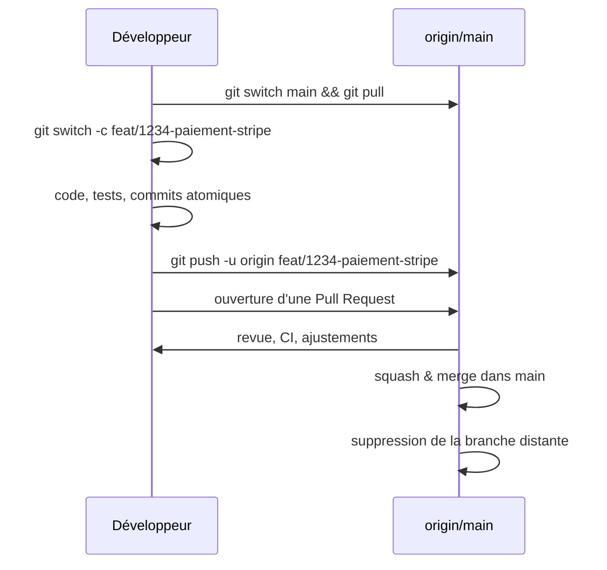
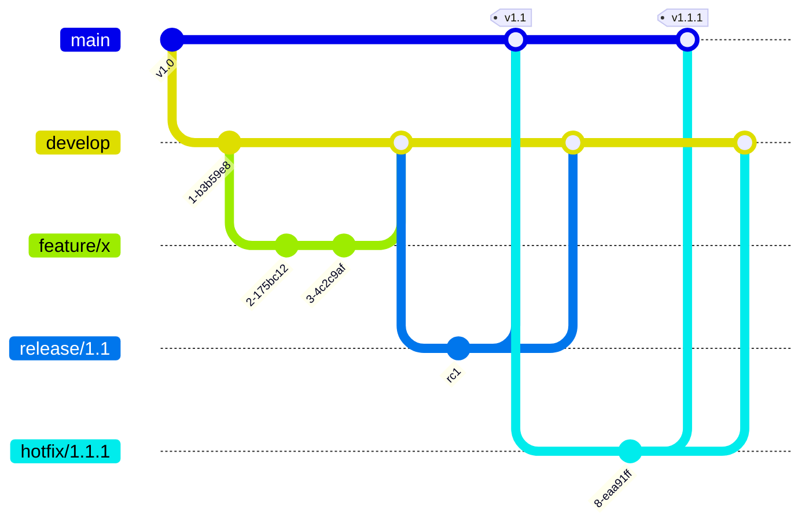

# [Tansoftware](https://www.tansoftware.com) - Bonnes pratiques Git [](README.md)

[](LICENSE) [](#) [](https://git-scm.com/) [](https://www.markdownguide.org/)

## Table des matières

* [Introduction](#introduction)
* [Glossaire express](#glossaire-express)
* [Modèle mental : ce que Git stocke réellement](#modèle-mental--ce-que-git-stocke-réellement)
* [Configuration initiale](#configuration-initiale)
* [Messages de commit](#messages-de-commit)
* [Branches et stratégie de branchement](#branches-et-stratégie-de-branchement)
* [Trunk-Based Development : le standard moderne](#trunk-based-development--le-standard-moderne)
* [GitFlow : utile, mais souvent surdimensionné](#gitflow--utile-mais-souvent-surdimensionné)
* [Forks vs branches partagées](#forks-vs-branches-partagées)
* [Monorepo vs polyrepo](#monorepo-vs-polyrepo)
* [Gestion des conflits](#gestion-des-conflits)
* [Rebase, merge ou squash : trois stratégies de fusion](#rebase-merge-ou-squash--trois-stratégies-de-fusion)
* [Stacked PRs : la revue par couches](#stacked-prs--la-revue-par-couches)
* [Tags et versionnage](#tags-et-versionnage)
* [Commits et tags signés](#commits-et-tags-signés)
* [Squash](#squash)
* [Réécrire l'historique en sécurité](#réécrire-lhistorique-en-sécurité)
* [Cherry-pick, revert, reset : choisir le bon outil](#cherry-pick-revert-reset--choisir-le-bon-outil)
* [Stash : mettre de côté du travail en cours](#stash--mettre-de-côté-du-travail-en-cours)
* [Worktree : plusieurs checkouts en parallèle](#worktree--plusieurs-checkouts-en-parallèle)
* [Bisect : retrouver le commit fautif](#bisect--retrouver-le-commit-fautif)
* [Reflog : la machine à remonter le temps](#reflog--la-machine-à-remonter-le-temps)
* [Internes Git : objets, refs, packfiles](#internes-git--objets-refs-packfiles)
* [Gros dépôts : LFS, sparse checkout, partial clone](#gros-dépôts--lfs-sparse-checkout-partial-clone)
* [Fichiers sensibles](#fichiers-sensibles)
* [Le fichier .gitignore](#le-fichier-gitignore)
* [Le fichier .gitattributes et la normalisation CRLF](#le-fichier-gitattributes-et-la-normalisation-crlf)
* [Hooks Git](#hooks-git)
* [Pull Requests : la revue comme garde-fou](#pull-requests--la-revue-comme-garde-fou)
* [Protection de branche côté GitHub](#protection-de-branche-côté-github)
* [Pièges classiques et comment s'en sortir](#pièges-classiques-et-comment-sen-sortir)
* [Antisèche des commandes](#antisèche-des-commandes)
* [Pour aller plus loin](#pour-aller-plus-loin)

## Introduction

Ce dépôt rassemble les pratiques que l'on retient en équipe pour qu'un dépôt Git reste lisible, sûr et auditable. La référence canonique est le livre [Pro Git](https://git-scm.com/book/fr/v2) de Scott Chacon et Ben Straub, librement consultable.

Le mémo s'adresse à un public débutant à intermédiaire. Chaque notion technique est définie à sa première apparition, dans un encadré **Définition** dédié, puis approfondie dans la section correspondante. Les exemples sont donnés en Bash ; ils fonctionnent à l'identique dans Git Bash sous Windows, dans WSL, ou dans un terminal macOS / Linux.

> Conventions adoptées dans ce mémo : la branche d'intégration s'appelle `main` (renommage par défaut sur GitHub depuis 2020) ; les messages de commit suivent [Conventional Commits](https://www.conventionalcommits.org/fr/) ; les commandes sont exécutées dans un terminal compatible Bash ; on suppose un dépôt distant nommé `origin`.

[Retour en haut de page](#table-des-matières)

## Glossaire express

Ce glossaire fixe le vocabulaire utilisé dans tout le document. Les sections suivantes y reviennent en détail ; gardez-le sous la main lors d'une première lecture.

| Terme | Définition courte |
|-------|-------------------|
| **Commit** | Instantané (snapshot) de l'arborescence du projet à un instant donné, accompagné d'un message, d'un auteur et d'un identifiant SHA-1 (ou SHA-256). |
| **Branche** | Pointeur mobile vers un commit. Avancer une branche, c'est déplacer ce pointeur. |
| **HEAD** | Pointeur spécial désignant l'endroit où Git écrira le prochain commit (généralement la branche courante). |
| **Fast-forward** | Type de fusion où la branche cible n'a pas divergé : Git se contente d'avancer le pointeur, sans créer de commit de fusion. |
| **Merge (fusion)** | Intégration d'une branche dans une autre, créant un commit de fusion à deux parents lorsque les branches ont divergé. |
| **Three-way merge** | Algorithme de fusion à trois points : la base commune (ancêtre), la branche A et la branche B. |
| **Rebase** | Réécriture de l'historique consistant à rejouer les commits d'une branche au sommet d'une autre. Produit de nouveaux SHA. |
| **Squash** | Fusion de plusieurs commits en un seul, généralement à la fin d'une fonctionnalité. |
| **Cherry-pick** | Réapplication d'un commit isolé sur une autre branche. |
| **Bisect** | Recherche dichotomique automatisée du commit qui a introduit une régression. |
| **Stash** | Pile de modifications temporairement mises de côté pour libérer le répertoire de travail. |
| **Reflog** | Journal local des mouvements de `HEAD` et des branches ; permet de retrouver des commits qui ne sont plus référencés par aucune branche. |
| **Dangling commit** | Commit orphelin, plus pointé par aucune branche ni aucun tag, en sursis avant garbage collection. |
| **Hook** | Script déclenché automatiquement par un événement Git (avant commit, avant push, etc.). |
| **`.gitignore`** | Fichier listant les motifs de chemins à ne pas suivre dans Git. |
| **`.gitattributes`** | Fichier qui attache des attributs aux chemins (fins de ligne, diff personnalisé, fichiers binaires, LFS). |
| **Commit signé** | Commit accompagné d'une signature cryptographique GPG, SSH ou S/MIME prouvant l'identité de l'auteur. |
| **Tag** | Étiquette pointant sur un commit, immuable par convention, qui matérialise une version. |
| **Pull Request (PR) / Merge Request (MR)** | Demande d'intégration d'une branche dans une autre, support de la revue de code. |

[Retour en haut de page](#table-des-matières)

## Modèle mental : ce que Git stocke réellement

Comprendre la structure de stockage évite la majorité des malentendus. Git n'est pas un système de différentiels (« delta ») mais une base d'objets adressés par leur empreinte (SHA-1 par défaut, SHA-256 dans les dépôts récents).

Quatre types d'objets composent la base :

| Objet | Rôle |
|-------|------|
| **Blob** | Contenu d'un fichier (sans nom ni chemin). |
| **Tree** | Répertoire : table associant des noms à des blobs ou à d'autres trees. |
| **Commit** | Pointeur vers un tree (l'instantané), un ou plusieurs commits parents, un auteur, un committer, une date, un message. |
| **Tag annoté** | Pointeur signé vers un commit, avec auteur, date et message. |

À côté des objets, des *références* (refs) servent de poignées humaines : `refs/heads/main` (une branche), `refs/tags/v1.0.0` (un tag), `refs/remotes/origin/main` (la dernière position connue d'une branche distante).

Conséquences pratiques :

- Une branche est *bon marché* : un fichier de 41 octets contenant un SHA.
- Un commit n'efface jamais les précédents ; il en ajoute un nouveau qui pointe vers eux.
- Tant qu'une référence (branche, tag, reflog, stash) garde un commit accessible, ses données ne disparaissent pas, même après un `reset` agressif.

[Retour en haut de page](#table-des-matières)

## Configuration initiale

Une configuration soignée évite des heures de débogage de fins de ligne, d'auteurs erronés ou de pulls hasardeux.

```bash
# Identité (obligatoire pour tout commit)
git config --global user.name  "Prénom Nom"
git config --global user.email "prenom.nom@example.com"

# Branche par défaut sur les nouveaux dépôts
git config --global init.defaultBranch main

# Pull = rebase par défaut (évite les commits de fusion parasites sur main)
git config --global pull.rebase true

# Push = pousse seulement la branche courante
git config --global push.default current

# Garde-fou contre les force-push catastrophiques
git config --global push.useForceIfIncludes true

# Détection automatique des renommages dans les diffs
git config --global diff.renames copies

# Couleurs et UTF-8 dans les logs
git config --global core.quotepath false
git config --global color.ui auto

# Cache d'authentification HTTPS (15 minutes par défaut)
git config --global credential.helper cache
```

Sous Windows, ajouter :

```bash
git config --global core.autocrlf true
```

Sous macOS / Linux :

```bash
git config --global core.autocrlf input
```

Voir aussi la section [.gitattributes](#le-fichier-gitattributes) pour aller au-delà de `core.autocrlf`.

[Retour en haut de page](#table-des-matières)

## Messages de commit

Un message de commit s'adresse au futur lecteur (vous, dans six mois) qui essaie de comprendre **pourquoi** une modification a été faite. La spécification [Conventional Commits](https://www.conventionalcommits.org/fr/) impose un format machine-lisible utile pour générer des changelogs et déclencher des releases sémantiques.

### Format

```text
<type>(<portée optionnelle>): <description impérative à la 1re ligne, 50 caractères max>

<corps optionnel : pourquoi, alternatives écartées, lien vers l'issue>

<pied optionnel : BREAKING CHANGE, Refs #123, Reviewed-by, etc.>
```

### Les onze types standards

| Type | Quand l'utiliser |
|------|------------------|
| `feat` | Ajout d'une fonctionnalité visible par l'utilisateur. |
| `fix` | Correction de bug. |
| `docs` | Documentation uniquement (README, commentaires de code, ADR). |
| `style` | Mise en forme, espaces, points-virgules — **aucun** changement de comportement. |
| `refactor` | Réorganisation interne sans ajout de fonctionnalité ni correction. |
| `perf` | Amélioration de performance mesurable. |
| `test` | Ajout ou refonte de tests. |
| `build` | Changements affectant la compilation, les dépendances, le packaging. |
| `ci` | Configuration d'intégration continue (`.github/workflows/`, `.gitlab-ci.yml`). |
| `chore` | Tâche de maintenance qui ne rentre dans aucune autre case (mise à jour `.gitignore`, renommage de scripts internes, etc.). |
| `revert` | Annulation d'un commit antérieur (le corps cite le SHA reverté). |

### La portée (`scope`)

La portée, entre parenthèses, est un nom court désignant la zone du code touchée. Elle est facultative mais fortement recommandée dès que le projet dépasse une dizaine de modules. Exemples : `feat(auth):`, `fix(panier):`, `docs(api):`, `refactor(parser):`. Elle facilite la recherche (`git log --grep "(auth)"`) et la génération de changelogs par section.

### Ruptures de compatibilité

Une rupture se signale de deux manières, idéalement les deux à la fois :

1. Un `!` après le type/scope : `feat(api)!: nouvelle signature de /users`.
2. Un pied `BREAKING CHANGE:` décrivant la rupture et la procédure de migration.

```text
feat(api)!: passage de l'authentification de session à JWT

BREAKING CHANGE: les clients doivent désormais transmettre un en-tête
Authorization: Bearer <token>. Les cookies de session ne sont plus lus.
```

### À éviter

```text
update
fixed bug
WIP
.
asdf
mes modifs du vendredi
```

### À préférer

```text
feat(panier): autoriser les codes promo cumulables

Une étude utilisateur a montré que 18 % des paniers abandonnés sont liés
à l'impossibilité de cumuler une remise fidélité avec un code marketing.
Refs #482
```

```text
fix(auth): corriger la fuite mémoire sur l'expiration du token

Le timer n'était pas annulé quand l'utilisateur se déconnectait avant
expiration, ce qui retenait l'objet User en mémoire.
```

### Bonnes pratiques

| Règle | Pourquoi |
|-------|----------|
| Verbe à l'impératif (`ajoute`, `corrige`) | Cohérent avec le style des messages générés par Git (`Merge`, `Revert`). |
| 50 caractères pour le sujet, 72 pour le corps | Lisibilité dans `git log --oneline` et les outils tiers. |
| Un commit = un changement atomique | Permet `git revert` et `git bisect` ciblés. |
| Pas de point final sur le sujet | Convention partagée. |
| Référencer l'issue | Trace bidirectionnelle entre code et ticket. |
| Séparer sujet et corps par une ligne vide | Sinon, certains outils traitent tout comme une ligne unique. |
| Citer un SHA en cas de revert ou de fix de régression | `Reverts: 3e1f7c2`, `Fixes: a91d3b4`. |

### Outillage de validation

- [`commitlint`](https://commitlint.js.org/) couplé à un hook `commit-msg` rejette tout message non conforme.
- [`commitizen`](https://commitizen-tools.github.io/commitizen/) propose un assistant interactif (`cz commit`) qui guide la rédaction.
- [`semantic-release`](https://semantic-release.gitbook.io/) lit les Conventional Commits pour calculer la prochaine version SemVer et publier automatiquement le changelog.

### Limites et critiques de Conventional Commits

Conventional Commits est une norme utile, mais ce n'est pas une recette miracle. Plusieurs critiques récurrentes méritent d'être connues avant de l'imposer à toute une équipe.

#### Le type ne tombe pas toujours juste

Que faire d'un commit qui :

- Améliore la lisibilité d'une fonction *et* corrige un edge-case mineur ? `refactor` ou `fix` ?
- Ajoute un test *et* corrige le bug que ce test révèle ? `test` ou `fix` ?
- Met à jour une dépendance pour fermer une CVE ? `chore`, `fix`, `build`, `security` ?
- Renomme un dossier interne sans changer le comportement ? `refactor`, `chore`, `style` ?

La spécification ne tranche pas ; chaque équipe arbitre, et les arbitrages divergent. Sans guide d'équipe, le type devient une loterie.

#### `chore:` se transforme en poubelle

`chore` est censé désigner les tâches d'outillage. En pratique, il devient le fourre-tout par défaut quand on hésite. Sur certains dépôts, 40 % des commits sont en `chore:`, ce qui ruine la valeur informative du préfixe et brouille les changelogs générés.

Antidotes :

- Documenter clairement le périmètre de chaque type dans un `CONTRIBUTING.md`.
- Ajouter des types personnalisés si pertinent : `security:`, `deps:`, `infra:`, `i18n:`.
- Réviser la liste de types tous les six mois en rétrospective.

#### Les scopes deviennent un mini-référentiel à maintenir

`feat(panier):`, `feat(checkout):`, `feat(billing):` : sur un projet de cinquante modules, la liste des scopes devient elle-même un objet à gérer. Quand un module est renommé, les anciens commits gardent l'ancien scope, et les recherches `git log --grep "(panier)"` retournent une vue partielle. Sur un monorepo, on peut être tenté d'utiliser le chemin (`feat(libs/ui):`), ce qui devient verbeux.

#### L'over-formalisation peut ralentir les revues

Sur des projets très formels, un commit rejeté par `commitlint` parce qu'il dépasse 72 caractères ou que le scope n'est pas dans la liste autorisée déclenche une friction : le développeur réécrit le message, push à nouveau, le revieweur revoit. Pour des contributions rares (open source, contributeurs occasionnels), c'est dissuasif.

#### `BREAKING CHANGE` sous-utilisé

Beaucoup d'équipes oublient le `!` ou le footer `BREAKING CHANGE:`, ce qui fait que `semantic-release` produit une version mineure pour un changement majeur. Le rituel de revue doit explicitement vérifier ce point sur les PR à risque.

#### Quand l'utiliser, quand l'éviter

| Contexte | Recommandation |
|----------|----------------|
| Bibliothèque publique avec releases automatiques (npm, PyPI) | **Oui**, indispensable. SemVer + changelog en dépend. |
| Application interne avec changelog manuel | **Oui**, mais sans `commitlint` strict — guide d'équipe suffit. |
| Hackathon, prototype, expérimentation courte | **Non**, friction inutile. |
| Dépôt avec contributeurs externes occasionnels | **Oui**, mais avec assistant (commitizen) et indulgence côté mainteneurs. |
| Mono-développeur sur projet personnel | À volonté. Bénéfice marginal sauf publication automatisée. |

#### Alternatives partielles

- **Gitmoji** : remplace le type par un emoji. Visuellement parlant mais peu adapté à un environnement professionnel formel.
- **Angular convention** (variante historique de Conventional Commits) : très proche, plus restrictive.
- **Pas de norme** : laissez les développeurs écrire des messages clairs en prose. Marche très bien pour des équipes mûres ; échoue dès que les nouveaux arrivent.

[Retour en haut de page](#table-des-matières)

## Branches et stratégie de branchement

> **Définition — Branche.** Pointeur mobile vers un commit. Une branche n'est ni une copie ni une duplication : c'est une étiquette, presque gratuite, qui suit votre tête de travail.

Une branche isole un travail en cours du tronc stable. Trois grandes familles de stratégies se partagent l'industrie.

### Comparatif des stratégies

| Critère | Trunk-Based Development | GitHub Flow | Git Flow (Driessen, 2010) |
|---------|------------------------|-------------|---------------------------|
| Branches longues | Non (< 1 jour, idéalement quelques heures) | Courtes (jusqu'à quelques jours) | Oui (`develop`, `release/*`, `hotfix/*`) |
| Branche d'intégration | `main` (toujours déployable) | `main` | `develop` (intégration), `main` (production) |
| Releases | Continues, plusieurs fois par jour | À la demande, après merge dans `main` | Versionnées, planifiées |
| Feature flags | Indispensables | Optionnels | Optionnels |
| Cible idéale | SaaS en livraison continue, équipe mature avec CI rapide | La plupart des produits web et open source | Logiciels installés chez le client, plusieurs versions maintenues en parallèle |
| Coût mental | Faible si CI fiable | Très faible | Élevé (cinq types de branches à orchestrer) |
| Réputation actuelle | Recommandé par la majorité des praticiens DevOps modernes | Standard de fait sur GitHub / GitLab | Souvent surdimensionné ; à réserver aux contextes qui en ont vraiment besoin |

Pour un projet neuf, le choix par défaut raisonnable est **GitHub Flow**, avec une dérive progressive vers **Trunk-Based** à mesure que la couverture de tests et la CI mûrissent. **Git Flow** ne se justifie que si l'on maintient simultanément plusieurs versions livrées chez des clients différents (logiciel embarqué, ERP installé, SDK avec longue compatibilité descendante). Sur un SaaS déployé en continu, GitFlow est presque toujours un fardeau de cérémonie qui ralentit les itérations.

### Critère de décision rapide

| Question | Réponse oui → stratégie suggérée |
|----------|----------------------------------|
| « Déployez-vous plusieurs fois par jour ? » | Trunk-Based |
| « Avez-vous une couverture de tests automatisés > 70 % ? » | Trunk-Based ou GitHub Flow |
| « Un nouveau venu peut-il déployer en production le premier jour ? » | Trunk-Based avec feature flags |
| « Maintenez-vous v3.x, v4.x et v5.x en production simultanément chez différents clients ? » | Git Flow avec branches `release/*` |
| « Travaillez-vous principalement en open source via PR de contributeurs externes ? » | GitHub Flow (forks + PR) |
| « Les développeurs et les ops sont-ils dans la même équipe ? » | Trunk-Based ou GitHub Flow |
| « Avez-vous besoin de geler une version pendant qu'une autre continue ? » | Git Flow ou Trunk-Based + branches de release ponctuelles |

### Conventions de nommage

| Préfixe | Usage |
|---------|-------|
| `feat/` | Nouvelle fonctionnalité. |
| `fix/` | Correction de bug. |
| `hotfix/` | Correctif urgent en production. |
| `chore/` | Tâche d'outillage, build, dépendances. |
| `docs/` | Documentation. |
| `refactor/` | Réorganisation sans changement de comportement. |
| `release/` | Préparation d'une version (gel des fonctionnalités, derniers fixes). |
| `experiment/` ou `spike/` | Exploration sans engagement de merge. |

Le nom inclut un identifiant de ticket lorsque possible : `feat/1234-paiement-stripe`. Pas d'accents, pas d'espaces, pas de majuscules : minuscules et tirets uniquement.

### Cycle d'une branche feature



### Hygiène des branches

- Supprimer la branche distante après merge (case « Delete branch » sur GitHub, automatisable).
- Nettoyer les branches locales obsolètes : `git fetch --prune`, puis `git branch -vv` pour repérer celles dont l'amont a disparu.
- Protéger `main` côté plateforme : interdiction de force-push, exigence de revue, exigence de CI verte, signatures requises pour les commits si l'équipe les utilise.

[Retour en haut de page](#table-des-matières)

## Trunk-Based Development : le standard moderne

> **Définition — Trunk-Based Development (TBD).** Stratégie de branchement où tous les développeurs intègrent leurs commits sur une branche unique (`main`, dite « le tronc »), au moins une fois par jour, en s'appuyant massivement sur l'intégration continue, les tests automatisés et les *feature flags* pour découpler la livraison du déploiement.

TBD est aujourd'hui le modèle dominant dans les organisations qui pratiquent le déploiement continu : Google (depuis l'origine, sur un monorepo de plusieurs milliards de lignes), Meta / Facebook, Netflix, Spotify, Stripe, Shopify. Ce n'est pas un effet de mode : le rapport [State of DevOps](https://cloud.google.com/devops/state-of-devops) (Google / DORA) corrèle systématiquement TBD à des indicateurs de performance plus élevés (fréquence de déploiement, lead time, taux d'échec, MTTR).

### Principes de base

| Principe | Pratique concrète |
|----------|-------------------|
| **Une seule branche d'intégration** | `main`, toujours déployable. Pas de `develop`, pas de `release/*` permanente. |
| **Branches de très courte durée** | Idéalement quelques heures, au pire un ou deux jours. Si une branche dure une semaine, c'est qu'elle est trop grosse. |
| **Intégration au moins quotidienne** | Chaque développeur merge ou rebase sur `main` au minimum une fois par jour. |
| **Feature flags pour le travail incomplet** | Le code d'une fonctionnalité non terminée est merge en `main` mais désactivé via un flag, pas isolé sur une branche longue. |
| **CI rapide et fiable** | < 10 minutes pour la suite principale. Au-delà, les développeurs cessent de la respecter. |
| **Build vert = priorité absolue** | Casser `main` est l'équivalent d'une alarme incendie. Tout le monde s'arrête pour rétablir le tronc. |

### Feature flags : le pivot de TBD

Sans feature flags, TBD est impossible : on ne peut pas merger du code à moitié écrit. Avec feature flags, on découple deux choses qui n'ont aucune raison d'être liées : *intégrer* du code (le mettre dans `main`) et *l'activer en production* (le rendre visible aux utilisateurs).

```javascript
// Pseudo-code : la feature est merge mais désactivée
if (featureFlags.isEnabled('panier_v2', user)) {
    return renderPanierV2();
}
return renderPanierV1();
```

Une fois la fonctionnalité prête et testée, on bascule le flag à `true` (déploiement progressif possible : 1 % des utilisateurs, puis 10 %, puis 100 %). Une fois stable et adoptée, le code de l'ancienne version et la condition sont retirés dans une PR de nettoyage.

Outils : [LaunchDarkly](https://launchdarkly.com/), [Unleash](https://www.getunleash.io/), [Flagsmith](https://www.flagsmith.com/), [GrowthBook](https://www.growthbook.io/), ou un simple système maison basé sur une table de configuration.

### TBD vs GitHub Flow : la frontière floue

GitHub Flow et TBD partagent la même architecture de branches (un tronc, des branches courtes, intégration via PR). La différence porte sur le **rythme** et l'**outillage** :

| Critère | GitHub Flow standard | Trunk-Based Development |
|---------|---------------------|-------------------------|
| Durée de vie d'une branche | Quelques jours à une semaine | Quelques heures à un jour |
| Fréquence d'intégration sur `main` | Plusieurs par semaine | Au moins une par jour et par développeur |
| Feature flags | Optionnels | Indispensables |
| Couverture de tests minimum | Recommandée | Critique (≥ 70-80 %) |
| Déploiement | À la demande | Continu, plusieurs fois par jour |

Beaucoup d'équipes commencent en GitHub Flow et glissent vers TBD au fil du temps : la frontière n'est pas un saut brutal, c'est un curseur sur la durée de vie acceptable d'une branche.

### Quand TBD est mal adapté

- **CI lente ou instable** : si la suite de tests prend 45 minutes ou échoue 30 % du temps pour des raisons aléatoires, TBD multiplie les frictions.
- **Couverture de tests faible** : sans filet automatisé, la pression d'intégration quotidienne se transforme en pression sur des testeurs manuels.
- **Régulations exigeant des phases de validation explicites** : domaines bancaires, médicaux ou avioniques, où une branche `release/*` matérialise un gel formel.
- **Équipe encore en apprentissage de l'écriture de tests** : TBD demande une maturité technique qui se construit. Y aller trop tôt produit du code merge en `main` mais cassé.

### Mise en place progressive

1. **Mois 1-2** : raccourcir les branches existantes. Refuser celles qui dépassent une semaine.
2. **Mois 2-4** : améliorer la CI (parallélisation, mocks, suite rapide < 10 min).
3. **Mois 4-6** : introduire un système de feature flags, même simple.
4. **Mois 6-12** : passer à l'intégration quotidienne, avec rétrospective hebdomadaire sur les frictions résiduelles.

Voir [trunkbaseddevelopment.com](https://trunkbaseddevelopment.com/) pour une référence détaillée et illustrée par Paul Hammant.

[Retour en haut de page](#table-des-matières)

## GitFlow : utile, mais souvent surdimensionné

> **Définition — Git Flow.** Modèle de branchement publié par Vincent Driessen en 2010 (« A successful Git branching model »), articulé autour de cinq types de branches : `main` (production), `develop` (intégration), `feature/*`, `release/*`, `hotfix/*`.

Git Flow a été pendant une décennie le modèle de référence enseigné dans les écoles et les tutoriels. Il a influencé toute une génération de développeurs. Mais en 2020, son auteur lui-même a publié [une note rétrospective](https://nvie.com/posts/a-successful-git-branching-model/) précisant que ce modèle a été conçu pour des **logiciels versionnés livrés explicitement**, et qu'il n'est **pas adapté aux applications web déployées en continu** :

> « Git flow was originally designed in 2010 […] for software that is explicitly versioned, or where multiple versions of the software are supported in the wild. […] If your team is doing continuous delivery of software, I would suggest to adopt a much simpler workflow (like GitHub flow) instead. »

### Quand Git Flow est *adapté*

| Contexte | Pourquoi |
|----------|----------|
| Logiciel installé chez le client (ERP, CAO, SDK) | Plusieurs versions cohabitent en production. Une branche `release/3.x` existe pour patcher la 3.x pendant que la 4.x se prépare sur `develop`. |
| Bibliothèque avec compatibilité descendante longue | Les utilisateurs n'upgradent pas à chaque release ; il faut maintenir plusieurs lignes de version. |
| Logiciel embarqué ou avionique | Validations longues, certifications, gel explicite avant livraison. |
| Équipe avec un cycle de release planifié (mensuel, trimestriel) | Les branches `release/*` matérialisent les phases de stabilisation. |

### Quand Git Flow est *un fardeau*

| Contexte | Symptôme typique |
|----------|------------------|
| SaaS web déployé en continu | `develop` s'éloigne progressivement de `main` ; les merges deviennent douloureux ; personne ne sait laquelle des deux est « la vérité ». |
| Application mobile à déploiement OTA | Les `release/*` n'ont pas de sens : la version courante remplace la précédente. |
| Petite équipe (< 5 développeurs) | Le coût mental des cinq types de branches dépasse leur bénéfice. |
| Pas de hotfixes fréquents en production | La branche `hotfix/*` reste vide et déroute les nouveaux arrivants. |

### Schéma classique



Notez la complexité : pour un seul cycle de release avec un hotfix, on traverse cinq branches et six merges. Multiplié par dix releases par an, l'effort cumulé devient considérable.

### Si vous héritez d'un dépôt Git Flow

- Documentez très clairement quelle branche est la « source de vérité » (presque toujours `main`).
- Automatisez les merges symétriques (`release/*` → `main` et `release/*` → `develop`) pour éviter l'oubli.
- Posez la question, avec rétrospective et données : avons-nous *besoin* de Git Flow, ou est-ce un héritage culturel ? Une migration vers GitHub Flow ou TBD est souvent payante après six à douze mois de stabilisation.

[Retour en haut de page](#table-des-matières)

## Forks vs branches partagées

> **Définition — Fork.** Copie complète d'un dépôt sur le compte d'un autre utilisateur ou organisation, conservant un lien vers l'origine pour faciliter les Pull Requests entrantes.

Le choix entre *fork* et *branche dans le dépôt principal* dépend largement du modèle de gouvernance du projet.

### Modèle « fork » (open source, contributions externes)

C'est le modèle standard sur GitHub pour les projets open source. Un contributeur extérieur n'a pas le droit d'écrire dans le dépôt principal ; il doit :

1. Forker le dépôt sur son propre compte.
2. Créer une branche dans son fork.
3. Pousser ses commits sur son fork.
4. Ouvrir une PR depuis `son-compte:feat/x` vers `upstream:main`.

```bash
# Cloner son fork
git clone git@github.com:moi/projet.git
cd projet

# Ajouter le dépôt amont en remote
git remote add upstream git@github.com:org/projet.git

# Mettre à jour son fork à partir de l'amont
git fetch upstream
git switch main
git rebase upstream/main
git push origin main

# Préparer une contribution
git switch -c feat/ma-contribution
# ... travail, commits ...
git push origin feat/ma-contribution
# Puis ouvrir la PR sur GitHub depuis le fork
```

Avantages :

- Sécurité : les contributeurs externes ne peuvent rien casser dans le dépôt principal.
- Pas besoin d'accorder un accès en écriture à des inconnus.
- Le contributeur a un dépôt complet à lui, peut expérimenter librement.
- Compatible avec une politique de signature DCO ou de CLA (Contributor License Agreement).

Inconvénients :

- Synchronisation manuelle : un fork laissé sans entretien diverge.
- Les CI complexes (avec secrets) ne tournent pas toujours sur les PR depuis un fork (par défaut, GitHub Actions limite l'accès aux secrets).
- Légèrement plus lourd à expliquer aux nouveaux contributeurs.

### Modèle « branches partagées » (équipe interne)

Pour une équipe interne de confiance (employés, prestataires sous contrat), créer les branches directement dans le dépôt principal est généralement plus pratique :

- Pas de synchronisation à entretenir.
- La CI a accès à tous les secrets.
- Les outils de revue (suggestions, batch comments, push directs sur la PR) fonctionnent au mieux.
- Les statistiques d'équipe (vélocité, MTTR) sont consolidées dans un seul lieu.

L'accès en écriture est restreint par les protections de branche : on ne peut pas pousser directement sur `main`, on doit passer par PR.

### Comparatif

| Critère | Forks | Branches partagées |
|---------|-------|---------------------|
| Public cible | OSS, contributeurs externes, hackathons | Équipes internes |
| Sécurité | Forte (pas d'accès en écriture amont) | Repose sur les ACL et protections de branche |
| Friction quotidienne | Moyenne (synchronisation à gérer) | Faible |
| CI sur PR | Restreinte sur les forks (secrets cachés par défaut) | Pleine |
| Découvrabilité | Toutes les PR sont au même endroit (côté GitHub) | Idem |

### Cas hybride : forks internes

Certaines grandes organisations utilisent des forks internes (dans la même organisation GitHub) pour isoler le travail des équipes : la sécurité reste forte, et chaque équipe travaille dans son périmètre. C'est une voie intermédiaire pertinente pour les organisations de plus de 100 développeurs.

[Retour en haut de page](#table-des-matières)

## Monorepo vs polyrepo

> **Définition — Monorepo.** Un seul dépôt Git regroupe l'ensemble du code d'une organisation (ou d'un produit) : applications, bibliothèques, outils, infra. Exemples célèbres : Google, Meta, Microsoft (Windows), Twitter (avant 2023).
>
> **Définition — Polyrepo.** Chaque service, bibliothèque ou application a son propre dépôt Git, versionné et déployé indépendamment.

Le débat est aussi vieux que les organisations qui dépassent une dizaine de développeurs. Aucun des deux modèles n'est universellement supérieur ; chacun déplace les problèmes plutôt que de les supprimer.

### Comparatif

| Critère | Monorepo | Polyrepo |
|---------|----------|----------|
| Refactoring transverse (renommer une API utilisée partout) | Trivial : un seul commit atomique. | Pénible : N PRs coordonnées dans N dépôts, plus la gestion des versions. |
| Découverte de code | Navigation et recherche unifiées. | Multi-dépôts, multi-IDE, fragmenté. |
| CI / CD | Outils sophistiqués nécessaires (Bazel, Nx, Turborepo) pour ne builder que ce qui change. | CI standard par dépôt, plus simple à mettre en place. |
| Permissions par module | Difficile (Git ne sait pas restreindre un sous-répertoire ; CODEOWNERS partiellement). | Native (un dépôt = un ensemble de droits). |
| Charge sur Git | Croissante avec la taille (10+ Go, 100k+ fichiers). Demande LFS, partial clone, sparse checkout. | Faible : chaque dépôt reste de taille raisonnable. |
| Couplage entre composants | Tendance à se renforcer (« on est ensemble dans le repo »). | Plus distant, force les contrats d'interface. |
| Versionnement | Une seule version, partagée. | Chaque dépôt a sa propre version (et ses propres tags). |
| Onboarding | Un clone, tout est là. | Doit cloner et configurer N dépôts. |

### Quand choisir un monorepo

- L'équipe partage beaucoup de code (composants UI, modèles métier, types).
- Les refactorings transverses sont fréquents.
- Une infrastructure CI mature peut être investie (caching distribué, builds incrémentaux, mécanismes de release par dossier).
- L'organisation est petite à moyenne (jusqu'à quelques centaines de développeurs), ou très grande avec des moyens dédiés.

### Quand choisir un polyrepo

- Les composants ont des cycles de vie indépendants (un SDK public, une lib interne, un service legacy).
- Les équipes sont autonomes, avec peu d'interdépendances.
- Pas de budget pour investir dans l'outillage monorepo.
- Besoin fort d'isoler les permissions (clients sous NDA, code propriétaire vs OSS).

### Outillage monorepo

| Outil | Écosystème | Force |
|-------|-----------|-------|
| [Bazel](https://bazel.build/) | Multi-langages | Reproductibilité totale, caching distribué, mais courbe d'apprentissage raide. |
| [Nx](https://nx.dev/) | JS / TS principalement | Génération de projets, graphe de dépendances, intégration IDE. |
| [Turborepo](https://turbo.build/repo) | JS / TS | Léger, rapide, caching distribué. |
| [Pants](https://www.pantsbuild.org/) | Multi-langages | Rust + Python, alternative à Bazel. |
| [Lerna](https://lerna.js.org/) | JS / TS (publication de packages) | Plus ancien, complémentaire à Turborepo / Nx. |

### Cas intermédiaire : « metarepo »

Un dépôt parent référence plusieurs sous-dépôts via *git submodules* ou *git subtree*. C'est rarement satisfaisant : les submodules ont une réputation mitigée (synchronisation, états détachés, expérience utilisateur déroutante). À considérer uniquement pour des cas très spécifiques (vendoring d'une dépendance modifiée, projet client + livrables figés).

[Retour en haut de page](#table-des-matières)

## Gestion des conflits

> **Définition — Three-way merge.** Algorithme de fusion utilisé par Git lorsque deux branches ont divergé : il compare la base commune (ancêtre le plus récent) à chacune des deux versions et combine les changements. Si les deux côtés ont modifié la même zone, il y a *conflit*.

Un conflit survient quand deux commits modifient la même portion d'un fichier sans qu'une fusion automatique soit possible. Git ne décide pas à votre place ; il marque les zones concernées et attend une résolution manuelle.

### Anatomie d'un conflit

```text
<<<<<<< HEAD
const TVA = 0.20;
=======
const TVA = 0.21;
>>>>>>> feat/tva-belge
```

`HEAD` est votre version courante, l'autre est celle de la branche entrante. La résolution consiste à choisir, fusionner ou réécrire, puis supprimer les marqueurs.

### Résolution typique

```bash
git switch ma-branche
git fetch origin
git merge origin/main
# ... éditer les fichiers en conflit ...
git add <fichiers résolus>
git commit               # message pré-rempli par Git
```

### Outils utiles pendant un conflit

```bash
git status                        # liste les fichiers en conflit
git diff                          # vue combinée des deux versions
git diff --ours <fichier>         # ce que mon côté apporte
git diff --theirs <fichier>       # ce que l'autre côté apporte
git checkout --ours <fichier>     # garder ma version (rare, à confirmer)
git checkout --theirs <fichier>   # garder leur version
git merge --abort                 # tout annuler et revenir à l'état initial
```

Pour les conflits réguliers, activer `rerere` (« reuse recorded resolution ») :

```bash
git config --global rerere.enabled true
```

Git mémorise alors la résolution et la rejoue automatiquement si le même conflit se présente à nouveau (typique d'une branche feature longue qu'on rebase plusieurs fois).

### Bonnes pratiques

| Règle | Pourquoi |
|-------|----------|
| Synchroniser tôt et souvent (`git pull --rebase`) | Plus la branche dérive, plus le conflit est large. |
| Conflits par petits paquets | Trois conflits triviaux valent mieux qu'un conflit géant. |
| Demander à l'auteur de la modification entrante en cas de doute | Le but d'un conflit n'est pas de gagner, c'est de produire la bonne intention. |
| Tester immédiatement après résolution | Un fichier qui compile peut quand même être logiquement faux. |
| Activer `rerere` sur les longues branches | Évite de re-résoudre dix fois le même conflit. |

[Retour en haut de page](#table-des-matières)

## Rebase, merge ou squash : trois stratégies de fusion

> **Définition — Merge.** Création d'un commit de fusion (deux parents) qui réconcilie deux branches divergentes.
>
> **Définition — Rebase.** Réécriture de la branche courante : Git détache temporairement vos commits, déplace la base de la branche au sommet d'une autre, puis rejoue vos commits un par un. Les SHA changent.
>
> **Définition — Fast-forward.** Cas particulier où la branche cible n'a pas divergé : Git avance simplement le pointeur sans créer de commit de fusion.
>
> **Définition — Squash merge.** Mode d'intégration de PR qui fond tous les commits de la branche source en un commit unique posé au sommet de la cible.

Les opérations intègrent les commits d'une branche dans une autre, mais ne produisent pas le même historique.

### Visualisation

État de départ — `feat/x` a divergé de `main` :

```text
A---B---C  main
     \
      D---E---F  feat/x
```

Après `git merge feat/x` sur `main` (les deux branches ont divergé, three-way merge) :

```text
A---B---C-------M  main
     \         /
      D---E---F  feat/x
```

`M` est un commit de fusion à deux parents (`C` et `F`). L'historique conserve la trace exacte du parallélisme.

Après `git rebase main` (depuis `feat/x`) puis `git merge --ff-only feat/x` sur `main` :

```text
A---B---C---D'---E'---F'  main
```

Les commits `D`, `E`, `F` ont été rejoués au sommet de `C` et portent désormais de nouveaux SHA (`D'`, `E'`, `F'`). L'historique est linéaire ; il ne reflète plus le parallélisme réel, mais il est plus simple à parcourir.

### Comparatif

| Aspect | `git merge` | `git rebase` |
|--------|-------------|--------------|
| Historique | Préserve la topologie ; un commit de fusion unit les deux branches. | Linéaire ; les commits de la branche source sont rejoués au sommet de la cible. |
| Identifiants des commits | Inchangés. | Nouveaux SHA (les commits sont réécrits). |
| Lisibilité | Vrai au plus près de ce qui s'est passé. | Plus simple à parcourir avec `git log --oneline`. |
| Conflits | Une seule passe de résolution. | Une passe par commit rejoué (mais souvent plus petits). |
| Risque | Aucun. | À ne **jamais** utiliser sur des commits déjà partagés (force-push requis ensuite). |

### Règle d'or

> Rebasez localement avant de pousser ; mergez après.

Concrètement : on rebase une branche feature sur `main` pour la garder propre, puis on fusionne via une Pull Request (souvent en *squash merge*).

### Pourquoi « ne jamais rebaser un commit publié »

Si vos collègues ont fondé du travail sur les anciens commits `D`, `E`, `F` et que vous publiez `D'`, `E'`, `F'`, leur historique local référencera des commits qui ont disparu côté distant. Au prochain pull, Git ne saura pas réconcilier les deux historiques et créera une fusion involontaire — ou pire, écrasera leurs commits si quelqu'un fait `git push --force`. Sur une branche partagée, **toujours** préférer `merge`.

### Exemple complet

```bash
# Mettre à jour ma branche feature avec les derniers commits de main
git switch feat/1234
git fetch origin
git rebase origin/main
# (résolution éventuelle des conflits, puis git rebase --continue)
git push --force-with-lease   # plus sûr que --force
```

`--force-with-lease` refuse le push si quelqu'un d'autre a publié sur la branche entre-temps : c'est le filet de sécurité minimum face à `--force`.

### Quand préférer le merge

- Branche partagée entre plusieurs développeurs (réécrire ferait disparaître leurs commits).
- Préservation explicite de l'historique pour audit (réglementaire, sécurité).
- Branches `release/*` ou `hotfix/*` que l'on veut tracer comme telles.
- Intégration finale d'une PR dans `main` quand la politique d'équipe est « merge commits seulement ».

### Trois modes d'intégration de PR : squash, rebase, merge commit

GitHub, GitLab et Bitbucket exposent trois façons d'intégrer une PR :

| Mode | Effet sur `main` | Préserve les SHA d'origine ? | Commits intermédiaires conservés ? |
|------|------------------|------------------------------|-------------------------------------|
| **Squash and merge** | Un seul commit ajouté, message de la PR. | Non (nouveau commit unique). | Non (les commits de la branche disparaissent de `main`). |
| **Rebase and merge** | Les commits sont rejoués linéairement au sommet. | Non (nouveaux SHA). | Oui (un par un). |
| **Create a merge commit** | Un commit de fusion à deux parents. | Oui (les commits originaux sont préservés). | Oui. |

#### Squash and merge

Mode souvent activé par défaut sur GitHub, populaire dans les équipes qui valorisent un `main` linéaire et lisible.

Avantages :

- Un commit = une fonctionnalité, simple à `revert` ou `cherry-pick`.
- Le bruit des commits exploratoires (« WIP », « fix typo », « ça compile enfin ») ne pollue pas `main`.
- Le message du commit final reprend le titre et la description de la PR (renvoi vers la discussion complète).
- `git log --oneline` sur `main` se lit comme un changelog naturel.

Inconvénients :

- **Perte du contexte intermédiaire** : si la PR contient huit commits soigneusement structurés (1. extract function, 2. rename, 3. add test, 4. refactor, 5. add feature…), tout cela est aplati. `git bisect` perd en granularité ; `git blame` montre une seule date au lieu de la progression réelle.
- Les attributions multiples (co-authoring) sont parfois mal gérées si on oublie d'ajouter les `Co-authored-by:` dans le message squashé.
- Pour un gros refactor pédagogique, l'intention de la séquence est perdue.
- L'auteur peut être tenté de pousser des commits désordonnés en se disant « de toute façon ça va être squashé », ce qui appauvrit la qualité de revue intermédiaire.

#### Rebase and merge

Préserve les commits intermédiaires en les rejouant un par un sur `main`. Convient bien aux PR dont chaque commit est *intentionnel* et passe les tests indépendamment.

Avantages :

- Historique linéaire et détaillé.
- `git bisect` reste fin (chaque commit est testable).
- Les revues de PR par couche de commits sont préservées dans `main`.

Inconvénients :

- Les SHA changent (par rapport aux commits poussés sur la branche feature) : les liens externes (Slack, Jira, autre PR) deviennent obsolètes.
- Si un commit intermédiaire ne compile pas, `bisect` peut tomber dessus et donner un résultat trompeur.
- Discipline requise : un commit « WIP » au milieu d'une suite saine pollue `main`.

#### Create a merge commit

Mode historique. Préserve la topologie réelle (la PR apparaît comme une « bulle » dans l'historique) et tous les SHA d'origine.

Avantages :

- Trace exacte du parallélisme des branches.
- Audit : on voit immédiatement « ce commit fait partie de la PR #482 ».
- Aucune réécriture, donc pas de mauvaise surprise sur les SHA.

Inconvénients :

- Historique en treillis difficile à lire dans `git log --oneline`.
- Génère des commits de fusion superflus si les développeurs mergent souvent `main` dans leur branche en cours de route.
- Mauvaise expérience si la branche contient 47 commits de WIP.

#### Recommandation pratique

| Type de PR | Mode recommandé |
|------------|-----------------|
| Petite PR (< 200 lignes), peu de commits, exploratoire | **Squash and merge**. |
| PR pédagogique ou refactor en plusieurs étapes propres | **Rebase and merge**. |
| Branche partagée entre plusieurs développeurs (rare en PR, mais arrive) | **Create a merge commit**. |
| Politique d'équipe imposant un historique linéaire strict | Squash ou rebase (interdire le merge commit). |
| Audit réglementaire (finance, santé) exigeant la traçabilité maximale | Merge commit (préserve tous les SHA). |

Beaucoup d'équipes choisissent **squash par défaut** mais permettent **rebase** en option pour les PR dont chaque commit a été soigné. Le pire choix est *ne pas en parler* : laisser chaque développeur cliquer un bouton différent produit un historique incohérent.

[Retour en haut de page](#table-des-matières)

## Stacked PRs : la revue par couches

> **Définition — Stacked PRs.** Pratique consistant à découper une grosse modification en une pile de petites PR dépendantes les unes des autres, chacune basée sur la précédente, plutôt qu'une seule PR géante.

Le *stacked PRs* est devenu populaire dans les équipes qui valorisent les PR petites mais qui veulent toujours pouvoir livrer des fonctionnalités cohérentes. L'approche est popularisée par les outils [Graphite](https://graphite.dev/), [Sapling](https://sapling-scm.com/) (Meta), [Stacked](https://github.com/stacked-pulls), [git-spice](https://abhinav.github.io/git-spice/) et le système interne de Phabricator.

### Le problème que ça résout

Une « grosse » PR de 2 000 lignes pose plusieurs problèmes :

- La revue est superficielle : au-delà de 400 lignes, la qualité de revue chute drastiquement (étude classique de SmartBear, 2011).
- Le revieweur procrastine : « je regarde demain quand j'aurai du temps », et la PR pourrit.
- Un seul commentaire bloquant fait recommencer la moitié du travail.
- Les conflits avec `main` deviennent quasi inévitables.

À l'inverse, une PR de 50 lignes se revue en cinq minutes. Mais une fonctionnalité de 2 000 lignes ne se découpe pas en 40 PR indépendantes : il y a des dépendances. D'où la *pile*.

### Anatomie d'une pile

```text
main
 │
 ├── PR1: feat(panier): extract Pricing service           (50 lignes)
 │    │
 │    ├── PR2: feat(panier): add discount strategy        (80 lignes, basée sur PR1)
 │    │    │
 │    │    ├── PR3: feat(panier): wire up coupon UI       (120 lignes, basée sur PR2)
 │    │    │    │
 │    │    │    └── PR4: feat(panier): integration tests  (60 lignes, basée sur PR3)
```

Chaque PR est :

- Petite (< 150 lignes idéalement).
- Auto-cohérente (compile, passe les tests).
- Revuable indépendamment.
- Mergée dans l'ordre : PR1 d'abord, puis PR2 rebase automatiquement sur le nouveau `main`, et ainsi de suite.

### Pourquoi c'est dur en Git « nu »

Git seul ne sait pas suivre une pile : si vous modifiez la PR1 (suite à un commentaire de revue), il faut manuellement rebaser PR2, PR3 et PR4 dans l'ordre, puis force-pusher chacune. Une seule erreur et toute la pile s'effondre.

```bash
# Manuel, pénible :
git switch pr1
# corrections
git push --force-with-lease

git switch pr2
git rebase pr1
git push --force-with-lease

git switch pr3
git rebase pr2
git push --force-with-lease
# etc.
```

### Outils dédiés

| Outil | Particularité |
|-------|---------------|
| [Graphite](https://graphite.dev/) | CLI + interface web sur GitHub. `gt sync` rebase toute la pile en une commande. Très adopté en startup US. |
| [Sapling](https://sapling-scm.com/) | Fork de Mercurial par Meta, compatible avec Git côté serveur. Modèle de stacked diffs natif. |
| [git-spice](https://abhinav.github.io/git-spice/) | Outil CLI open source, plus léger, sans serveur. |
| [git-branchless](https://github.com/arxanas/git-branchless) | Suite d'outils pour piles (`git move`, `git restack`). |
| [ghstack](https://github.com/ezyang/ghstack) | Utilisé par PyTorch / Meta, traduit une pile locale en plusieurs PR GitHub. |

### Workflow type avec Graphite

```bash
# Créer la base de la pile
gt create -m "feat(panier): extract Pricing service"

# Ajouter une couche
gt create -m "feat(panier): add discount strategy"

# Encore une
gt create -m "feat(panier): wire up coupon UI"

# Synchroniser tout : rebase, push, mise à jour des PR
gt submit
```

Si le revieweur demande un changement sur la base, on l'applique localement, puis `gt sync` réordonne et republie toute la pile en une commande.

### Limites et critiques

- Surcoût d'apprentissage pour l'équipe (un nouvel outil à comprendre).
- Quatre PR à revoir au lieu d'une : le revieweur doit comprendre le contexte global avant de plonger dans chaque couche.
- Risque de fragmentation excessive : « atomiser » au point de perdre la cohérence.
- Mauvaise expérience si l'équipe ne pratique pas, parce qu'un seul collègue qui ignore la pile peut merger PR2 avant PR1 et tout casser.

À adopter quand la taille des PR devient un goulet d'étranglement systémique. Pour une équipe de 3-5 personnes avec des PR déjà sous 300 lignes, c'est souvent superflu.

[Retour en haut de page](#table-des-matières)

## Tags et versionnage

> **Définition — Tag.** Étiquette pointant sur un commit, immuable par convention. Deux variantes : *léger* (alias de SHA) et *annoté* (objet Git complet, signable).

Un tag sert à marquer une version publiée afin de pouvoir la retrouver, la comparer ou la rejouer.

### Tags annotés vs légers

```bash
# Tag annoté (objet Git complet : auteur, date, message, signature possible)
git tag -a v1.4.0 -m "Release 1.4.0"

# Tag léger (simple alias de SHA, pas d'auteur ni de message)
git tag v1.4.0
```

Préférez **toujours** les tags annotés pour les releases publiques : ils portent une signature et un message, et `git describe` ne fonctionne correctement qu'avec eux.

### SemVer

[Semantic Versioning](https://semver.org/lang/fr/) impose le format `MAJEUR.MINEUR.CORRECTIF` :

| Incrément | Signal envoyé |
|-----------|---------------|
| `MAJEUR` (1.x.x → 2.0.0) | Rupture d'API publique. |
| `MINEUR` (1.4.x → 1.5.0) | Ajout rétrocompatible. |
| `CORRECTIF` (1.4.0 → 1.4.1) | Correction de bug rétrocompatible. |

Les *pré-releases* se notent avec un suffixe : `1.5.0-rc.1`, `2.0.0-beta.3`. Les *métadonnées de build* utilisent un `+` : `1.5.0+build.42`.

```bash
git tag -a v2.0.0 -m "Release 2.0.0 - BREAKING: nouvelle API d'authentification"
git push origin v2.0.0          # un tag ne se pousse pas tout seul
git push --tags                 # ou pousser tous les tags d'un coup
```

### Supprimer un tag

```bash
git tag -d v1.4.0                # local
git push origin :refs/tags/v1.4.0  # distant
```

À éviter sauf erreur évidente : un tag publié devrait être considéré comme immuable.

[Retour en haut de page](#table-des-matières)

## Commits et tags signés

> **Définition — Commit signé.** Commit accompagné d'une signature cryptographique (GPG, SSH ou S/MIME) qui prouve que l'auteur déclaré est bien celui qui a créé le commit.

Sans signature, le champ `author` d'un commit est purement déclaratif : n'importe qui peut écrire `Linus Torvalds <torvalds@linux-foundation.org>`. Pour les projets sensibles (sécurité, supply chain), GitHub et GitLab affichent un badge « Verified » uniquement sur les commits signés et dont la clé publique est enregistrée sur le compte.

### Signature SSH (recommandée depuis Git 2.34)

Plus simple à mettre en place que GPG si vous avez déjà une clé SSH.

```bash
# Indiquer à Git d'utiliser SSH pour signer
git config --global gpg.format ssh
git config --global user.signingkey ~/.ssh/id_ed25519.pub

# Activer la signature automatique des commits et des tags
git config --global commit.gpgsign true
git config --global tag.gpgsign  true
```

Sur GitHub : **Settings → SSH and GPG keys → New SSH key → Key type : Signing Key**, et coller la clé publique.

### Signature GPG (historique, toujours valide)

```bash
# Générer une clé GPG (algorithme moderne, sans expiration courte)
gpg --full-generate-key            # choisir RSA 4096 ou ed25519

# Lister les clés et récupérer l'ID
gpg --list-secret-keys --keyid-format=long

# Configurer Git
git config --global user.signingkey <ID>
git config --global commit.gpgsign true
git config --global tag.gpgsign  true

# Exporter la clé publique pour la coller dans GitHub
gpg --armor --export <ID>
```

### Signer ponctuellement

```bash
git commit -S -m "feat(auth): ..."   # commit signé une seule fois
git tag   -s v1.4.0 -m "Release 1.4.0"  # tag signé
git verify-commit <SHA>
git verify-tag    v1.4.0
```

### Politique d'équipe

- Activer la règle « Require signed commits » sur la branche `main` pour les projets critiques.
- Documenter dans le README la procédure de génération et d'enregistrement de la clé.
- Ne jamais commiter une clé privée — voir la section [Fichiers sensibles](#fichiers-sensibles).

[Retour en haut de page](#table-des-matières)

## Squash

> **Définition — Squash.** Fusion de plusieurs commits en un seul. Utile pour transformer une suite de commits exploratoires (« WIP », « fix typo », « ça marche enfin ») en un commit unique racontant proprement la fonctionnalité.

### Squash interactif local

```bash
git rebase -i origin/main
```

Dans l'éditeur, on remplace `pick` par `squash` (ou `s`) sur les commits à fondre dans le précédent. La variante `fixup` (ou `f`) fait la même chose mais jette le message au lieu de le concaténer :

```text
pick   3e1f7c2 feat(panier): squelette du panier
squash a91d3b4 wip
fixup  7c8e0a1 corrige test cassé
squash f4b9d22 ajout du test e2e
```

Git propose ensuite de réécrire le message final.

### Squash à la fusion

La plupart des plateformes (GitHub, GitLab, Bitbucket) offrent une option *Squash and merge* qui fait la même chose au moment d'intégrer la PR. Elle est généralement préférable parce qu'elle préserve les commits individuels sur la branche feature et n'écrit qu'un commit propre dans `main`. La case « Default to PR title and description » côté GitHub évite l'écueil du message squashé qui répète mécaniquement les sujets de chaque commit.

### Quand ne pas squasher

- Branches partagées (réécrire l'historique commun perturbe les autres contributeurs).
- Travail composé d'étapes vraiment distinctes qui méritent chacune un `git revert` ou `git bisect` indépendant.
- PR de gros refactor où la séquence des commits raconte la progression d'une transformation (extract → rename → inline).

[Retour en haut de page](#table-des-matières)

## Réécrire l'historique en sécurité

Réécrire l'historique (rebase, squash, amend, filter-repo) crée de nouveaux commits à la place des anciens. Bien fait, c'est un atout ; mal fait, c'est une catastrophe partagée.

### Quand le force-push est acceptable

| Contexte | Force-push autorisé ? |
|----------|-----------------------|
| Branche personnelle sur laquelle vous êtes seul à travailler | Oui, avec `--force-with-lease`. |
| Branche de PR, après rebase ou squash, avant merge | Oui, avec `--force-with-lease`. Prévenir si la PR est en cours de revue. |
| Branche partagée par plusieurs développeurs | Non. Préférer un nouveau commit (`revert`) ou une nouvelle branche. |
| `main`, `master`, `develop`, `release/*` | **Jamais.** Ces branches doivent être protégées au niveau de la plateforme. |

### `--force-with-lease` vs `--force`

```bash
# Dangereux : écrase tout, même les commits qu'un collègue vient de pousser.
git push --force

# Recommandé : refuse le push si la branche distante a bougé depuis votre dernier fetch.
git push --force-with-lease
```

Avec `push.useForceIfIncludes = true` (cf. [Configuration initiale](#configuration-initiale)), Git ajoute un garde-fou supplémentaire qui vérifie aussi que vos refs locales reflètent bien l'état distant.

### `git commit --amend`

Modifie le dernier commit (message ou contenu). Tant qu'il n'est pas poussé, c'est anodin.

```bash
git commit --amend                  # rouvre l'éditeur sur le dernier message
git commit --amend --no-edit        # ajoute les fichiers staged au dernier commit, message inchangé
```

Une fois poussé, un amend nécessite un force-push, donc les mêmes précautions qu'un rebase.

### `git filter-repo` : réécriture massive

Pour purger un fichier de tout l'historique, renommer un auteur sur cent commits, ou extraire un sous-répertoire en dépôt indépendant. Voir aussi la section [Fichiers sensibles](#fichiers-sensibles) pour le cas particulier des secrets.

[Retour en haut de page](#table-des-matières)

## Cherry-pick, revert, reset : choisir le bon outil

> **Définition — Cherry-pick.** Réapplication d'un commit isolé sur la branche courante, créant un nouveau commit avec le même contenu et un nouveau SHA.

### `git cherry-pick`

Utile pour :

- Backporter un fix de `main` vers une branche `release/1.4` maintenue.
- Récupérer un commit isolé d'une branche abandonnée.

```bash
git switch release/1.4
git cherry-pick 3e1f7c2
git cherry-pick 3e1f7c2..a91d3b4   # une plage de commits
```

À éviter pour des dizaines de commits : préférer un merge ou un rebase complet.

### `git revert`

Crée un nouveau commit qui annule les changements d'un commit antérieur. Sans réécriture d'historique, donc sûr sur les branches partagées.

```bash
git revert 3e1f7c2                     # un commit
git revert -m 1 <SHA-merge>            # annuler un merge (le 1 désigne le parent à conserver)
```

C'est la méthode standard pour défaire un commit déjà poussé sur `main`.

### `git reset` : trois modes

| Mode | Effet sur HEAD | Effet sur l'index | Effet sur le répertoire de travail |
|------|----------------|-------------------|-----------------------------------|
| `--soft` | Déplacé | Inchangé (les modifs restent staged) | Inchangé |
| `--mixed` (défaut) | Déplacé | Réinitialisé (les modifs deviennent unstaged) | Inchangé |
| `--hard` | Déplacé | Réinitialisé | **Réinitialisé — modifications perdues** |

```bash
git reset --soft HEAD~1     # défaire le dernier commit, garder les modifs staged
git reset --mixed HEAD~1    # défaire le dernier commit, modifs en working tree
git reset --hard HEAD~1     # défaire le dernier commit ET les modifs (DANGEREUX)
```

`--hard` ne devrait pas être utilisé sur des modifications non sauvegardées sans `git stash` préalable, et jamais sur une branche partagée.

[Retour en haut de page](#table-des-matières)

## Stash : mettre de côté du travail en cours

> **Définition — Stash.** Pile de modifications temporairement mises de côté pour libérer le répertoire de travail (par exemple pour basculer rapidement sur une autre branche).

```bash
git stash push -m "WIP refactor du parser"   # stocker les modifs courantes
git stash list                                # lister la pile
git stash show -p stash@{0}                   # voir le diff complet
git stash pop                                 # rejouer le plus récent et le retirer de la pile
git stash apply stash@{2}                     # rejouer un stash spécifique sans le retirer
git stash drop stash@{0}                      # supprimer un stash
git stash clear                               # vider toute la pile
```

Pour stocker aussi les fichiers non suivis :

```bash
git stash push -u -m "WIP avec nouveaux fichiers"
```

Garde-fou : un stash est local et n'est pas poussé. Ne pas l'utiliser comme stockage longue durée — préférer un commit `wip` sur une branche feature, qui pourra être squashé plus tard.

[Retour en haut de page](#table-des-matières)

## Worktree : plusieurs checkouts en parallèle

> **Définition — Worktree.** Mécanisme natif de Git permettant d'avoir plusieurs répertoires de travail (checkouts) attachés à un même dépôt, chacun positionné sur une branche différente, sans recloner.

`git worktree` est l'une des fonctionnalités les plus sous-utilisées de Git. Elle remplace avantageusement la danse classique `stash → switch → travail → switch → stash pop` lorsqu'une interruption survient.

### Cas typique

Vous travaillez sur `feat/1234-paiement` quand un hotfix urgent arrive. Trois solutions possibles :

1. **Stash + switch** : `git stash`, basculer, fixer, revenir, `git stash pop`. Risque : oublier le stash, conflits au pop, mélanger les contextes.
2. **Cloner à nouveau le dépôt** : marche, mais long sur un dépôt de plusieurs Go ; double l'espace disque ; deux configurations à maintenir.
3. **`git worktree`** : ajouter un répertoire de travail supplémentaire, qui partage les objets Git mais a son propre checkout. Instantané, économe en disque, propre.

### Commandes essentielles

```bash
# Lister les worktrees existants
git worktree list

# Créer un nouveau worktree pour un hotfix urgent
git worktree add ../projet-hotfix hotfix/1.4.2 origin/main

# Travailler dans le nouveau répertoire
cd ../projet-hotfix
# ... fixer, commiter, pusher ...

# De retour, supprimer le worktree
cd ../projet
git worktree remove ../projet-hotfix

# Nettoyer les worktrees orphelins (si on a effacé le dossier à la main)
git worktree prune
```

### Bénéfices concrets

- **Pas de stash** : votre travail en cours sur `feat/1234-paiement` reste intact dans son dossier.
- **Pas de re-build** : les caches d'IDE, de Maven, de `node_modules` du worktree principal ne sont pas perturbés.
- **Pas de double clone** : les objets Git (commits, blobs, packfiles) sont partagés via `.git/worktrees/`.
- **Compatible avec les IDE modernes** : VS Code, IntelliJ et JetBrains tools ouvrent un worktree comme un projet à part.

### Cas d'usage courants

| Situation | Worktree adapté |
|-----------|-----------------|
| Hotfix urgent pendant un gros refactor | `git worktree add ../proj-hotfix hotfix/x` |
| Comparaison côte-à-côte de deux branches | `git worktree add ../proj-feat-b feat/b` |
| Build CI long pendant qu'on continue à coder | Worktree dédié pour la branche en build |
| Bisect automatisé qui prend du temps | Worktree dédié, le worktree principal reste utilisable |
| Démo client pendant qu'on travaille sur la suite | `git worktree add ../proj-demo v2.4.0` |

### Limites

- Une même branche ne peut être checkée que dans un seul worktree à la fois (sauf `--force`).
- Les hooks Git sont partagés via `.git/hooks/` ; leur exécution dépend du contexte du worktree.
- Les outils qui présupposent un seul checkout (certains scripts artisanaux) peuvent dérouter.

[Retour en haut de page](#table-des-matières)

## Bisect : retrouver le commit fautif

> **Définition — Bisect.** Recherche dichotomique du commit qui a introduit une régression : Git divise par deux à chaque étape la plage de commits suspects, en se basant sur vos verdicts « bon » / « mauvais ».

Sur une plage de 1024 commits, `git bisect` trouve le coupable en 10 étapes au lieu de 1024.

### Mode interactif

```bash
git bisect start
git bisect bad                   # le commit courant est défectueux
git bisect good v1.3.0           # cette version-là était saine
# Git checkout un commit au milieu, à vous de tester :
# - si le bug est présent : git bisect bad
# - sinon                  : git bisect good
git bisect reset                 # quand c'est fini
```

### Mode automatisé : `git bisect run`

Si vous avez une commande qui retourne 0 quand le code est sain et autre chose sinon :

```bash
git bisect start HEAD v1.3.0
git bisect run npm test -- --testPathPattern panier
```

Git exécute le test à chaque étape et conclut tout seul. C'est l'argument massue en faveur des commits atomiques : un commit qui mélange refactor et fonctionnalité fait perdre la moitié de l'efficacité de bisect.

### Exemple complet de bug-hunt automatisé

Scénario : la fonction `calculerTotal()` retourne le mauvais montant depuis la version 1.5.0, alors qu'elle était correcte en 1.4.0. Plusieurs centaines de commits séparent les deux versions.

#### Étape 1 — Écrire un test reproducteur minimal

On crée un script `scripts/bisect-test.sh` :

```bash
#!/usr/bin/env bash
# scripts/bisect-test.sh
# Code de sortie :
#   0   = commit sain
#   1   = commit fautif
#   125 = à ignorer (compilation cassée, dépendances absentes, etc.)

set -u

# (1) Réinstaller les dépendances : leur version peut avoir changé entre les commits
npm ci --prefer-offline --no-audit --silent || exit 125

# (2) S'assurer que le projet compile, sinon ce commit ne nous renseigne pas
npm run build --silent || exit 125

# (3) Lancer LE test ciblé qui isole le bug
if npm test -- --testPathPattern 'panier.calcul.total' --silent; then
    exit 0   # Test passe : commit sain
else
    exit 1   # Test échoue : commit fautif
fi
```

Important : le code 125 indique à `bisect` que le commit n'est pas testable (build cassé indépendant) et qu'il doit l'ignorer plutôt que de le marquer mauvais. C'est ce qui sauve la session si vous tombez sur un commit intermédiaire qui ne compile pas.

#### Étape 2 — Lancer la chasse

```bash
chmod +x scripts/bisect-test.sh

# Marquer la dernière version connue saine et la première version connue mauvaise
git bisect start
git bisect bad   v1.5.0
git bisect good  v1.4.0

# Laisser Git automatiser la dichotomie
git bisect run scripts/bisect-test.sh
```

Sur 512 commits suspects, Git effectue 9 itérations (log2(512) = 9). Chaque itération checkout un commit, exécute le script, lit le code de retour, choisit la moitié à explorer.

#### Étape 3 — Lire le verdict

```text
9c4f7e1 is the first bad commit
commit 9c4f7e1
Author: Alice <alice@example.com>
Date:   Tue Mar 12 14:32:18 2024 +0100

    refactor(panier): extraction du calcul TVA

 src/panier/total.ts | 14 +++++++-------
 1 file changed, 7 insertions(+), 7 deletions(-)
```

Git nomme le commit fautif. On termine la session :

```bash
git bisect reset
```

#### Étape 4 — Astuces avancées

```bash
# Sauter un commit qu'on sait défectueux pour une raison non liée
git bisect skip

# Visualiser le sous-ensemble restant à explorer
git bisect log
git bisect visualize

# Reproduire la session ailleurs (script, autre poste)
git bisect log > bisect-session.log
git bisect replay bisect-session.log

# Limiter la dichotomie à un sous-répertoire
git bisect start -- src/panier/

# Combiner avec un worktree pour ne pas geler le checkout principal
git worktree add ../projet-bisect HEAD
cd ../projet-bisect
git bisect start
# ...
```

#### Pourquoi ça marche si bien

L'efficacité de `bisect run` repose sur trois conditions :

1. Un test reproductible qui ne dépend pas d'un état extérieur fragile (date, réseau, secret).
2. Un build qui se relance proprement à chaque commit (utiliser `npm ci`, pas `npm install`).
3. Des commits atomiques. Un seul commit fautif est trouvé par dichotomie ; si ce commit fait dix choses à la fois, vous savez juste *où* mais pas *quoi*.

[Retour en haut de page](#table-des-matières)

## Reflog : la machine à remonter le temps

> **Définition — Reflog.** Journal local des mouvements de `HEAD` et de chaque branche. Conservé environ 90 jours, il permet de retrouver des commits qui ne sont plus pointés par aucune branche (« dangling commits »).
>
> **Définition — Dangling commit.** Commit orphelin, plus accessible par aucune référence ; en sursis avant garbage collection (`git gc`).

Le reflog est la bouée de sauvetage en cas de manipulation hasardeuse (`reset --hard`, `rebase` cassé, branche supprimée par erreur).

```bash
git reflog                       # historique de HEAD
git reflog show ma-branche       # historique d'une branche précise

# Récupérer un commit perdu après un reset --hard
git reset --hard HEAD@{1}

# Recréer une branche supprimée
git switch -c ma-branche-restored <SHA récupéré dans le reflog>
```

Tant qu'un commit apparaît dans le reflog, ses données sont accessibles. Au-delà de 90 jours (configurable via `gc.reflogExpire`), le garbage collector peut les supprimer définitivement.

### Scénarios de récupération concrets

#### Récupérer après un `git reset --hard` malencontreux

```bash
# Avant le drame
git log --oneline
# 3e1f7c2 (HEAD -> main) feat(panier): coupons cumulables
# a91d3b4 feat(panier): squelette
# 7c8e0a1 chore: bump deps

# Le drame
git reset --hard HEAD~3   # adieu trois commits

# Le secours
git reflog
# 7c8e0a1 (HEAD -> main) HEAD@{0}: reset: moving to HEAD~3
# 3e1f7c2 HEAD@{1}: commit: feat(panier): coupons cumulables
# a91d3b4 HEAD@{2}: commit: feat(panier): squelette

# Restaurer
git reset --hard HEAD@{1}
```

Tout est revenu. Le reflog est local : si vous travaillez sur un autre poste qui n'a pas le reflog, vous êtes coincé. D'où l'intérêt de pousser régulièrement sur une branche de sauvegarde.

#### Récupérer une branche supprimée

```bash
# La branche feat/1234 existait, je l'ai effacée
git branch -D feat/1234

# Retrouver son dernier SHA via le reflog
git reflog | grep feat/1234
# 9c4f7e1 HEAD@{14}: checkout: moving from feat/1234 to main

# Recréer la branche
git switch -c feat/1234 9c4f7e1
```

#### Récupérer un commit perdu après un rebase raté

```bash
# Avant : trois commits sur ma feature
# Après un rebase -i où j'ai accidentellement remplacé "pick" par "drop"

git reflog
# 9c4f7e1 HEAD@{0}: rebase finished: returning to refs/heads/feat/x
# ...
# a91d3b4 HEAD@{6}: commit: feat: ajout du test e2e   <- perdu après le rebase

# Cherry-pick du commit perdu
git cherry-pick a91d3b4
```

#### Trouver un commit orphelin (dangling)

```bash
# Lister tous les commits non référencés mais encore présents
git fsck --lost-found

# dangling commit a91d3b4...
# dangling blob  ...

# Inspecter le contenu
git show a91d3b4
git switch -c sauvetage a91d3b4
```

### Étendre la durée de rétention

Pour une mission longue ou une enquête forensique, on peut prolonger la durée de vie du reflog :

```bash
git config --global gc.reflogExpire 365.days
git config --global gc.reflogExpireUnreachable 90.days
```

Le coût en stockage est négligeable sauf sur des dépôts immenses.

[Retour en haut de page](#table-des-matières)

## Internes Git : objets, refs, packfiles

Comprendre les internes de Git est rarement nécessaire au quotidien, mais devient déterminant dès qu'il faut diagnostiquer un dépôt qui « rame », un push qui n'aboutit pas, ou une maintenance d'urgence.

### La base d'objets

Tous les objets Git vivent sous `.git/objects/`. Chaque objet est compressé en zlib, identifié par le SHA-1 (ou SHA-256) de son contenu, et stocké dans un fichier dont le chemin est construit à partir des deux premiers caractères du SHA :

```text
.git/objects/3e/1f7c2a91d3b4...   <- contenu zlib
```

Quatre types d'objets :

| Type | Contenu | Inspection |
|------|---------|-----------|
| **blob** | Le contenu brut d'un fichier (sans nom, sans permissions). | `git cat-file -p <SHA>` |
| **tree** | La liste « nom + permissions + SHA blob/tree » d'un répertoire. | `git cat-file -p <SHA>` |
| **commit** | Pointeur vers un tree, parents, auteur, committer, message. | `git cat-file -p <SHA>` |
| **tag annoté** | Pointeur vers un commit (ou un autre objet), auteur, message, signature. | `git cat-file -p <SHA>` |

```bash
# Type d'un objet
git cat-file -t 3e1f7c2

# Contenu lisible
git cat-file -p HEAD
# tree 4f9a2b8c...
# parent a91d3b4...
# author Alice <alice@example.com> 1735689600 +0100
# committer Alice <alice@example.com> 1735689600 +0100
#
# feat(panier): coupons cumulables

# Le tree pointé par le commit
git cat-file -p HEAD^{tree}
# 100644 blob 7c8e0a1... package.json
# 040000 tree 9c4f7e1... src
```

### Les références (refs)

Sous `.git/refs/`, des fichiers texte contiennent simplement un SHA :

```text
.git/refs/heads/main           <- 3e1f7c2a91d3b4...
.git/refs/heads/feat/1234      <- a91d3b47c8e0a1...
.git/refs/tags/v1.4.0          <- 9c4f7e1f4b9d22...
.git/refs/remotes/origin/main  <- 3e1f7c2a91d3b4...
```

`HEAD` est un cas spécial : c'est un fichier `.git/HEAD` qui contient soit un SHA (état détaché) soit `ref: refs/heads/main` (pointe vers une branche).

Pour économiser de l'espace, Git regroupe parfois ces fichiers dans `.git/packed-refs`.

### Les packfiles

Stocker chaque objet dans un fichier individuel devient inefficace pour des dépôts de centaines de milliers d'objets. Git regroupe alors les objets dans des *packfiles* (`.git/objects/pack/pack-*.pack`), avec un index (`.idx`) pour la recherche rapide. Les versions successives d'un même fichier sont stockées en *delta* (différence binaire), ce qui économise drastiquement la place.

```bash
# Forcer un packing
git gc

# Plus agressif : recompacter tout
git gc --aggressive --prune=now

# Inspecter les packfiles
git verify-pack -v .git/objects/pack/pack-*.idx | sort -k 3 -n | tail -20
# Liste les 20 plus gros objets, utile pour traquer un binaire qui pèse 500 Mo
```

### Diagnostiquer un dépôt lent

| Symptôme | Cause probable | Diagnostic |
|----------|----------------|-----------|
| `git status` lent | Beaucoup de fichiers non suivis ou hooks lents. | `git status -uno`, `core.untrackedCache=true`, `core.fsmonitor=true`. |
| `git log` lent | Reflog géant ou packfiles non optimisés. | `git gc`, `git reflog expire`. |
| `git push` lent | Gros binaire dans l'historique. | `git verify-pack` pour identifier ; `git filter-repo` pour purger. |
| Clone très long | Histoire profonde, beaucoup d'objets. | `git clone --depth=1` (clone superficiel) ou `--filter=blob:none` (partial clone). |
| `.git` énorme | Binaires non en LFS, historique non purgé. | LFS, `git filter-repo`. |

### Maintenance régulière

Git 2.30+ propose `git maintenance`, qui automatise les tâches de gc, prefetch, packing :

```bash
# Activer la maintenance automatique en arrière-plan
git maintenance start

# Lancer ponctuellement
git maintenance run --task=gc --task=commit-graph
```

Sur un dépôt actif, exécuter `git gc` une fois par semaine suffit en général à maintenir des performances correctes.

[Retour en haut de page](#table-des-matières)

## Gros dépôts : LFS, sparse checkout, partial clone

Les équipes modernes manipulent des monorepos de 10, 50 voire plusieurs centaines de Go (jeu vidéo, ML, design assets). Git seul ne tient pas la charge ; trois mécanismes complémentaires existent.

### Git LFS : déporter les gros binaires

> **Définition — Git LFS (Large File Storage).** Extension de Git qui remplace les gros fichiers binaires (images, vidéos, modèles ML, exécutables) par un *pointeur texte* dans le dépôt Git, le contenu réel étant stocké séparément sur un serveur LFS.

Sans LFS, chaque modification d'un gros binaire est stockée en delta dans la base d'objets : un dépôt avec 100 versions d'une vidéo de 500 Mo finit à 50 Go. Avec LFS, le binaire actuel pèse seulement son poids réel, et l'historique pointe vers les versions distantes.

```bash
# Installer (une fois par poste)
git lfs install

# Déclarer les types de fichiers à stocker en LFS
git lfs track "*.psd"
git lfs track "*.zip"
git lfs track "*.bin"
git lfs track "*.mp4"

# Cela écrit dans .gitattributes :
# *.psd filter=lfs diff=lfs merge=lfs -text

# Commiter normalement
git add .gitattributes design.psd
git commit -m "chore: ajout du PSD via LFS"
git push
```

Le dépôt Git ne contient qu'un pointeur texte (~130 octets) ; le binaire vit sur le serveur LFS de GitHub / GitLab / un serveur self-hosted.

#### Pièges LFS

- **Migrer un dépôt existant** : `git lfs migrate import --include="*.psd" --everything` réécrit l'historique. Force-push obligatoire.
- **Coût** : GitHub facture le stockage et la bande passante LFS au-delà du quota gratuit (1 Go offert). Surveiller la consommation.
- **Clone partiel par défaut** : `GIT_LFS_SKIP_SMUDGE=1 git clone ...` pour récupérer les pointeurs sans télécharger les binaires immédiatement (utile en CI qui n'en a pas besoin).
- **Pas adapté à tout** : pour quelques fichiers de quelques Mo, LFS est superflu. Réservez-le aux binaires de plusieurs dizaines de Mo qui changent souvent.

### Partial clone : ne télécharger que ce qu'on lit

> **Définition — Partial clone.** Clone qui omet certains objets (typiquement les blobs) lors de la récupération initiale, et les télécharge à la demande au moment du checkout ou de la lecture.

```bash
# Clone sans aucun blob (les arbres et commits sont là, le contenu des fichiers vient au checkout)
git clone --filter=blob:none git@github.com:org/monorepo.git

# Clone sans les blobs > 1 Mo
git clone --filter=blob:limit=1m git@github.com:org/monorepo.git

# Clone sans aucun arbre (encore plus radical)
git clone --filter=tree:0 git@github.com:org/monorepo.git
```

Au premier `git checkout` sur une branche, Git récupère à la volée les blobs nécessaires. Sur un monorepo de 50 Go, le gain de temps de clone passe de 30 minutes à 30 secondes.

### Sparse checkout : ne déployer qu'une partie de l'arbre

> **Définition — Sparse checkout.** Mécanisme qui restreint le contenu *matérialisé* dans le répertoire de travail à un sous-ensemble du dépôt, tout en gardant l'historique complet.

Combiné avec un partial clone, on obtient l'expérience d'un dépôt léger sur disque malgré une histoire massive en amont.

```bash
# Activer
git sparse-checkout init --cone

# Déclarer les répertoires qu'on veut voir
git sparse-checkout set apps/web libs/ui libs/shared

# Vérifier ce qui est matérialisé
git sparse-checkout list

# Désactiver (récupérer tout)
git sparse-checkout disable
```

Le mode `--cone` est plus rapide et plus prévisible que le mode complet (basé sur des motifs `.gitignore`), au prix d'une expressivité réduite (on ne peut sélectionner que des sous-répertoires entiers).

### Combo gagnant pour un monorepo

```bash
# Cloner intelligemment un monorepo de 50 Go
git clone --filter=blob:none --no-checkout git@github.com:org/monorepo.git
cd monorepo
git sparse-checkout init --cone
git sparse-checkout set apps/mon-app libs/utilises-par-mon-app
git checkout main
```

Résultat : sur disque, seuls les répertoires nécessaires sont déployés. L'historique est complet (on peut faire `git log`, `git blame`), les blobs absents seront récupérés à la demande.

### Stratégies complémentaires

| Stratégie | Utile pour |
|-----------|-----------|
| `git clone --depth=1` (shallow clone) | CI, déploiements, agents qui n'ont pas besoin de l'historique. |
| `git fetch --filter=blob:none` | Réduire la bande passante des fetchs incrémentaux. |
| Submodules | À éviter sauf besoin précis : expérience utilisateur déroutante. |
| Subtree | Vendoring d'une dépendance externe : alternative aux submodules, sans état détaché. |
| Scalar / VFS for Git | Solutions Microsoft pour des dépôts énormes (Windows source). |

[Retour en haut de page](#table-des-matières)

## Fichiers sensibles

Mots de passe, clés d'API, certificats, fichiers `.env` : tout secret commité reste dans l'historique pour toujours, **même après suppression**. Une fois publié, considérez le secret comme compromis et faites-le tourner immédiatement.

### Prévenir

| Pratique | Outils |
|----------|--------|
| `.gitignore` complet dès l'init du dépôt | [gitignore.io](https://www.toptal.com/developers/gitignore) |
| Gabarits sans valeurs (`.env.example`) | — |
| Hook `pre-commit` qui scanne les secrets | [gitleaks](https://github.com/gitleaks/gitleaks), [trufflehog](https://github.com/trufflesecurity/trufflehog), [detect-secrets](https://github.com/Yelp/detect-secrets) |
| Stockage dans un coffre | [Vault](https://www.vaultproject.io/), AWS Secrets Manager, 1Password, Doppler |
| Secret scanning côté plateforme | [GitHub secret scanning](https://docs.github.com/fr/code-security/secret-scanning) (gratuit pour les dépôts publics, partenaires intégrés pour AWS, Stripe, GitHub Tokens, etc.). |

### Réagir à une fuite

```bash
# 1. Faire tourner immédiatement le secret compromis (révocation, nouvelle clé).
# 2. Réécrire l'historique pour retirer le fichier.
git filter-repo --path config/secrets.yml --invert-paths

# Variante : retirer un motif (ex. toute ligne contenant un token AWS).
git filter-repo --replace-text <(echo 'AKIA[0-9A-Z]{16}==>REDACTED')

# 3. Forcer le push (et prévenir l'équipe).
git push --force-with-lease --all
git push --force-with-lease --tags
```

`git filter-repo` ([documentation](https://github.com/newren/git-filter-repo)) remplace `git filter-branch`, désormais déprécié. Une alternative simple à utiliser est [BFG Repo-Cleaner](https://rtyley.github.io/bfg-repo-cleaner/), particulièrement efficace sur les gros dépôts :

```bash
# Supprimer toutes les occurrences d'un fichier dans l'historique
bfg --delete-files secrets.yml

# Remplacer des chaînes (mots de passe, tokens) par ***REMOVED***
bfg --replace-text passwords.txt
```

### Après réécriture

- Sur GitHub, demander la purge du cache des forks (sinon le secret reste accessible via les forks).
- Faire tourner aussi tout secret dérivé (sessions, certificats émis avec la clé compromise).
- Ouvrir un post-mortem : pourquoi le hook `pre-commit` n'a-t-il pas attrapé la fuite ?

[Retour en haut de page](#table-des-matières)

## Le fichier .gitignore

> **Définition — `.gitignore`.** Fichier listant les motifs de chemins à ne pas suivre dans Git. Lu à chaque opération qui pourrait ajouter un fichier à l'index.

`.gitignore` indique à Git les fichiers et motifs à ne pas suivre : artefacts de build, dépendances installées, configuration locale d'IDE, fichiers binaires volumineux.

### Exemple PHP / Node minimal

```gitignore
# Dépendances
/vendor/
/node_modules/

# Variables d'environnement
.env
.env.local

# Builds
/dist/
/build/
*.log

# IDE / OS
.idea/
.vscode/
.DS_Store
Thumbs.db
```

### Syntaxe rapide

| Motif | Effet |
|-------|-------|
| `build/` | Tout dossier nommé `build`, à n'importe quelle profondeur. |
| `/build/` | Le dossier `build` à la **racine** du dépôt seulement. |
| `*.log` | Tout fichier `.log`, à n'importe quelle profondeur. |
| `!important.log` | Exception : ne **pas** ignorer `important.log`. |
| `**/tmp` | Tout sous-dossier `tmp`, à n'importe quel niveau. |
| `doc/**/*.pdf` | Tous les `.pdf` sous `doc/`, à toute profondeur. |

### Pièges courants

| Symptôme | Cause | Solution |
|----------|-------|----------|
| Le fichier reste suivi malgré le `.gitignore` | Il a été commité avant l'ajout de la règle. | `git rm --cached <fichier>` puis recommit. |
| Une règle ne s'applique pas | Mauvais slash : `/build` (racine) vs `build/` (partout). | Tester avec `git check-ignore -v <fichier>`. |
| Trop de bruit dans le diff | Pas de gabarit central. | Démarrer depuis un modèle [gitignore.io](https://www.toptal.com/developers/gitignore). |
| Un fichier privé est ignoré mais reste sensible | `.gitignore` n'enlève **rien** de l'historique. | Voir [Fichiers sensibles](#fichiers-sensibles). |

### `.gitignore` global

Pour les fichiers spécifiques à votre poste (configuration d'IDE personnelle, fichiers macOS), un `.gitignore` global évite de polluer chaque dépôt :

```bash
git config --global core.excludesFile ~/.gitignore_global
```

[Retour en haut de page](#table-des-matières)

## Le fichier .gitattributes et la normalisation CRLF

> **Définition — `.gitattributes`.** Fichier qui attache des attributs aux chemins du dépôt : fins de ligne, traitement diff, fichiers binaires, prise en charge de Git LFS, export-ignore.

Là où `.gitignore` cache des fichiers, `.gitattributes` change la façon dont Git les traite.

### Cas d'usage typiques

```gitattributes
# Fins de ligne : LF dans le dépôt, conversion à la volée selon la plateforme
* text=auto eol=lf

# Forcer LF pour les scripts shell et la config (sinon CRLF sous Windows casse tout)
*.sh   text eol=lf
*.yml  text eol=lf
*.yaml text eol=lf

# Forcer CRLF pour les fichiers Windows-only
*.bat  text eol=crlf
*.cmd  text eol=crlf

# Marquer comme binaire (pas de diff, pas de fusion automatique)
*.png  binary
*.pdf  binary
*.xlsx binary

# Diff personnalisé pour des formats courants
*.json   diff=json
*.md     diff=markdown

# Exclure des fichiers de l'archive `git archive` (utile pour les releases)
.github/        export-ignore
tests/          export-ignore
.gitattributes  export-ignore
.gitignore      export-ignore

# Git LFS pour les gros binaires (après git lfs install)
*.psd  filter=lfs diff=lfs merge=lfs -text
*.zip  filter=lfs diff=lfs merge=lfs -text
```

### Pourquoi c'est important pour une équipe mixte Windows / macOS / Linux

Sans `.gitattributes`, deux développeurs sur deux OS différents finissent par produire des diffs vides remplis uniquement de changements de fins de ligne. La règle `* text=auto eol=lf` règle ce problème une fois pour toutes en imposant LF dans le dépôt et en laissant Git convertir au checkout selon l'OS.

### Le problème CRLF en détail

Historique : Windows utilise `CRLF` (`\r\n`) en fin de ligne, héritage des télétypes IBM. macOS / Linux utilisent `LF` (`\n`). Ouvrir un fichier `LF` dans le Bloc-notes Windows historique affiche tout sur une ligne ; ouvrir un fichier `CRLF` dans certains outils Linux fait apparaître `^M` à la fin de chaque ligne.

Sans normalisation, voici ce qui se passe :

1. Alice (Linux) crée `app.js` en `LF` et le commite.
2. Bob (Windows) clone, son éditeur convertit le fichier en `CRLF` à l'enregistrement.
3. Bob commite : *toutes* les lignes apparaissent comme modifiées dans le diff, alors qu'il n'a touché qu'une seule ligne.
4. Alice tire les changements de Bob, son éditeur reconvertit en `LF`, et chaque va-et-vient produit un diff catastrophique.
5. Le `git blame` est ruiné : chaque ligne est attribuée au dernier qui a sauvegardé.

### Trois leviers complémentaires

| Levier | Effet | Recommandation |
|--------|-------|----------------|
| `core.autocrlf` (config Git locale) | `true` sur Windows : convertit en CRLF au checkout, en LF au commit. `input` sur Linux/macOS : pas de conversion au checkout, LF au commit. `false` : pas de conversion. | Acceptable comme repli, mais dépend de la config de chaque poste. |
| `.gitattributes` avec `* text=auto eol=lf` | Politique versionnée dans le dépôt, s'applique à tous les contributeurs. | **À privilégier** : la règle voyage avec le dépôt. |
| `.editorconfig` à la racine | Indique aux IDE la convention (indentation, fin de ligne, charset). | Complémentaire : règle aussi le problème dès l'édition. |

### Recette qui marche

```gitattributes
# .gitattributes — politique standard
* text=auto eol=lf

# Forcer LF même sur Windows (scripts shell qui ne tolèrent pas CRLF)
*.sh   text eol=lf
*.bash text eol=lf

# Forcer CRLF pour les fichiers Windows-only
*.bat text eol=crlf
*.cmd text eol=crlf
*.ps1 text eol=crlf

# Marquer comme binaire (pas de conversion, pas de diff textuel)
*.png  binary
*.jpg  binary
*.pdf  binary
*.xlsx binary
*.docx binary
```

```ini
# .editorconfig — recommandation IDE
root = true

[*]
end_of_line = lf
charset = utf-8
insert_final_newline = true
trim_trailing_whitespace = true

[*.{bat,cmd,ps1}]
end_of_line = crlf
```

### Migrer un dépôt qui a déjà du CRLF dans son historique

Si l'historique est déjà pollué, une réécriture en masse remet les pendules à l'heure :

```bash
# 1. Ajouter ou mettre à jour .gitattributes (cf. ci-dessus).
git add .gitattributes
git commit -m "chore: normalisation des fins de ligne"

# 2. Renormaliser tout l'index.
git add --renormalize .
git commit -m "chore: renormalisation des fins de ligne sur tout le dépôt"
```

`--renormalize` re-stocke chaque fichier en respectant la nouvelle politique `.gitattributes`, sans modifier leur contenu côté texte (juste les sauts de ligne).

[Retour en haut de page](#table-des-matières)

## Hooks Git

> **Définition — Hook.** Script déclenché automatiquement par un événement Git (avant commit, avant push, après merge…). Stocké dans `.git/hooks/`, il peut bloquer ou compléter l'opération en cours.

Les hooks sont **locaux** : ils ne sont pas propagés par `git clone`. Pour les partager dans une équipe, on utilise un gestionnaire dédié.

### Hooks usuels

| Hook | Déclenchement | Usage typique |
|------|---------------|---------------|
| `pre-commit` | Avant la création du commit | Linter, formateur, tests rapides, scan de secrets. |
| `prepare-commit-msg` | Avant l'ouverture de l'éditeur | Pré-remplir le message (ex. ajouter le numéro de ticket extrait du nom de branche). |
| `commit-msg` | Après saisie du message | Vérifier la convention (Conventional Commits via `commitlint`). |
| `pre-push` | Avant `git push` | Suite de tests complète, refus de pousser sur `main`. |
| `post-merge` | Après un `git merge` | Réinstaller les dépendances si `composer.lock` a changé. |
| `post-checkout` | Après `git switch` ou `git checkout` | Recharger les outils de version (nvm, asdf). |

### Outils de partage en équipe

- [pre-commit](https://pre-commit.com/) (Python, multi-langage, écosystème très riche)
- [Husky](https://typicode.github.io/husky/) (JavaScript / Node)
- [Lefthook](https://github.com/evilmartians/lefthook) (binaire unique, multi-langage, configuration YAML)

### Exemple `pre-commit` — lint et scan de secrets

```bash
#!/usr/bin/env bash
# .git/hooks/pre-commit — rendre exécutable : chmod +x .git/hooks/pre-commit
set -euo pipefail

echo "==> Lint"
if ! npm run lint --silent; then
    echo "Lint en échec - commit annulé." >&2
    exit 1
fi

echo "==> Scan de secrets"
if command -v gitleaks >/dev/null 2>&1; then
    gitleaks protect --staged --redact --no-banner
else
    echo "gitleaks non installé, scan ignoré." >&2
fi
```

### Exemple `commit-msg` — vérifier Conventional Commits

```bash
#!/usr/bin/env bash
# .git/hooks/commit-msg
COMMIT_MSG_FILE="$1"
PATTERN='^(feat|fix|docs|style|refactor|perf|test|build|ci|chore|revert)(\([a-z0-9_-]+\))?!?: .{1,72}$'

if ! grep -qE "$PATTERN" "$COMMIT_MSG_FILE"; then
    echo "Message non conforme Conventional Commits :" >&2
    cat "$COMMIT_MSG_FILE" >&2
    echo
    echo "Format attendu :" >&2
    echo "  <type>(<scope>): <description>" >&2
    echo "  Types : feat, fix, docs, style, refactor, perf, test, build, ci, chore, revert" >&2
    exit 1
fi
```

### Exemple `pre-push` — bloquer un push direct sur main

```bash
#!/usr/bin/env bash
# .git/hooks/pre-push
protected_branch='main'
current_branch=$(git symbolic-ref HEAD | sed -e 's,.*/\(.*\),\1,')

if [ "$current_branch" = "$protected_branch" ]; then
    echo "Push direct sur '$protected_branch' interdit. Passez par une Pull Request." >&2
    exit 1
fi
```

### Exemple `pre-commit` (gestionnaire `pre-commit`) — `.pre-commit-config.yaml`

```yaml
repos:
  - repo: https://github.com/pre-commit/pre-commit-hooks
    rev: v4.6.0
    hooks:
      - id: trailing-whitespace
      - id: end-of-file-fixer
      - id: check-merge-conflict
      - id: check-added-large-files
        args: ['--maxkb=500']
  - repo: https://github.com/gitleaks/gitleaks
    rev: v8.18.4
    hooks:
      - id: gitleaks
  - repo: https://github.com/compilerla/conventional-pre-commit
    rev: v3.2.0
    hooks:
      - id: conventional-pre-commit
        stages: [commit-msg]
```

Installation : `pip install pre-commit && pre-commit install --hook-type pre-commit --hook-type commit-msg`.

### Limites des hooks : la CI reste le vrai garde-fou

Les hooks Git locaux ont une limite fondamentale : **ils peuvent être contournés**. Tout développeur peut, volontairement ou non, ignorer un hook qui le gêne :

```bash
# Saute pre-commit ET commit-msg
git commit --no-verify -m "fix: hotfix urgent"

# Saute pre-push
git push --no-verify

# Désactivation complète des hooks
git config core.hooksPath /dev/null
```

Conséquences pratiques :

- Un secret peut être commité malgré `gitleaks` en `pre-commit`, si l'auteur tape `--no-verify` (parfois par habitude, parfois par urgence ressentie).
- Un message non conforme passe si `commit-msg` est sauté.
- Les linters et tests rapides ne s'exécutent plus.

Le hook est donc un **assistant**, pas un **gardien**. Le vrai gardien est la **CI / le serveur** :

| Garde-fou | Forçabilité par le développeur | Couverture |
|-----------|-------------------------------|-----------|
| `pre-commit` local | Contournable (`--no-verify`). | Avant le commit, sur le poste de l'auteur. |
| Hooks côté serveur (Git natif `pre-receive`) | Non contournable, mais nécessite un serveur Git auto-hébergé pour les configurer. | Au push, refus définitif si le hook échoue. |
| **CI (GitHub Actions, GitLab CI, Jenkins)** | **Non contournable**. | Sur chaque PR / commit poussé, exécutée par la plateforme. |
| Branch protection (« required status checks ») | Bloque le merge si la CI n'est pas verte. | Au moment du merge dans `main`. |
| Secret scanning côté plateforme | Non contournable. | À chaque push, sur le serveur. |

### Stratégie recommandée

| Contrôle | Côté hook local | Côté CI |
|----------|-----------------|---------|
| Lint rapide | Oui (feedback immédiat) | Oui (vérité) |
| Format auto | Oui (corrige avant commit) | Vérification (refuser si pas formaté) |
| Tests unitaires rapides | Optionnel | **Oui, obligatoire** |
| Tests d'intégration | Non (trop lents) | **Oui** |
| Scan de secrets | Oui (interception précoce) | **Oui, obligatoire** (filet de sécurité) |
| Conventional Commits | Oui | Oui (sur le titre de PR) |
| Build de production | Non | **Oui** |
| Audit de licences, dépendances vulnérables | Non | **Oui** |

Règle d'or : tout ce qui doit être *garanti* avant un merge doit tourner en CI. Les hooks locaux sont un **gain d'ergonomie** (feedback en 2 secondes au lieu de 5 minutes), pas une garantie.

### Hooks côté serveur

Sur un serveur Git auto-hébergé (Gitea, GitLab self-managed, Bitbucket Server), on peut configurer des hooks `pre-receive` ou `update` qui s'exécutent à chaque push et qu'aucun client ne peut contourner. C'est la seule manière de garantir, par exemple, qu'aucun secret ne franchit jamais la frontière vers le dépôt.

GitHub.com ne permet pas de hooks `pre-receive` personnalisés (sauf sur GitHub Enterprise Server) ; il faut s'appuyer sur GitHub Actions et les *required status checks* à la place.

[Retour en haut de page](#table-des-matières)

## Pull Requests : la revue comme garde-fou

Une Pull Request (PR) — ou Merge Request sur GitLab — n'est pas qu'un bouton « fusionner ». C'est l'unité de revue, la dernière barrière avant `main`.

### Description d'une PR utile

```markdown
## Pourquoi
Décrire le problème ou la valeur métier (lien vers ticket).

## Quoi
Lister les changements clés en une dizaine de lignes maximum.

## Comment tester
Étapes reproductibles : commande, URL, jeu de données.

## Risques / impacts
- Migration de schéma : oui / non
- Feature flag : nom du flag, état par défaut
- Rétrocompatibilité : oui / non
```

### Bonnes pratiques côté auteur

- Ouvrir la PR tôt, en *draft*, pour aligner sur la direction avant d'avoir tout codé.
- Garder la diff sous ~400 lignes : au-delà, la qualité de revue chute drastiquement.
- Répondre aux commentaires plutôt que les fermer silencieusement.
- Rebaser sur `main` avant le merge final pour une diff propre.

### Bonnes pratiques côté revieweur

- Distinguer **bloquants** (« ne fusionne pas tant que… ») et **suggestions** (« nit: ... »).
- Approuver explicitement quand c'est bon ; ne pas laisser une PR en suspens parce qu'on l'a oubliée.
- Critiquer le code, pas la personne. Préférer « cette boucle est en O(n²) » à « tu as écrit une boucle en O(n²) ».

### Protection de branche recommandée sur `main`

- Require a pull request before merging.
- Require approvals : au moins 1 (2 sur projets sensibles).
- Require status checks to pass : CI verte, tests, lint.
- Require signed commits (si l'équipe les utilise).
- Require linear history (option qui force squash ou rebase, interdit les merges classiques).
- Do not allow bypassing the above settings.
- Restrict who can push to matching branches.
- Disallow force pushes.

[Retour en haut de page](#table-des-matières)

## Protection de branche côté GitHub

GitHub propose deux générations d'outils pour verrouiller `main` : les *Branch protection rules* (historiques) et les *Rulesets* (depuis 2023, plus puissants). Cette section détaille les options critiques.

### Required reviewers

Sous **Settings → Branches → Add rule** (ou **Rulesets → New ruleset**) :

| Option | Effet | Recommandation |
|--------|-------|----------------|
| **Require a pull request before merging** | Interdit les push directs sur la branche. | **Activer toujours** sur `main`. |
| **Require approvals (1 minimum)** | N revues approuvées avant merge. | 1 minimum, 2 sur projets sensibles ou réglementés. |
| **Dismiss stale pull request approvals when new commits are pushed** | Si l'auteur pousse de nouveaux commits, les approbations précédentes sont annulées. | **Activer**, sinon une PR approuvée tôt peut être modifiée silencieusement avant merge. |
| **Require review from Code Owners** | Force la revue par les responsables désignés dans `.github/CODEOWNERS`. | Activer dès qu'un fichier `CODEOWNERS` existe. |
| **Restrict who can dismiss pull request reviews** | Limite la levée d'une revue bloquante. | Activer pour éviter qu'un auteur ne lève sa propre revue critique. |
| **Allow specified actors to bypass required pull requests** | Liste blanche d'utilisateurs ou bots qui contournent la règle. | À utiliser avec parcimonie : Dependabot, Renovate, release-bot. |

#### Exemple `CODEOWNERS`

```text
# .github/CODEOWNERS

# Par défaut : l'équipe core revoit tout
*                    @org/core-team

# La sécurité revoit le périmètre auth
/src/auth/           @org/security
/src/crypto/         @org/security

# Le frontend a son équipe
/apps/web/           @org/frontend
/libs/ui/            @org/frontend

# La doc peut être merge sans revue technique
/docs/               @org/tech-writers

# Les workflows CI sont sensibles : double revue
/.github/workflows/  @org/devops @org/security
```

GitHub bloque le merge tant que les owners désignés n'ont pas approuvé.

### Required status checks

| Option | Effet |
|--------|-------|
| **Require status checks to pass before merging** | Bloque le merge tant que la CI n'est pas verte. |
| **Require branches to be up to date before merging** | Force un rebase / merge de `main` dans la PR avant le merge final. Plus strict mais évite les régressions de type « la PR seule passait, mais en combinaison avec un autre merge récent ça casse ». |
| Liste des checks requis | Cocher explicitement : `build`, `test`, `lint`, `security-scan`, etc. |

Attention : un check requis qui n'est jamais lancé (parce que le workflow ne se déclenche pas sur la PR) bloque indéfiniment le merge. Vérifier que les triggers de workflow correspondent aux required checks.

### Signed commits, linear history, conversation resolution

| Option | Effet | Quand activer |
|--------|-------|---------------|
| **Require signed commits** | Refuse les commits non signés (GPG ou SSH). | Projets sensibles (sécurité, supply chain). Toute l'équipe doit savoir signer. |
| **Require linear history** | Interdit les merge commits (force squash ou rebase). | Si l'équipe veut un `main` linéaire absolu. |
| **Require conversation resolution before merging** | Bloque tant qu'il reste des commentaires non résolus. | Bonne pratique : oblige à répondre à chaque remarque. |
| **Require deployments to succeed before merging** | Couple le merge à un déploiement de staging réussi. | Avancé : équipes avec environnements de preview par PR. |

### Force push et suppression

| Option | Effet | Recommandation |
|--------|-------|----------------|
| **Allow force pushes** | Si désactivé : aucun force push possible, même par les admins. | Désactiver sur `main`, `release/*`, branches protégées. |
| **Allow deletions** | Si désactivé : la branche ne peut pas être supprimée. | Désactiver sur `main`. |
| **Lock branch** | Branche en lecture seule : aucun push, même via PR. | Pour les branches archivées (vieilles releases). |

### Le piège des « bypass admins »

Par défaut, dans les *classic branch protection rules*, les administrateurs du dépôt peuvent contourner toutes les règles. C'est une commodité dangereuse : le compte admin devient une porte dérobée permanente.

| Option | Effet |
|--------|-------|
| **Do not allow bypassing the above settings** (classic) | Applique la règle aux admins eux-mêmes. |
| **Restrict who can bypass these rules** (rulesets) | Liste blanche explicite des contournements autorisés. |

**Règle de gouvernance** : un admin légitime n'a pas besoin de contourner la règle ; il peut ouvrir une PR et la faire approuver comme tout le monde. Activer le bypass admins, c'est en réalité un signal « personne ne fait vraiment respecter la règle ».

Audit : GitHub journalise toute tentative de bypass dans l'audit log (visible côté Organization → Settings → Audit log). Sur un projet sensible, mettre en place une alerte sur ces événements.

### Rulesets vs Branch protection rules (classic)

GitHub recommande désormais les **Rulesets** (2023+) :

| Avantage des Rulesets | Détail |
|----------------------|--------|
| Couvrent plusieurs branches via patterns | `main`, `release/**`, `hotfix/**` en un seul ruleset. |
| Mode « Evaluate » | Tester une règle sans l'appliquer ; observer les violations potentielles avant de durcir. |
| Liste de bypass plus fine | Granularité par utilisateur, équipe ou app GitHub. |
| Versionnés en JSON | Exportables, importables, intégrables dans une infra-as-code. |
| Couvrent aussi les tags | Un ruleset peut protéger les tags `v*` contre la suppression. |

Migration : les anciennes branch protection rules continuent de fonctionner en parallèle ; en cas de conflit, la règle la plus stricte gagne. Migrer progressivement, avec une phase d'évaluation en mode « audit only ».

### Exemple de ruleset JSON

```json
{
  "name": "Protection main",
  "target": "branch",
  "enforcement": "active",
  "conditions": {
    "ref_name": {
      "include": ["refs/heads/main", "refs/heads/release/**"],
      "exclude": []
    }
  },
  "rules": [
    { "type": "deletion" },
    { "type": "non_fast_forward" },
    {
      "type": "pull_request",
      "parameters": {
        "required_approving_review_count": 2,
        "dismiss_stale_reviews_on_push": true,
        "require_code_owner_review": true,
        "required_review_thread_resolution": true
      }
    },
    {
      "type": "required_status_checks",
      "parameters": {
        "strict_required_status_checks_policy": true,
        "required_status_checks": [
          { "context": "build" },
          { "context": "test" },
          { "context": "lint" }
        ]
      }
    },
    { "type": "required_signatures" }
  ],
  "bypass_actors": []
}
```

`bypass_actors: []` signifie : **personne** n'échappe à la règle, pas même le owner de l'organisation. C'est l'option la plus sûre.

[Retour en haut de page](#table-des-matières)

## Pièges classiques et comment s'en sortir

### « Je suis en *detached HEAD* »

> **Définition — Detached HEAD.** État où `HEAD` pointe directement sur un commit au lieu de pointer sur une branche. Tout commit créé dans cet état n'est rattaché à aucune branche et risque d'être perdu.

```bash
# Vous avez fait git checkout <SHA> et travaillé un peu. Pour sauver :
git switch -c sauvetage-de-mon-travail
# Puis revenir à l'état normal :
git switch main
```

### « J'ai commité sur main par erreur »

```bash
# Sauver les commits dans une branche dédiée
git switch -c feat/mon-travail

# Revenir main à sa position d'origine (avant les commits accidentels)
git switch main
git reset --hard origin/main
```

Si les commits ont déjà été poussés sur `main`, ne **pas** force-push ; faire un `git revert` à la place et ouvrir une PR.

### « J'ai fait un `reset --hard` et perdu mon travail »

```bash
git reflog
# Identifier le HEAD@{n} d'avant le reset
git reset --hard HEAD@{n}
```

### « J'ai force-push sur une branche partagée »

Prévenir immédiatement l'équipe. Chaque collègue qui avait la branche localement devra :

```bash
git fetch origin
git reset --hard origin/<branche>   # s'ils n'avaient pas de modifs locales non poussées
```

Pour les modifs locales, sauvegarder d'abord (`git stash` ou nouvelle branche), puis réappliquer après `reset`.

### « `git pull` a créé un commit de fusion bizarre »

Cela arrive quand `pull.rebase` est à `false` et que la branche distante a divergé. Solution : configurer `pull.rebase = true` (cf. [Configuration initiale](#configuration-initiale)) et, en cas d'urgence, défaire avec `git reset --hard ORIG_HEAD`.

### « J'ai poussé un secret par erreur »

Voir [Fichiers sensibles](#fichiers-sensibles). Action immédiate : faire tourner le secret. La réécriture d'historique vient ensuite.

### « Ma PR a 800 commits depuis que j'ai mergé main dedans plusieurs fois »

Préférer un rebase une fois en fin de PR plutôt que des merges successifs en cours de route. Pour rattraper :

```bash
git fetch origin
git rebase -i origin/main
# squasher les commits parasites, garder les commits métier
git push --force-with-lease
```

[Retour en haut de page](#table-des-matières)

## Antisèche des commandes

### Inspecter

```bash
git status                          # état du working tree et de l'index
git log --oneline --graph --all     # historique compact, toutes branches
git log --stat                      # historique avec liste de fichiers modifiés
git log -p <fichier>                # historique des modifications d'un fichier
git blame <fichier>                 # qui a écrit chaque ligne et quand
git show <SHA>                      # contenu complet d'un commit
git diff                            # working tree vs index
git diff --staged                   # index vs HEAD
git diff main...feat/x              # ce qu'apporte feat/x par rapport à main
```

### Manipuler

```bash
git switch <branche>                # changer de branche (Git 2.23+)
git switch -c <branche>             # créer et basculer
git restore <fichier>               # défaire les modifs non staged
git restore --staged <fichier>      # unstage
git add -p                          # ajouter par hunks (revue ligne à ligne)
git commit -m "feat(x): ..."        # commit
git commit --amend                  # modifier le dernier commit
```

### Synchroniser

```bash
git fetch origin                    # récupérer sans modifier le working tree
git pull --rebase                   # fetch + rebase (recommandé)
git push -u origin <branche>        # premier push, lie la branche locale au distant
git push --force-with-lease         # force-push sécurisé
```

### Sortir d'un mauvais pas

```bash
git reflog                          # journal local des mouvements
git stash                           # mettre de côté
git merge --abort                   # annuler un merge en cours
git rebase --abort                  # annuler un rebase en cours
git cherry-pick --abort             # annuler un cherry-pick en cours
git fsck --lost-found               # retrouver des objets orphelins
```

### Travailler sur plusieurs choses en parallèle

```bash
git worktree add ../proj-hotfix hotfix/x   # nouveau checkout dans un autre dossier
git worktree list                          # lister les worktrees
git worktree remove ../proj-hotfix         # nettoyer
```

### Gros dépôts

```bash
git clone --filter=blob:none <url>         # partial clone (blobs à la demande)
git clone --depth=1 <url>                  # shallow clone (CI, agents)
git sparse-checkout init --cone            # restreindre l'arbre matérialisé
git sparse-checkout set apps/web libs/ui   # ne déployer qu'un sous-ensemble
git lfs track "*.psd"                      # déporter les gros binaires
git gc                                     # repacker le dépôt
git maintenance start                      # maintenance automatique en arrière-plan
```

### Réutiliser des résolutions de conflit

```bash
git config --global rerere.enabled true    # activer rerere
git rerere status                          # voir ce qui est mémorisé
git rerere clear                           # purger les résolutions enregistrées
```

### Internes : inspecter les objets

```bash
git cat-file -t <SHA>                      # type d'un objet
git cat-file -p <SHA>                      # contenu lisible
git rev-parse HEAD                         # SHA complet de HEAD
git rev-parse HEAD^{tree}                  # SHA du tree pointé par HEAD
git verify-pack -v .git/objects/pack/*.idx | sort -k 3 -n | tail -20
                                           # 20 plus gros objets (chasse aux binaires)
```

[Retour en haut de page](#table-des-matières)

## Pour aller plus loin

- [Pro Git (livre officiel, gratuit)](https://git-scm.com/book/fr/v2)
- [Git documentation officielle](https://git-scm.com/doc)
- [Conventional Commits](https://www.conventionalcommits.org/fr/)
- [Atlassian Git Tutorials](https://www.atlassian.com/fr/git/tutorials)
- [Oh My Git! - apprendre Git en jouant](https://ohmygit.org/)
- [Learn Git Branching - exercices interactifs](https://learngitbranching.js.org/?locale=fr_FR)
- [Trunk Based Development - le site de référence](https://trunkbaseddevelopment.com/)
- [Vincent Driessen - note rétrospective sur Git Flow (2020)](https://nvie.com/posts/a-successful-git-branching-model/)
- [GitHub Flow](https://docs.github.com/fr/get-started/using-github/github-flow)
- [State of DevOps Report (Google / DORA)](https://cloud.google.com/devops/state-of-devops)
- [Monorepo.tools - panorama des outils monorepo](https://monorepo.tools/)
- [Graphite - stacked PRs sur GitHub](https://graphite.dev/)
- [Sapling SCM (Meta)](https://sapling-scm.com/)
- [git-filter-repo](https://github.com/newren/git-filter-repo)
- [BFG Repo-Cleaner](https://rtyley.github.io/bfg-repo-cleaner/)
- [pre-commit framework](https://pre-commit.com/)
- [Husky (hooks Git pour Node)](https://typicode.github.io/husky/)
- [Lefthook (hooks multi-langages)](https://github.com/evilmartians/lefthook)
- [Git LFS](https://git-lfs.com/)
- [Git partial clone (documentation officielle)](https://git-scm.com/docs/partial-clone)
- [Git sparse-checkout (documentation officielle)](https://git-scm.com/docs/git-sparse-checkout)
- [Git worktree (documentation officielle)](https://git-scm.com/docs/git-worktree)
- [Git rerere (documentation officielle)](https://git-scm.com/docs/git-rerere)
- [GitHub - signature de commits](https://docs.github.com/fr/authentication/managing-commit-signature-verification)
- [GitHub - signature SSH](https://docs.github.com/fr/authentication/managing-commit-signature-verification/about-commit-signature-verification#ssh-commit-signature-verification)
- [GitHub Rulesets](https://docs.github.com/fr/repositories/configuring-branches-and-merges-in-your-repository/managing-rulesets)
- [GitHub CODEOWNERS](https://docs.github.com/fr/repositories/managing-your-repositorys-settings-and-features/customizing-your-repository/about-code-owners)

## Licence

Distribué sous licence [MIT](LICENSE).

## Auteur

**Tansoftware - Tanguy Chénier** · [LinkedIn](https://www.linkedin.com/in/tanguy-chenier) · [Tan-Software](https://github.com/Tan-Software) · [Compte personnel (derniers outils)](https://github.com/tanguychenier) · [tansoftware.com](https://www.tansoftware.com)
