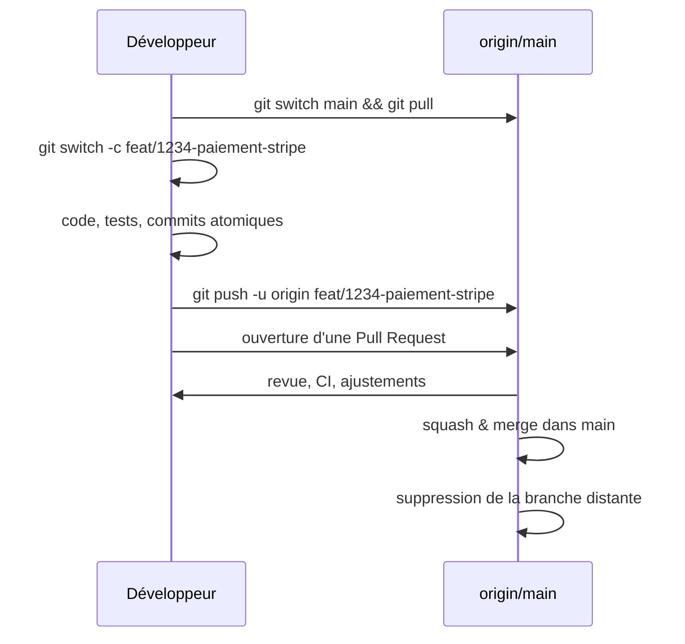

# [Tansoftware](https://www.tansoftware.com) - Bonnes pratiques Git [](README.md)

[](LICENSE) [](#) [](https://git-scm.com/) [](https://www.markdownguide.org/)

## Table des matières

* [Introduction](#introduction)
* [Messages de commit](#messages-de-commit)
* [Branches et stratégie de branchement](#branches-et-stratégie-de-branchement)
* [Gestion des conflits](#gestion-des-conflits)
* [Rebase ou merge ?](#rebase-ou-merge-)
* [Tags et versionnage](#tags-et-versionnage)
* [Squash](#squash)
* [Fichiers sensibles](#fichiers-sensibles)
* [Le fichier .gitignore](#le-fichier-gitignore)
* [Hooks Git](#hooks-git)
* [Pour aller plus loin](#pour-aller-plus-loin)

## Introduction

Ce dépôt rassemble les pratiques que l'on retient en équipe pour qu'un dépôt Git reste lisible, sûr et auditable. La référence canonique est le livre [Pro Git](https://git-scm.com/book/fr/v2) de Scott Chacon et Ben Straub, librement consultable.

> Conventions adoptées dans ce mémo : la branche d'intégration s'appelle `main` (renommage par défaut sur GitHub depuis 2020) ; les messages de commit suivent [Conventional Commits](https://www.conventionalcommits.org/fr/) ; les commandes sont exécutées dans un terminal compatible Bash.

[🔝 Retour en haut de page](#table-des-matières)

## Messages de commit

Un message de commit s'adresse au futur lecteur (vous, dans six mois) qui essaie de comprendre **pourquoi** une modification a été faite. La spécification [Conventional Commits](https://www.conventionalcommits.org/fr/) impose un format machine-lisible utile pour générer des changelogs et déclencher des releases sémantiques.

### Format

```text
<type>(<portée optionnelle>): <description impérative à la 1re ligne, 50 caractères max>

<corps optionnel : pourquoi, alternatives écartées, lien vers l'issue>

<pied optionnel : BREAKING CHANGE, Refs #123, Co-authored-by, etc.>
```

Types courants : `feat`, `fix`, `docs`, `refactor`, `test`, `perf`, `build`, `ci`, `chore`.

### À éviter

```text
update
fixed bug
WIP
.
asdf
mes modifs du vendredi
```

### À préférer

```text
feat(panier): autoriser les codes promo cumulables

Une étude utilisateur a montré que 18 % des paniers abandonnés sont liés
à l'impossibilité de cumuler une remise fidélité avec un code marketing.
Refs #482
```

```text
fix(auth): corriger la fuite mémoire sur l'expiration du token

Le timer n'était pas annulé quand l'utilisateur se déconnectait avant
expiration, ce qui retenait l'objet User en mémoire.
```

### Bonnes pratiques

| Règle | Pourquoi |
|-------|----------|
| Verbe à l'impératif (`ajoute`, `corrige`) | Cohérent avec le style des messages générés par Git (`Merge`, `Revert`). |
| 50 caractères pour le sujet, 72 pour le corps | Lisibilité dans `git log --oneline` et les outils tiers. |
| Un commit = un changement atomique | Permet `git revert` et `git bisect` ciblés. |
| Pas de point final sur le sujet | Convention partagée. |
| Référencer l'issue | Trace bidirectionnelle entre code et ticket. |

[🔝 Retour en haut de page](#table-des-matières)

## Branches et stratégie de branchement

Une branche isole un travail en cours du tronc stable. Trois grandes familles de stratégies :

| Stratégie | Quand l'utiliser |
|-----------|------------------|
| **Trunk-Based Development** | Équipe de quelques personnes, intégration continue stricte, releases fréquentes. Branches très courtes (< 1 jour). |
| **GitHub Flow** | La plupart des équipes produit. Une branche par fonctionnalité, fusionnée par PR dans `main`. |
| **Git Flow** (Vincent Driessen, 2010) | Logiciels avec plusieurs versions maintenues en parallèle. Utilise `develop`, `release/*`, `hotfix/*`. Souvent surdimensionné aujourd'hui. |

### Conventions de nommage

| Préfixe | Usage |
|---------|-------|
| `feat/` | Nouvelle fonctionnalité. |
| `fix/` | Correction de bug. |
| `hotfix/` | Correctif urgent en production. |
| `chore/` | Tâche d'outillage, build, dépendances. |
| `docs/` | Documentation. |
| `refactor/` | Réorganisation sans changement de comportement. |

Le nom inclut un identifiant de ticket lorsque possible : `feat/1234-paiement-stripe`.

### Cycle d'une branche feature



[🔝 Retour en haut de page](#table-des-matières)

## Gestion des conflits

Un conflit survient quand deux commits modifient la même portion d'un fichier sans ancêtre commun récent. Git ne décide pas à votre place ; il marque les zones concernées et attend une résolution manuelle.

### Anatomie d'un conflit

```text
<<<<<<< HEAD
const TVA = 0.20;
=======
const TVA = 0.21;
>>>>>>> feat/tva-belge
```

`HEAD` est votre version courante, l'autre est celle de la branche entrante. La résolution consiste à choisir, fusionner ou réécrire, puis supprimer les marqueurs.

### Résolution typique

```bash
git switch ma-branche
git fetch origin
git merge origin/main
# ... éditer les fichiers en conflit ...
git add <fichiers résolus>
git commit               # message pré-rempli par Git
```

### Bonnes pratiques

| Règle | Pourquoi |
|-------|----------|
| Synchroniser tôt et souvent (`git pull --rebase`) | Plus la branche dérive, plus le conflit est large. |
| Conflits par petits paquets | Trois conflits triviaux valent mieux qu'un conflit géant. |
| Demander à l'auteur de la modification entrante en cas de doute | Le but d'un conflit n'est pas de gagner, c'est de produire la bonne intention. |
| Tester immédiatement après résolution | Un fichier compile peut quand même être logiquement faux. |

[🔝 Retour en haut de page](#table-des-matières)

## Rebase ou merge ?

Les deux opérations intègrent les commits d'une branche dans une autre, mais ne produisent pas le même historique.

| Aspect | `git merge` | `git rebase` |
|--------|-------------|--------------|
| Historique | Préserve la topologie : un *commit de fusion* unit les deux branches. | Linéaire : les commits de la branche source sont **rejoués** au sommet de la cible. |
| Identifiants des commits | Inchangés. | Nouveaux SHA (les commits sont *réécrits*). |
| Lisibilité | Vrai au plus près de ce qui s'est passé. | Plus simple à parcourir avec `git log --oneline`. |
| Risque | Aucun. | À ne **jamais** utiliser sur des commits déjà partagés (`git push --force` requis ensuite). |

### Règle d'or

> Rebasez localement avant de pousser ; mergez après.

Concrètement : on rebase une branche feature sur `main` pour la garder propre, puis on fusionne via une Pull Request (souvent en *squash merge*).

### Exemple

```bash
# Mettre à jour ma branche feature avec les derniers commits de main
git switch feat/1234
git fetch origin
git rebase origin/main
# (résolution éventuelle des conflits)
git push --force-with-lease   # plus sûr que --force
```

`--force-with-lease` refuse le push si quelqu'un d'autre a publié sur la branche entre-temps.

### Quand préférer le merge

- Branche partagée entre plusieurs développeurs (réécrire ferait disparaître leurs commits).
- Préservation explicite de l'historique pour audit.
- Branches `release/*` ou `hotfix/*` que l'on veut tracer comme telles.

[🔝 Retour en haut de page](#table-des-matières)

## Tags et versionnage

Un tag est une étiquette pointant sur un commit. Il sert à marquer une version publiée afin de pouvoir la retrouver, la comparer ou la rejouer.

### Tags annotés vs légers

```bash
# Tag annoté (objet Git complet : auteur, date, message, signature)
git tag -a v1.4.0 -m "Release 1.4.0"

# Tag léger (simple alias de SHA)
git tag v1.4.0
```

Préférez **toujours** les tags annotés pour les releases publiques : ils portent une signature et un message, et `git describe` ne fonctionne correctement qu'avec eux.

### SemVer

[Semantic Versioning](https://semver.org/lang/fr/) impose le format `MAJEUR.MINEUR.CORRECTIF` :

| Incrément | Signal envoyé |
|-----------|---------------|
| `MAJEUR` (1.x.x → 2.0.0) | Rupture d'API publique. |
| `MINEUR` (1.4.x → 1.5.0) | Ajout rétrocompatible. |
| `CORRECTIF` (1.4.0 → 1.4.1) | Correction de bug rétrocompatible. |

```bash
git tag -a v2.0.0 -m "Release 2.0.0 — BREAKING: nouvelle API d'authentification"
git push origin v2.0.0          # un tag ne se pousse pas tout seul
```

[🔝 Retour en haut de page](#table-des-matières)

## Squash

Le *squash* fusionne plusieurs commits en un seul. Utile pour transformer une suite de commits exploratoires (« WIP », « fix typo », « ça marche enfin ») en un commit unique racontant proprement la fonctionnalité.

### Squash interactif local

```bash
git rebase -i origin/main
```

Dans l'éditeur, on remplace `pick` par `squash` (ou `s`) sur les commits à fondre dans le précédent :

```text
pick   3e1f7c2 feat(panier): squelette du panier
squash a91d3b4 wip
squash 7c8e0a1 corrige test cassé
squash f4b9d22 ajout du test e2e
```

Git propose ensuite de réécrire le message final.

### Squash à la fusion

La plupart des plateformes (GitHub, GitLab) offrent une option *Squash and merge* qui fait la même chose au moment d'intégrer la PR. Elle est généralement préférable parce qu'elle préserve les commits individuels sur la branche feature et n'écrit qu'un commit propre dans `main`.

### Quand ne pas squasher

- Branches partagées (réécrire l'historique commun perturbe les autres contributeurs).
- Travail composé d'étapes vraiment distinctes qui méritent chacune un `git revert` ou `git bisect` indépendant.

[🔝 Retour en haut de page](#table-des-matières)

## Fichiers sensibles

Mots de passe, clés d'API, certificats, fichiers `.env` : tout secret commité reste dans l'historique pour toujours, **même après suppression**. Une fois publié, considérez le secret comme compromis et faites-le tourner.

### Prévenir

| Pratique | Outils |
|----------|--------|
| `.gitignore` complet dès l'init du dépôt | [gitignore.io](https://www.toptal.com/developers/gitignore) |
| Gabarits sans valeurs (`.env.example`) | — |
| Hook `pre-commit` qui scanne les secrets | [gitleaks](https://github.com/gitleaks/gitleaks), [trufflehog](https://github.com/trufflesecurity/trufflehog) |
| Stockage dans un coffre | [Vault](https://www.vaultproject.io/), AWS Secrets Manager, 1Password |

### Réagir à une fuite

```bash
# 1. Faire tourner immédiatement le secret compromis (révocation, nouvelle clé)
# 2. Réécrire l'historique pour retirer le fichier
git filter-repo --path config/secrets.yml --invert-paths
# 3. Forcer le push (et prévenir l'équipe)
git push --force-with-lease --all
git push --force-with-lease --tags
```

`git filter-repo` ([documentation](https://github.com/newren/git-filter-repo)) remplace `git filter-branch`, désormais déprécié. Sur GitHub, demander aussi la purge du cache des forks.

[🔝 Retour en haut de page](#table-des-matières)

## Le fichier .gitignore

`.gitignore` indique à Git les fichiers et motifs à ne pas suivre : artefacts de build, dépendances installées, configuration locale d'IDE, fichiers binaires volumineux.

### Exemple PHP / Node minimal

```gitignore
# Dépendances
/vendor/
/node_modules/

# Variables d'environnement
.env
.env.local

# Builds
/dist/
/build/
*.log

# IDE / OS
.idea/
.vscode/
.DS_Store
Thumbs.db
```

### Pièges courants

| Symptôme | Cause | Solution |
|----------|-------|----------|
| Le fichier reste suivi malgré le `.gitignore` | Il a été commité avant l'ajout de la règle. | `git rm --cached <fichier>` puis recommit. |
| Une règle ne s'applique pas | Mauvais slash : `/build` (racine) vs `build/` (partout). | Tester avec `git check-ignore -v <fichier>`. |
| Trop de bruit dans le diff | Pas de gabarit central. | Démarrer depuis un modèle [gitignore.io](https://www.toptal.com/developers/gitignore). |

[🔝 Retour en haut de page](#table-des-matières)

## Hooks Git

Un *hook* est un script déclenché par un événement Git. Stocké dans `.git/hooks/`, il peut bloquer un commit, un push, une fusion. Les hooks sont **locaux** : ils ne sont pas propagés par `git clone`. Pour les partager dans une équipe, on utilise un gestionnaire dédié.

### Hooks usuels

| Hook | Déclenchement | Usage typique |
|------|---------------|---------------|
| `pre-commit` | Avant la création du commit | Linter, formateur, tests rapides, scan de secrets. |
| `commit-msg` | Après saisie du message | Vérifier la convention (Conventional Commits). |
| `pre-push` | Avant `git push` | Suite de tests complète. |
| `post-merge` | Après un `git merge` | Réinstaller les dépendances si `composer.lock` a changé. |

### Outils de partage en équipe

- [pre-commit](https://pre-commit.com/) (Python, multi-langage)
- [Husky](https://typicode.github.io/husky/) (JavaScript / Node)
- [Lefthook](https://github.com/evilmartians/lefthook) (binaire unique, multi-langage)

### Exemple `pre-commit` minimal

```bash
#!/usr/bin/env bash
# .git/hooks/pre-commit — rendre exécutable : chmod +x .git/hooks/pre-commit
set -e

if ! npm run lint --silent; then
    echo "Lint en échec — commit annulé." >&2
    exit 1
fi
```

[🔝 Retour en haut de page](#table-des-matières)

## Pour aller plus loin

- [Pro Git (livre officiel, gratuit)](https://git-scm.com/book/fr/v2)
- [Git documentation officielle](https://git-scm.com/doc)
- [Conventional Commits](https://www.conventionalcommits.org/fr/)
- [Atlassian Git Tutorials](https://www.atlassian.com/fr/git/tutorials)
- [Oh My Git! — apprendre Git en jouant](https://ohmygit.org/)
- [Learn Git Branching — exercices interactifs](https://learngitbranching.js.org/?locale=fr_FR)

## Licence

Distribué sous licence [MIT](LICENSE).

## Auteur

**Tansoftware - Tanguy Chénier** · [LinkedIn](https://www.linkedin.com/in/tanguy-chenier) · [Tan-Software](https://github.com/Tan-Software) · [Compte personnel (derniers outils)](https://github.com/tanguychenier) · [tansoftware.com](https://www.tansoftware.com)
