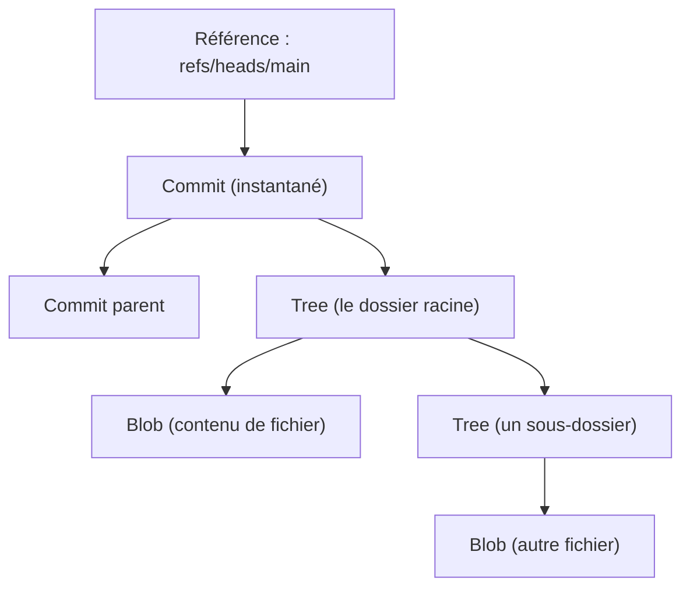

[↑ Sommaire](../README.md#table-des-matières) · [Commits et messages →](02-commits-et-messages.md)

# 1. Fondations et concepts

## Introduction

> **Que veut dire « Git » ?** Git est un logiciel qui enregistre l'historique de vos fichiers, un peu comme un appareil photo qui prendrait une photo de tout votre projet à chaque fois que vous le décidez. Vous pouvez revenir à n'importe quelle photo passée, comparer deux photos, ou travailler à plusieurs sans écraser le travail des autres. Le mot « Git » désigne le programme ; un « dépôt » (en anglais *repository*, souvent abrégé *repo*) est l'album qui contient toutes ces photos plus le code.

Git enregistre l'historique d'un projet pour qu'il reste lisible, sûr et vérifiable. La référence la plus complète est le livre [Pro Git](https://git-scm.com/book/fr/v2) de Scott Chacon et Ben Straub, gratuit en ligne.

Chaque notion technique est expliquée à sa première apparition, dans un encadré dédié, avec une comparaison du quotidien, puis approfondie dans la section correspondante. Les exemples sont donnés en Bash, un langage de commandes pour piloter l'ordinateur en tapant du texte. Ils fonctionnent à l'identique dans Git Bash sous Windows, dans WSL (la couche Linux intégrée à Windows) et dans un terminal macOS ou Linux.

> **Que veut dire « Bash » ?** Bash est un interpréteur de commandes : un programme dans lequel vous tapez une instruction (par exemple `git status`), vous appuyez sur Entrée, et l'ordinateur l'exécute. C'est comme dicter des ordres courts à un assistant qui les exécute immédiatement, au lieu de cliquer dans des menus.

Conventions retenues dans tout le document : la branche principale d'intégration (la ligne de référence du projet) s'appelle `main`, qui est le nom par défaut sur GitHub depuis 2020. Les messages de commit suivent [Conventional Commits](https://www.conventionalcommits.org/fr/), une norme d'écriture détaillée plus bas. Les commandes s'exécutent dans un terminal compatible Bash. On suppose un dépôt distant (la copie de référence hébergée sur un serveur) nommé `origin`.

[Retour en haut de page](#table-des-matières)

## Glossaire express

Ce vocabulaire revient dans tout le document. Les sections suivantes l'approfondissent.

> **Que veut dire « SHA » ?** SHA (prononcé « cha ») veut dire *Secure Hash Algorithm*, c'est-à-dire « algorithme de hachage sécurisé ». Concrètement, c'est une fonction qui transforme un contenu (un fichier, un commit) en une longue empreinte unique de chiffres et de lettres, par exemple `3e1f7c2a91d3b4...`. C'est comme une empreinte digitale : deux contenus différents donnent deux empreintes différentes, et la même empreinte garantit le même contenu. Git utilise ces empreintes pour nommer et retrouver chaque élément sans ambiguïté.

| Terme | Définition courte |
|-------|-------------------|
| **Commit** | Instantané (snapshot) de l'arborescence du projet à un instant donné, accompagné d'un message, d'un auteur et d'un identifiant SHA-1 (ou SHA-256). |
| **Branche** | Pointeur mobile vers un commit. Avancer une branche, c'est déplacer ce pointeur. |
| **HEAD** | Pointeur spécial désignant l'endroit où Git écrira le prochain commit (généralement la branche courante). |
| **Fast-forward** | Type de fusion où la branche cible n'a pas divergé : Git se contente d'avancer le pointeur, sans créer de commit de fusion. |
| **Merge (fusion)** | Intégration d'une branche dans une autre, créant un commit de fusion à deux parents lorsque les branches ont divergé. |
| **Three-way merge** | Algorithme de fusion à trois points : la base commune (ancêtre), la branche A et la branche B. |
| **Rebase** | Réécriture de l'historique consistant à rejouer les commits d'une branche au sommet d'une autre. Produit de nouveaux SHA. |
| **Squash** | Fusion de plusieurs commits en un seul, généralement à la fin d'une fonctionnalité. |
| **Cherry-pick** | Réapplication d'un commit isolé sur une autre branche. |
| **Bisect** | Recherche dichotomique automatisée du commit qui a introduit une régression. |
| **Stash** | Pile de modifications temporairement mises de côté pour libérer le répertoire de travail. |
| **Reflog** | Journal local des mouvements de `HEAD` et des branches ; permet de retrouver des commits qui ne sont plus référencés par aucune branche. |
| **Dangling commit** | Commit orphelin, plus pointé par aucune branche ni aucun tag, en sursis avant garbage collection. |
| **Hook** | Script déclenché automatiquement par un événement Git (avant commit, avant push, etc.). |
| **`.gitignore`** | Fichier listant les motifs de chemins à ne pas suivre dans Git. |
| **`.gitattributes`** | Fichier qui attache des attributs aux chemins (fins de ligne, diff personnalisé, fichiers binaires, LFS). |
| **Commit signé** | Commit accompagné d'une signature cryptographique GPG, SSH ou S/MIME prouvant l'identité de l'auteur. |
| **Tag** | Étiquette pointant sur un commit, immuable par convention, qui matérialise une version. |
| **Pull Request (PR) / Merge Request (MR)** | Demande d'intégration d'une branche dans une autre, support de la revue de code. |

[Retour en haut de page](#table-des-matières)

## Modèle mental : ce que Git stocke réellement

Comprendre comment Git range les données évite la majorité des malentendus. Git ne stocke pas seulement les différences entre versions (les « delta », c'est-à-dire les écarts d'une version à l'autre). Il stocke une base d'objets, chacun désigné par son empreinte SHA. Par défaut cette empreinte est calculée avec SHA-1 ; les dépôts récents peuvent utiliser SHA-256, plus robuste.

Quatre types d'objets composent cette base :

| Objet | Rôle |
|-------|------|
| **Blob** | Contenu d'un fichier (sans nom ni chemin). |
| **Tree** | Répertoire : table associant des noms à des blobs ou à d'autres trees. |
| **Commit** | Pointeur vers un tree (l'instantané), un ou plusieurs commits parents, un auteur, un committer (la personne qui valide l'enregistrement), une date, un message. |
| **Tag annoté** | Pointeur signé vers un commit, avec auteur, date et message. |

> **Que veut dire « blob » et « tree » ?** Un *blob* (de l'anglais *Binary Large OBject*, « gros objet binaire ») est juste le contenu d'un fichier, sans son nom : imaginez le texte d'une page arraché de son classeur, sans intercalaire. Un *tree* (« arbre ») joue le rôle d'un dossier : il dit « dans ce dossier, il y a un fichier nommé X dont le contenu est tel blob, et un sous-dossier Y qui est tel autre tree ». L'ensemble forme une arborescence, comme l'explorateur de fichiers de votre ordinateur.

À côté des objets, des *références* (en abrégé *refs*) servent de poignées lisibles par un humain, car personne ne veut retenir une empreinte de 40 caractères : `refs/heads/main` (une branche), `refs/tags/v1.0.0` (un tag), `refs/remotes/origin/main` (la dernière position connue d'une branche sur le serveur distant).



Conséquences pratiques :

- Une branche est *bon marché* : un fichier de 41 octets contenant un SHA.
- Un commit n'efface jamais les précédents ; il en ajoute un nouveau qui pointe vers eux.
- Tant qu'une référence (branche, tag, reflog, stash) garde un commit accessible, ses données ne disparaissent pas, même après un `reset` agressif.

[Retour en haut de page](#table-des-matières)

## Configuration initiale

Bien régler Git au départ évite des heures de débogage : fins de ligne incohérentes, commits attribués à la mauvaise personne, récupérations de code qui tournent mal. Les commandes ci-dessous écrivent ces réglages une fois pour toutes.

> **Que veut dire « `--global` » ?** L'option `--global` applique le réglage à votre compte sur la machine, pour tous vos projets, et pas seulement au dépôt courant. C'est comme régler la langue de votre téléphone une fois, plutôt que dans chaque application. Sans `--global`, le réglage ne vaut que pour le dépôt dans lequel vous êtes.

```bash
# Identité (obligatoire pour tout commit)
git config --global user.name  "Prénom Nom"
git config --global user.email "prenom.nom@example.com"

# Branche par défaut sur les nouveaux dépôts
git config --global init.defaultBranch main

# Pull = rebase par défaut (évite les commits de fusion parasites sur main)
git config --global pull.rebase true

# Push = pousse seulement la branche courante
git config --global push.default current

# Garde-fou contre les force-push catastrophiques
git config --global push.useForceIfIncludes true

# Détection automatique des renommages dans les diffs
git config --global diff.renames copies

# Couleurs et UTF-8 dans les logs
git config --global core.quotepath false
git config --global color.ui auto

# Cache d'authentification HTTPS (15 minutes par défaut)
git config --global credential.helper cache
```

Sous Windows, ajouter :

```bash
git config --global core.autocrlf true
```

Sous macOS / Linux :

```bash
git config --global core.autocrlf input
```

Voir aussi la section [.gitattributes](#le-fichier-gitattributes) pour aller au-delà de `core.autocrlf`.

[Retour en haut de page](#table-des-matières)

---

[↑ Sommaire](../README.md#table-des-matières) · [Commits et messages →](02-commits-et-messages.md)
