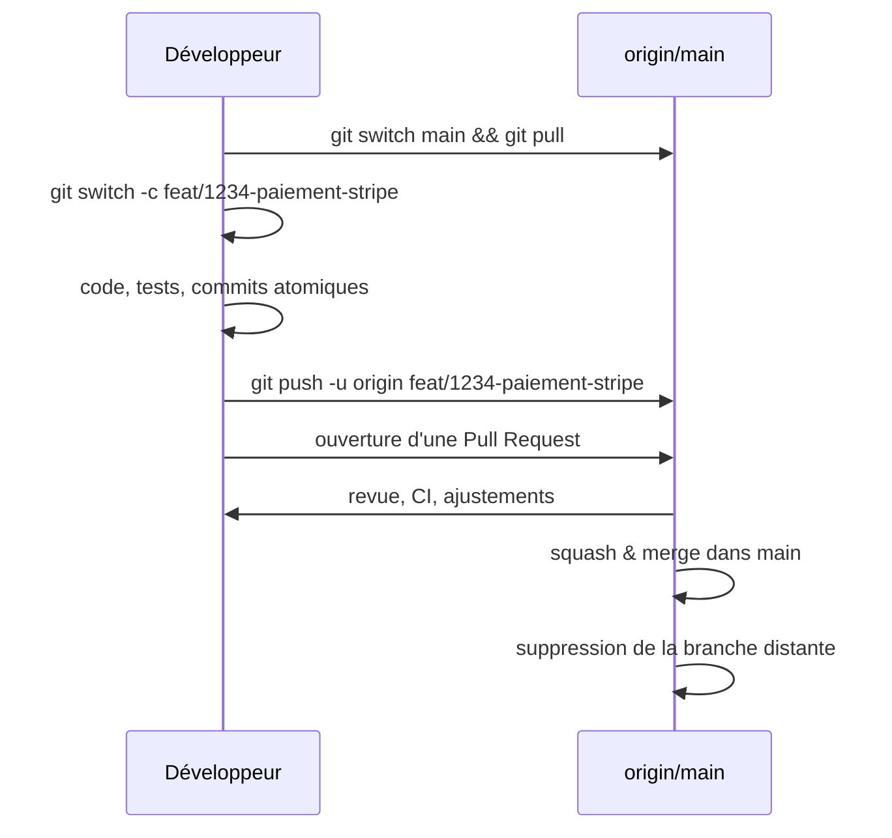
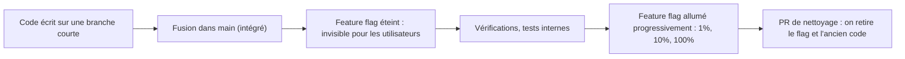
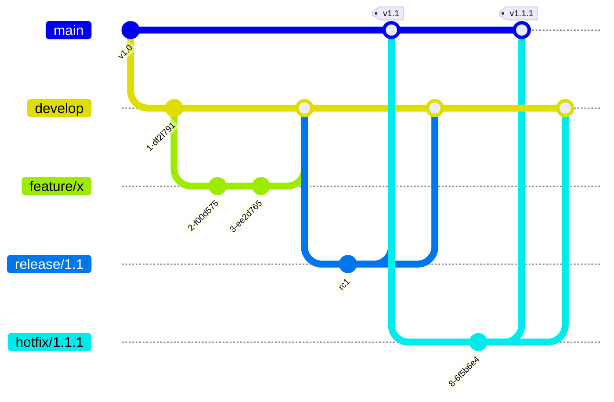

[← Commits et messages](02-commits-et-messages.md) · [↑ Sommaire](../README.md#table-des-matières) · [Intégration : fusion, conflits et revue par couches →](04-integration-fusion-conflits-et-revue-par-couches.md)

# 3. Branches et stratégies de workflow

## Branches et stratégie de branchement

> **Que veut dire « branche » ?** Une branche est un pointeur mobile vers un commit, autrement dit une étiquette qui dit « le travail en cours est ici ». Ce n'est ni une copie ni un double du projet : c'est presque gratuit. Imaginez un marque-page que vous déplacez de page en page dans un livre ; la branche est ce marque-page, et avancer la branche, c'est simplement le glisser sur la photo suivante. Travailler sur une branche permet d'expérimenter sans toucher à la version de référence.

Une branche isole un travail en cours du tronc stable (la branche `main`, considérée comme fiable). Trois grandes familles de stratégies se partagent les équipes.

### Comparatif des stratégies

> **Que veut dire « feature flag » ?** Un *feature flag* (« interrupteur de fonctionnalité ») est un interrupteur dans le code qui permet d'activer ou de désactiver une fonctionnalité sans toucher au code lui-même. On peut ainsi livrer du code inachevé tout en le laissant éteint pour les utilisateurs, puis l'allumer le jour voulu, comme un magasin qui installe un rayon mais le garde fermé derrière un rideau jusqu'à l'inauguration.

> **Que veut dire « SaaS » ?** SaaS veut dire *Software as a Service*, « logiciel en tant que service ». C'est un logiciel utilisé via Internet, mis à jour par l'éditeur sans que l'utilisateur installe quoi que ce soit (Gmail, Slack, Notion). À l'opposé d'un logiciel installé sur le poste du client, dont plusieurs versions cohabitent dans la nature.

| Critère | Trunk-Based Development | GitHub Flow | Git Flow (Driessen, 2010) |
|---------|------------------------|-------------|---------------------------|
| Branches longues | Non (< 1 jour, idéalement quelques heures) | Courtes (jusqu'à quelques jours) | Oui (`develop`, `release/*`, `hotfix/*`) |
| Branche d'intégration | `main` (toujours déployable) | `main` | `develop` (intégration), `main` (production) |
| Releases | Continues, plusieurs fois par jour | À la demande, après merge dans `main` | Versionnées, planifiées |
| Feature flags | Indispensables | Optionnels | Optionnels |
| Cible idéale | SaaS en livraison continue, équipe mature avec CI rapide | La plupart des produits web et open source | Logiciels installés chez le client, plusieurs versions maintenues en parallèle |
| Coût mental | Faible si CI fiable | Très faible | Élevé (cinq types de branches à orchestrer) |
| Réputation actuelle | Recommandé par la majorité des praticiens DevOps modernes | Standard de fait sur GitHub / GitLab | Souvent surdimensionné ; à réserver aux contextes qui en ont vraiment besoin |

Pour un projet neuf, le choix par défaut raisonnable est **GitHub Flow**, avec une dérive progressive vers **Trunk-Based** à mesure que la couverture de tests et la CI mûrissent. **Git Flow** ne se justifie que si l'on maintient simultanément plusieurs versions livrées chez des clients différents (logiciel embarqué, ERP installé, SDK avec longue compatibilité descendante). Sur un SaaS déployé en continu, GitFlow est presque toujours un fardeau de cérémonie qui ralentit les itérations.

### Critère de décision rapide

| Question | Réponse oui → stratégie suggérée |
|----------|----------------------------------|
| « Déployez-vous plusieurs fois par jour ? » | Trunk-Based |
| « Avez-vous une couverture de tests automatisés > 70 % ? » | Trunk-Based ou GitHub Flow |
| « Un nouveau venu peut-il déployer en production le premier jour ? » | Trunk-Based avec feature flags |
| « Maintenez-vous v3.x, v4.x et v5.x en production simultanément chez différents clients ? » | Git Flow avec branches `release/*` |
| « Travaillez-vous principalement en open source via PR de contributeurs externes ? » | GitHub Flow (forks + PR) |
| « Les développeurs et les ops sont-ils dans la même équipe ? » | Trunk-Based ou GitHub Flow |
| « Avez-vous besoin de geler une version pendant qu'une autre continue ? » | Git Flow ou Trunk-Based + branches de release ponctuelles |

### Conventions de nommage

| Préfixe | Usage |
|---------|-------|
| `feat/` | Nouvelle fonctionnalité. |
| `fix/` | Correction de bug. |
| `hotfix/` | Correctif urgent en production. |
| `chore/` | Tâche d'outillage, build, dépendances. |
| `docs/` | Documentation. |
| `refactor/` | Réorganisation sans changement de comportement. |
| `release/` | Préparation d'une version (gel des fonctionnalités, derniers fixes). |
| `experiment/` ou `spike/` | Exploration sans engagement de merge. |

Le nom inclut un identifiant de ticket lorsque possible : `feat/1234-paiement-stripe`. Pas d'accents, pas d'espaces, pas de majuscules : minuscules et tirets uniquement.

### Cycle d'une branche feature

> **Que veut dire « Pull Request » (PR) ?** Une *Pull Request* (« demande de tirage », parfois *Merge Request* sur GitLab) est une demande officielle d'intégrer votre branche dans la branche principale. Elle ouvre un espace de discussion où des collègues relisent le code, commentent et approuvent avant la fusion. C'est l'équivalent de soumettre un texte à un comité de relecture avant publication, plutôt que de le publier directement.

> **Que veut dire « feature » et « hotfix » ?** Une *feature* (« fonctionnalité ») est un nouvel élément utile pour l'utilisateur. Un *hotfix* (« correctif à chaud ») est une correction urgente appliquée directement à la version en production parce qu'un problème grave est en cours, comme un pansement posé en urgence sans attendre la prochaine visite médicale.



### Hygiène des branches

- Supprimer la branche distante après merge (case « Delete branch » sur GitHub, automatisable).
- Nettoyer les branches locales obsolètes : `git fetch --prune`, puis `git branch -vv` pour repérer celles dont l'amont a disparu.
- Protéger `main` côté plateforme : interdiction de force-push, exigence de revue, exigence de CI verte, signatures requises pour les commits si l'équipe les utilise.

[Retour en haut de page](#table-des-matières)

## Trunk-Based Development : le standard moderne

> **Que veut dire « Trunk-Based Development » (TBD) ?** *Trunk-Based Development* veut dire « développement basé sur le tronc ». C'est une façon de travailler où tout le monde intègre son code sur une seule branche commune (`main`, le « tronc » de l'arbre), au moins une fois par jour. Pour que ce soit possible sans tout casser, on s'appuie sur l'intégration continue, des tests automatisés et des feature flags. L'image : au lieu que chacun bricole longtemps dans son atelier isolé, tout le monde rapporte ses pièces sur l'établi commun chaque jour, et un contrôle automatique vérifie que rien ne casse.

TBD est aujourd'hui le modèle dominant dans les organisations qui livrent en continu : Google (depuis l'origine, sur un monorepo de plusieurs milliards de lignes), Meta, Netflix, Spotify, Stripe, Shopify. Ce n'est pas une mode : le rapport [State of DevOps](https://cloud.google.com/devops/state-of-devops) (Google et DORA) associe régulièrement TBD à de meilleurs indicateurs de performance (fréquence de déploiement, lead time, taux d'échec, MTTR).

> **Que veut dire « DevOps », « DORA », « lead time » et « MTTR » ?** *DevOps* est la contraction de *Development* (développement) et *Operations* (exploitation) : une culture où ceux qui écrivent le code et ceux qui le font tourner en production travaillent ensemble plutôt qu'en silos séparés. *DORA* (*DevOps Research and Assessment*) est l'équipe de recherche qui mesure ces pratiques. Le *lead time* est le délai entre « le code est écrit » et « il est en production ». Le *MTTR* (*Mean Time To Recovery*, « temps moyen de rétablissement ») est le temps qu'il faut pour réparer après une panne. Plus ces deux durées sont courtes, plus l'équipe est réactive.

### Principes de base

| Principe | Pratique concrète |
|----------|-------------------|
| **Une seule branche d'intégration** | `main`, toujours déployable. Pas de `develop`, pas de `release/*` permanente. |
| **Branches de très courte durée** | Idéalement quelques heures, au pire un ou deux jours. Si une branche dure une semaine, c'est qu'elle est trop grosse. |
| **Intégration au moins quotidienne** | Chaque développeur merge ou rebase sur `main` au minimum une fois par jour. |
| **Feature flags pour le travail incomplet** | Le code d'une fonctionnalité non terminée est merge en `main` mais désactivé via un flag, pas isolé sur une branche longue. |
| **CI rapide et fiable** | < 10 minutes pour la suite principale. Au-delà, les développeurs cessent de la respecter. |
| **Build vert = priorité absolue** | Casser `main` est l'équivalent d'une alarme incendie. Tout le monde s'arrête pour rétablir le tronc. |

### Feature flags : le pivot de TBD

Sans feature flags, TBD est impossible : on ne peut pas fusionner du code à moitié écrit sans risquer de casser la version visible. Avec un feature flag, on sépare deux choses qui n'ont aucune raison d'être liées : *intégrer* le code (le mettre dans `main`) et *l'activer en production* (le rendre visible aux utilisateurs).



```javascript
// Pseudo-code : la feature est merge mais désactivée
if (featureFlags.isEnabled('panier_v2', user)) {
    return renderPanierV2();
}
return renderPanierV1();
```

Une fois la fonctionnalité prête et testée, on bascule le flag à `true` (déploiement progressif possible : 1 % des utilisateurs, puis 10 %, puis 100 %). Une fois stable et adoptée, le code de l'ancienne version et la condition sont retirés dans une PR de nettoyage.

Outils : [LaunchDarkly](https://launchdarkly.com/), [Unleash](https://www.getunleash.io/), [Flagsmith](https://www.flagsmith.com/), [GrowthBook](https://www.growthbook.io/), ou un simple système maison basé sur une table de configuration.

### TBD vs GitHub Flow : la frontière floue

GitHub Flow et TBD partagent la même architecture de branches (un tronc, des branches courtes, intégration via PR). La différence porte sur le **rythme** et l'**outillage** :

| Critère | GitHub Flow standard | Trunk-Based Development |
|---------|---------------------|-------------------------|
| Durée de vie d'une branche | Quelques jours à une semaine | Quelques heures à un jour |
| Fréquence d'intégration sur `main` | Plusieurs par semaine | Au moins une par jour et par développeur |
| Feature flags | Optionnels | Indispensables |
| Couverture de tests minimum | Recommandée | Critique (≥ 70-80 %) |
| Déploiement | À la demande | Continu, plusieurs fois par jour |

Beaucoup d'équipes commencent en GitHub Flow et glissent vers TBD au fil du temps : la frontière n'est pas un saut brutal, c'est un curseur sur la durée de vie acceptable d'une branche.

### Quand TBD est mal adapté

- **CI lente ou instable** : si la suite de tests prend 45 minutes ou échoue 30 % du temps pour des raisons aléatoires, TBD multiplie les frictions.
- **Couverture de tests faible** : sans filet automatisé, la pression d'intégration quotidienne se transforme en pression sur des testeurs manuels.
- **Régulations exigeant des phases de validation explicites** : domaines bancaires, médicaux ou avioniques, où une branche `release/*` matérialise un gel formel.
- **Équipe encore en apprentissage de l'écriture de tests** : TBD demande une maturité technique qui se construit. Y aller trop tôt produit du code merge en `main` mais cassé.

### Mise en place progressive

1. **Mois 1-2** : raccourcir les branches existantes. Refuser celles qui dépassent une semaine.
2. **Mois 2-4** : améliorer la CI (parallélisation, mocks, suite rapide < 10 min).
3. **Mois 4-6** : introduire un système de feature flags, même simple.
4. **Mois 6-12** : passer à l'intégration quotidienne, avec rétrospective hebdomadaire sur les frictions résiduelles.

Voir [trunkbaseddevelopment.com](https://trunkbaseddevelopment.com/) pour une référence détaillée et illustrée par Paul Hammant.

[Retour en haut de page](#table-des-matières)

## GitFlow : utile, mais souvent surdimensionné

> **Que veut dire « Git Flow » ?** Git Flow est un modèle d'organisation des branches publié par Vincent Driessen en 2010 (« A successful Git branching model »). Il repose sur cinq types de branches aux rôles précis : `main` (la version en production), `develop` (l'intégration du travail en cours), `feature/*` (les fonctionnalités), `release/*` (la préparation d'une version) et `hotfix/*` (les correctifs urgents). C'est comme une usine avec cinq ateliers spécialisés : très structuré, mais lourd si l'usine ne produit qu'un seul article à la fois.

Git Flow a été pendant une décennie le modèle de référence enseigné dans les écoles et les tutoriels. Il a influencé toute une génération de développeurs. Mais en 2020, son auteur lui-même a publié [une note rétrospective](https://nvie.com/posts/a-successful-git-branching-model/) précisant que ce modèle a été conçu pour des **logiciels versionnés livrés explicitement**, et qu'il n'est **pas adapté aux applications web déployées en continu** :

> « Git flow was originally designed in 2010 […] for software that is explicitly versioned, or where multiple versions of the software are supported in the wild. […] If your team is doing continuous delivery of software, I would suggest to adopt a much simpler workflow (like GitHub flow) instead. »

### Quand Git Flow est *adapté*

| Contexte | Pourquoi |
|----------|----------|
| Logiciel installé chez le client (ERP, CAO, SDK) | Plusieurs versions cohabitent en production. Une branche `release/3.x` existe pour patcher la 3.x pendant que la 4.x se prépare sur `develop`. |
| Bibliothèque avec compatibilité descendante longue | Les utilisateurs n'upgradent pas à chaque release ; il faut maintenir plusieurs lignes de version. |
| Logiciel embarqué ou avionique | Validations longues, certifications, gel explicite avant livraison. |
| Équipe avec un cycle de release planifié (mensuel, trimestriel) | Les branches `release/*` matérialisent les phases de stabilisation. |

### Quand Git Flow est *un fardeau*

| Contexte | Symptôme typique |
|----------|------------------|
| SaaS web déployé en continu | `develop` s'éloigne progressivement de `main` ; les merges deviennent douloureux ; personne ne sait laquelle des deux est « la vérité ». |
| Application mobile à déploiement OTA (*Over The Air*, mise à jour automatique « par les airs », sans câble) | Les `release/*` n'ont pas de sens : la version courante remplace la précédente. |
| Petite équipe (< 5 développeurs) | Le coût mental des cinq types de branches dépasse leur bénéfice. |
| Pas de hotfixes fréquents en production | La branche `hotfix/*` reste vide et déroute les nouveaux arrivants. |

### Schéma classique



Notez la complexité : pour un seul cycle de release avec un hotfix, on traverse cinq branches et six merges. Multiplié par dix releases par an, l'effort cumulé devient considérable.

### Si vous héritez d'un dépôt Git Flow

- Documentez très clairement quelle branche est la « source de vérité » (presque toujours `main`).
- Automatisez les merges symétriques (`release/*` → `main` et `release/*` → `develop`) pour éviter l'oubli.
- Posez la question, avec rétrospective et données : avons-nous *besoin* de Git Flow, ou est-ce un héritage culturel ? Une migration vers GitHub Flow ou TBD est souvent payante après six à douze mois de stabilisation.

[Retour en haut de page](#table-des-matières)

## Forks vs branches partagées

> **Que veut dire « fork » ?** Un *fork* (« fourche », au sens de bifurcation) est une copie complète d'un dépôt placée sur votre propre compte, qui garde un lien vers le dépôt d'origine. Cela vous laisse expérimenter librement chez vous, puis proposer vos changements au projet d'origine. L'image : photocopier un livre entier pour annoter votre exemplaire, sans droit d'écrire dans l'original, puis soumettre vos annotations à l'auteur.

> **Que veut dire « open source » ?** Un logiciel *open source* (« code source ouvert ») est un logiciel dont le code est public, que chacun peut lire, modifier et redistribuer selon une licence. N'importe qui peut donc proposer une amélioration, ce qui explique l'usage massif des forks dans ce monde.

Le choix entre *fork* et *branche dans le dépôt principal* dépend surtout de la gouvernance du projet (qui a le droit d'écrire où).

### Modèle « fork » (open source, contributions externes)

> **Que veut dire « remote », « origin » et « upstream » ?** Un *remote* (« dépôt distant ») est une copie du dépôt hébergée ailleurs, sur un serveur. Quand vous clonez un projet, Git appelle `origin` ce serveur de départ par convention. Dans un fork, on ajoute en plus un remote nommé `upstream` (« en amont ») qui pointe vers le projet d'origine, afin de récupérer ses nouveautés. Pensez à `origin` comme votre boîte aux lettres et à `upstream` comme la maison mère dont vous suivez les annonces.

C'est le modèle standard sur GitHub pour les projets open source. Un contributeur extérieur n'a pas le droit d'écrire dans le dépôt principal, il doit donc :

1. Forker le dépôt sur son propre compte.
2. Créer une branche dans son fork.
3. Pousser ses commits sur son fork.
4. Ouvrir une PR depuis `son-compte:feat/x` vers `upstream:main`.

```bash
# Cloner son fork
git clone git@github.com:moi/projet.git
cd projet

# Ajouter le dépôt amont en remote
git remote add upstream git@github.com:org/projet.git

# Mettre à jour son fork à partir de l'amont
git fetch upstream
git switch main
git rebase upstream/main
git push origin main

# Préparer une contribution
git switch -c feat/ma-contribution
# ... travail, commits ...
git push origin feat/ma-contribution
# Puis ouvrir la PR sur GitHub depuis le fork
```

Avantages :

- Sécurité : les contributeurs externes ne peuvent rien casser dans le dépôt principal.
- Pas besoin d'accorder un accès en écriture à des inconnus.
- Le contributeur a un dépôt complet à lui, peut expérimenter librement.
- Compatible avec une politique de signature DCO (*Developer Certificate of Origin*, « certificat d'origine du développeur » : une ligne ajoutée au commit qui atteste que vous avez le droit de contribuer ce code) ou de CLA (*Contributor License Agreement*, « accord de licence du contributeur » : un contrat précisant les droits cédés au projet).

Inconvénients :

- Synchronisation manuelle : un fork laissé sans entretien diverge.
- Les CI complexes (avec *secrets*, c'est-à-dire des mots de passe ou clés que la CI utilise) ne tournent pas toujours sur les PR venant d'un fork : par défaut, GitHub Actions cache ces secrets aux contributeurs externes, pour éviter qu'un inconnu ne les vole.
- Légèrement plus lourd à expliquer aux nouveaux contributeurs.

### Modèle « branches partagées » (équipe interne)

Pour une équipe interne de confiance (employés, prestataires sous contrat), créer les branches directement dans le dépôt principal est généralement plus pratique :

- Pas de synchronisation à entretenir.
- La CI a accès à tous les secrets.
- Les outils de revue (suggestions, batch comments, push directs sur la PR) fonctionnent au mieux.
- Les statistiques d'équipe (vélocité, MTTR) sont consolidées dans un seul lieu.

L'accès en écriture est restreint par les protections de branche : on ne peut pas pousser directement sur `main`, on doit passer par PR.

### Comparatif

| Critère | Forks | Branches partagées |
|---------|-------|---------------------|
| Public cible | OSS, contributeurs externes, hackathons | Équipes internes |
| Sécurité | Forte (pas d'accès en écriture amont) | Repose sur les ACL (*Access Control Lists*, « listes de contrôle d'accès » : les droits qui disent qui peut faire quoi) et les protections de branche |
| Friction quotidienne | Moyenne (synchronisation à gérer) | Faible |
| CI sur PR | Restreinte sur les forks (secrets cachés par défaut) | Pleine |
| Découvrabilité | Toutes les PR sont au même endroit (côté GitHub) | Idem |

### Cas hybride : forks internes

Certaines grandes organisations utilisent des forks internes (dans la même organisation GitHub) pour isoler le travail des équipes : la sécurité reste forte, et chaque équipe travaille dans son périmètre. C'est une voie intermédiaire pertinente pour les organisations de plus de 100 développeurs.

[Retour en haut de page](#table-des-matières)

## Monorepo vs polyrepo

> **Que veut dire « monorepo » ?** Un *monorepo* (« mono-dépôt ») est un seul dépôt Git qui regroupe tout le code d'une organisation : toutes les applications, bibliothèques, outils et fichiers d'infrastructure au même endroit. C'est la grande bibliothèque centrale où tous les livres sont rangés sur les mêmes étagères. Google, Meta et Microsoft (pour Windows) fonctionnent ainsi.
>
> **Que veut dire « polyrepo » ?** Un *polyrepo* (« multi-dépôts ») est l'inverse : chaque service, bibliothèque ou application vit dans son propre dépôt Git, avec sa version et son déploiement à lui. Ce sont autant de petites bibliothèques de quartier, chacune autonome.

Le débat est aussi vieux que les organisations de plus d'une dizaine de développeurs. Aucun des deux modèles n'est supérieur dans l'absolu : chacun déplace les difficultés plutôt que de les faire disparaître.

### Comparatif

> **Que veut dire « CI/CD » ?** On a vu *CI* (intégration continue). *CD* veut dire *Continuous Delivery/Deployment*, « livraison ou déploiement continu » : prolonger l'automatisation jusqu'à la mise en production, pour qu'un code validé parte chez les utilisateurs sans étape manuelle. CI vérifie, CD livre.

> **Que veut dire « refactoring » ?** Un *refactoring* (« remaniement ») consiste à réorganiser le code pour le rendre plus clair ou plus simple, sans changer ce qu'il fait pour l'utilisateur. C'est comme ranger une cuisine : les plats sortis restent les mêmes, mais on retrouve les ustensiles plus vite.

| Critère | Monorepo | Polyrepo |
|---------|----------|----------|
| Refactoring transverse (renommer une API utilisée partout) | Trivial : un seul commit atomique. | Pénible : N PRs coordonnées dans N dépôts, plus la gestion des versions. |
| Découverte de code | Navigation et recherche unifiées. | Multi-dépôts, multi-IDE, fragmenté. |
| CI / CD | Outils sophistiqués nécessaires (Bazel, Nx, Turborepo) pour ne builder que ce qui change. | CI standard par dépôt, plus simple à mettre en place. |
| Permissions par module | Difficile (Git ne sait pas restreindre un sous-répertoire ; le fichier CODEOWNERS, qui désigne des responsables par dossier, n'y répond qu'en partie). | Native (un dépôt = un ensemble de droits). |
| Charge sur Git | Croissante avec la taille (10+ Go, 100k+ fichiers). Demande LFS, partial clone, sparse checkout. | Faible : chaque dépôt reste de taille raisonnable. |
| Couplage entre composants | Tendance à se renforcer (« on est ensemble dans le repo »). | Plus distant, force les contrats d'interface. |
| Versionnement | Une seule version, partagée. | Chaque dépôt a sa propre version (et ses propres tags). |
| Onboarding | Un clone, tout est là. | Doit cloner et configurer N dépôts. |

### Quand choisir un monorepo

- L'équipe partage beaucoup de code (composants UI, modèles métier, types).
- Les refactorings transverses sont fréquents.
- Une infrastructure CI mature peut être investie (caching distribué, builds incrémentaux, mécanismes de release par dossier).
- L'organisation est petite à moyenne (jusqu'à quelques centaines de développeurs), ou très grande avec des moyens dédiés.

### Quand choisir un polyrepo

- Les composants ont des cycles de vie indépendants (un SDK public, une lib interne, un service legacy).
- Les équipes sont autonomes, avec peu d'interdépendances.
- Pas de budget pour investir dans l'outillage monorepo.
- Besoin fort d'isoler les permissions (clients sous NDA, code propriétaire vs OSS).

### Outillage monorepo

| Outil | Écosystème | Force |
|-------|-----------|-------|
| [Bazel](https://bazel.build/) | Multi-langages | Reproductibilité totale, caching distribué, mais courbe d'apprentissage raide. |
| [Nx](https://nx.dev/) | JS / TS principalement | Génération de projets, graphe de dépendances, intégration IDE. |
| [Turborepo](https://turbo.build/repo) | JS / TS | Léger, rapide, caching distribué. |
| [Pants](https://www.pantsbuild.org/) | Multi-langages | Rust + Python, alternative à Bazel. |
| [Lerna](https://lerna.js.org/) | JS / TS (publication de packages) | Plus ancien, complémentaire à Turborepo / Nx. |

### Cas intermédiaire : « metarepo »

Un dépôt parent référence plusieurs sous-dépôts via *git submodules* ou *git subtree*.

> **Que veut dire « submodule », « subtree » et « vendoring » ?** Un *submodule* (« sous-module ») est un dépôt Git imbriqué dans un autre, dont seul un pointeur de version est enregistré dans le parent. Un *subtree* (« sous-arbre ») copie carrément le code d'un autre dépôt dans un sous-dossier du vôtre. Le *vendoring* est le fait de copier une dépendance externe directement dans votre dépôt pour la figer et la maîtriser, au lieu de la télécharger à chaque fois.

C'est rarement satisfaisant : les submodules ont une réputation mitigée (synchronisation fastidieuse, états détachés, expérience déroutante). À réserver à des cas très précis (vendoring d'une dépendance que vous avez modifiée, projet client avec livrables figés).

[Retour en haut de page](#table-des-matières)

---

[← Commits et messages](02-commits-et-messages.md) · [↑ Sommaire](../README.md#table-des-matières) · [Intégration : fusion, conflits et revue par couches →](04-integration-fusion-conflits-et-revue-par-couches.md)
