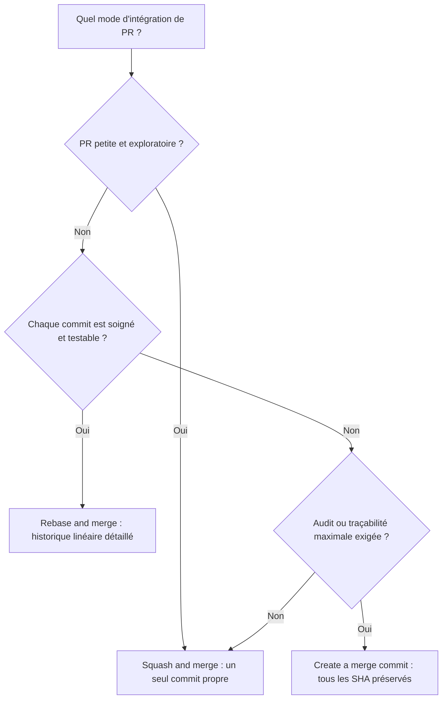
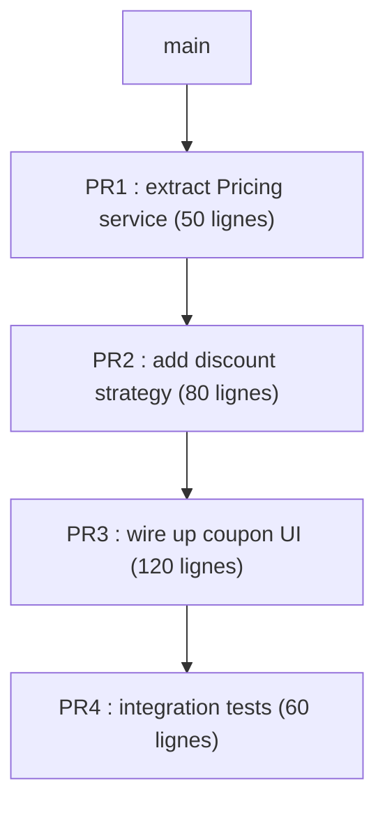

[← Branches et stratégies de workflow](03-branches-et-strategies-de-workflow.md) · [↑ Sommaire](../README.md#table-des-matières) · [Versions et signatures →](05-versions-et-signatures.md)

# 4. Intégration : fusion, conflits et revue par couches

## Gestion des conflits

> **Que veut dire « three-way merge » ?** *Three-way merge* veut dire « fusion à trois points ». Quand deux branches ont évolué chacune de leur côté, Git regarde trois versions du fichier : leur ancêtre commun (le point de départ), la version A et la version B. En comparant chaque version au départ, il devine quoi garder. Si les deux côtés ont modifié exactement la même ligne, il ne peut pas deviner, et c'est un *conflit*. L'image : deux personnes corrigent la même phrase d'un brouillon partagé ; tant qu'elles touchent des phrases différentes, on combine sans problème, mais si elles réécrivent la même phrase différemment, il faut trancher à la main.

Un conflit survient donc quand deux commits modifient la même portion d'un fichier sans qu'une fusion automatique soit possible. Git ne décide pas à votre place : il marque les zones concernées et attend que vous choisissiez.

### Anatomie d'un conflit

```text
<<<<<<< HEAD
const TVA = 0.20;
=======
const TVA = 0.21;
>>>>>>> feat/tva-belge
```

`HEAD` est votre version courante, l'autre est celle de la branche entrante. La résolution consiste à choisir, fusionner ou réécrire, puis supprimer les marqueurs.

### Résolution typique

```bash
git switch ma-branche
git fetch origin
git merge origin/main
# ... éditer les fichiers en conflit ...
git add <fichiers résolus>
git commit               # message pré-rempli par Git
```

### Outils utiles pendant un conflit

```bash
git status                        # liste les fichiers en conflit
git diff                          # vue combinée des deux versions
git diff --ours <fichier>         # ce que mon côté apporte
git diff --theirs <fichier>       # ce que l'autre côté apporte
git checkout --ours <fichier>     # garder ma version (rare, à confirmer)
git checkout --theirs <fichier>   # garder leur version
git merge --abort                 # tout annuler et revenir à l'état initial
```

Pour les conflits réguliers, activer `rerere` (« reuse recorded resolution ») :

```bash
git config --global rerere.enabled true
```

Git mémorise alors la résolution et la rejoue automatiquement si le même conflit se présente à nouveau (typique d'une branche feature longue qu'on rebase plusieurs fois).

### Bonnes pratiques

| Règle | Pourquoi |
|-------|----------|
| Synchroniser tôt et souvent (`git pull --rebase`) | Plus la branche dérive, plus le conflit est large. |
| Conflits par petits paquets | Trois conflits triviaux valent mieux qu'un conflit géant. |
| Demander à l'auteur de la modification entrante en cas de doute | Le but d'un conflit n'est pas de gagner, c'est de produire la bonne intention. |
| Tester immédiatement après résolution | Un fichier qui compile peut quand même être logiquement faux. |
| Activer `rerere` sur les longues branches | Évite de re-résoudre dix fois le même conflit. |

[Retour en haut de page](#table-des-matières)

## Rebase, merge ou squash : trois stratégies de fusion

> **Que veut dire « merge » (fusion) ?** Un *merge* crée un commit spécial à deux parents qui réunit deux branches ayant divergé. C'est comme nouer ensemble deux fils qui s'étaient séparés : le nœud (le commit de fusion) garde la trace des deux chemins.

> **Que veut dire « rebase » ?** Un *rebase* (« rebasage ») réécrit votre branche : Git met vos commits de côté, déplace le point de départ de la branche au sommet d'une autre, puis rejoue vos commits un par un par-dessus. Comme les commits sont recréés, ils reçoivent de nouvelles empreintes SHA. L'image : recopier vos notes au propre à partir d'une nouvelle page de référence, plutôt que de coller un nœud entre deux versions.

> **Que veut dire « fast-forward » ?** Un *fast-forward* (« avance rapide ») arrive quand la branche d'arrivée n'a pas bougé depuis que vous l'avez quittée : Git n'a rien à réconcilier, il fait juste glisser le marque-page en avant, sans créer de commit de fusion. Comme avancer la lecture d'une vidéo sans rien monter.

> **Que veut dire « squash merge » ?** Un *squash merge* (« fusion par écrasement ») fond tous les commits d'une branche en un seul commit propre posé sur la branche d'arrivée. C'est résumer dix brouillons successifs en une seule version finale avant de la classer.

Ces opérations intègrent toutes les commits d'une branche dans une autre, mais elles ne produisent pas le même historique.

### Visualisation

État de départ, la branche `feat/x` a divergé de `main` :

```text
A---B---C  main
     \
      D---E---F  feat/x
```

Après `git merge feat/x` sur `main` (les deux branches ont divergé, three-way merge) :

```text
A---B---C-------M  main
     \         /
      D---E---F  feat/x
```

`M` est un commit de fusion à deux parents (`C` et `F`). L'historique conserve la trace exacte du parallélisme.

Après `git rebase main` (depuis `feat/x`) puis `git merge --ff-only feat/x` sur `main` :

```text
A---B---C---D'---E'---F'  main
```

Les commits `D`, `E`, `F` ont été rejoués au sommet de `C` et portent désormais de nouveaux SHA (`D'`, `E'`, `F'`). L'historique est linéaire ; il ne reflète plus le parallélisme réel, mais il est plus simple à parcourir.

### Comparatif

| Aspect | `git merge` | `git rebase` |
|--------|-------------|--------------|
| Historique | Préserve la topologie ; un commit de fusion unit les deux branches. | Linéaire ; les commits de la branche source sont rejoués au sommet de la cible. |
| Identifiants des commits | Inchangés. | Nouveaux SHA (les commits sont réécrits). |
| Lisibilité | Vrai au plus près de ce qui s'est passé. | Plus simple à parcourir avec `git log --oneline`. |
| Conflits | Une seule passe de résolution. | Une passe par commit rejoué (mais souvent plus petits). |
| Risque | Aucun. | À ne **jamais** utiliser sur des commits déjà partagés (force-push requis ensuite). |

### Règle d'or

> Rebasez localement avant de pousser ; mergez après.

Concrètement : on rebase une branche feature sur `main` pour la garder propre, puis on fusionne via une Pull Request (souvent en *squash merge*).

### Pourquoi « ne jamais rebaser un commit publié »

Si vos collègues ont fondé du travail sur les anciens commits `D`, `E`, `F` et que vous publiez `D'`, `E'`, `F'`, leur historique local référencera des commits qui ont disparu côté distant. Au prochain pull, Git ne saura pas réconcilier les deux historiques et créera une fusion involontaire, ou pire, écrasera leurs commits si quelqu'un fait `git push --force`. Sur une branche partagée, **toujours** préférer `merge`.

### Exemple complet

```bash
# Mettre à jour ma branche feature avec les derniers commits de main
git switch feat/1234
git fetch origin
git rebase origin/main
# (résolution éventuelle des conflits, puis git rebase --continue)
git push --force-with-lease   # plus sûr que --force
```

`--force-with-lease` refuse le push si quelqu'un d'autre a publié sur la branche entre-temps : c'est le filet de sécurité minimum face à `--force`.

### Quand préférer le merge

- Branche partagée entre plusieurs développeurs (réécrire ferait disparaître leurs commits).
- Préservation explicite de l'historique pour audit (réglementaire, sécurité).
- Branches `release/*` ou `hotfix/*` que l'on veut tracer comme telles.
- Intégration finale d'une PR dans `main` quand la politique d'équipe est « merge commits seulement ».

### Trois modes d'intégration de PR : squash, rebase, merge commit

GitHub, GitLab et Bitbucket exposent trois façons d'intégrer une PR :

| Mode | Effet sur `main` | Préserve les SHA d'origine ? | Commits intermédiaires conservés ? |
|------|------------------|------------------------------|-------------------------------------|
| **Squash and merge** | Un seul commit ajouté, message de la PR. | Non (nouveau commit unique). | Non (les commits de la branche disparaissent de `main`). |
| **Rebase and merge** | Les commits sont rejoués linéairement au sommet. | Non (nouveaux SHA). | Oui (un par un). |
| **Create a merge commit** | Un commit de fusion à deux parents. | Oui (les commits originaux sont préservés). | Oui. |

#### Squash and merge

Mode souvent activé par défaut sur GitHub, populaire dans les équipes qui valorisent un `main` linéaire et lisible.

Avantages :

- Un commit = une fonctionnalité, simple à `revert` ou `cherry-pick`.
- Le bruit des commits exploratoires (« WIP », « fix typo », « ça compile enfin ») ne pollue pas `main`.
- Le message du commit final reprend le titre et la description de la PR (renvoi vers la discussion complète).
- `git log --oneline` sur `main` se lit comme un changelog naturel.

Inconvénients :

- **Perte du contexte intermédiaire** : si la PR contient huit commits soigneusement structurés (1. extract function, 2. rename, 3. add test, 4. refactor, 5. add feature…), tout cela est aplati. `git bisect` perd en granularité ; `git blame` montre une seule date au lieu de la progression réelle.
- Les attributions multiples (co-authoring) sont parfois mal gérées si on oublie d'ajouter les `Co-authored-by:` dans le message squashé.
- Pour un gros refactor pédagogique, l'intention de la séquence est perdue.
- L'auteur peut être tenté de pousser des commits désordonnés en se disant « de toute façon ça va être squashé », ce qui appauvrit la qualité de revue intermédiaire.

#### Rebase and merge

Préserve les commits intermédiaires en les rejouant un par un sur `main`. Convient bien aux PR dont chaque commit est *intentionnel* et passe les tests indépendamment.

Avantages :

- Historique linéaire et détaillé.
- `git bisect` reste fin (chaque commit est testable).
- Les revues de PR par couche de commits sont préservées dans `main`.

Inconvénients :

- Les SHA changent (par rapport aux commits poussés sur la branche feature) : les liens externes (Slack, Jira, autre PR) deviennent obsolètes.
- Si un commit intermédiaire ne compile pas, `bisect` peut tomber dessus et donner un résultat trompeur.
- Discipline requise : un commit « WIP » au milieu d'une suite saine pollue `main`.

#### Create a merge commit

Mode historique. Préserve la topologie réelle (la PR apparaît comme une « bulle » dans l'historique) et tous les SHA d'origine.

Avantages :

- Trace exacte du parallélisme des branches.
- Audit : on voit immédiatement « ce commit fait partie de la PR #482 ».
- Aucune réécriture, donc pas de mauvaise surprise sur les SHA.

Inconvénients :

- Historique en treillis difficile à lire dans `git log --oneline`.
- Génère des commits de fusion superflus si les développeurs mergent souvent `main` dans leur branche en cours de route.
- Mauvaise expérience si la branche contient 47 commits de WIP.

#### Recommandation pratique



| Type de PR | Mode recommandé |
|------------|-----------------|
| Petite PR (< 200 lignes), peu de commits, exploratoire | **Squash and merge**. |
| PR pédagogique ou refactor en plusieurs étapes propres | **Rebase and merge**. |
| Branche partagée entre plusieurs développeurs (rare en PR, mais arrive) | **Create a merge commit**. |
| Politique d'équipe imposant un historique linéaire strict | Squash ou rebase (interdire le merge commit). |
| Audit réglementaire (finance, santé) exigeant la traçabilité maximale | Merge commit (préserve tous les SHA). |

Beaucoup d'équipes choisissent **squash par défaut** mais permettent **rebase** en option pour les PR dont chaque commit a été soigné. Le pire choix est *ne pas en parler* : laisser chaque développeur cliquer un bouton différent produit un historique incohérent.

[Retour en haut de page](#table-des-matières)

## Stacked PRs : la revue par couches

> **Que veut dire « stacked PRs » ?** *Stacked PRs* veut dire « PR empilées ». Au lieu d'une seule énorme demande de fusion difficile à relire, on découpe le travail en plusieurs petites PR posées l'une sur l'autre, chacune construite à partir de la précédente. C'est comme servir un repas en plusieurs petits plats à goûter un par un, plutôt qu'un plat unique trop copieux que personne n'a le courage d'attaquer.



Les *stacked PRs* sont devenues populaires dans les équipes qui veulent des PR petites tout en livrant des fonctionnalités cohérentes. L'approche est popularisée par les outils [Graphite](https://graphite.dev/), [Sapling](https://sapling-scm.com/) (Meta), [Stacked](https://github.com/stacked-pulls), [git-spice](https://abhinav.github.io/git-spice/) et le système interne de Phabricator.

### Le problème que ça résout

Une « grosse » PR de 2 000 lignes pose plusieurs problèmes :

- La revue est superficielle : au-delà de 400 lignes, la qualité de revue chute drastiquement (étude classique de SmartBear, 2011).
- Le revieweur procrastine : « je regarde demain quand j'aurai du temps », et la PR pourrit.
- Un seul commentaire bloquant fait recommencer la moitié du travail.
- Les conflits avec `main` deviennent quasi inévitables.

À l'inverse, une PR de 50 lignes se revue en cinq minutes. Mais une fonctionnalité de 2 000 lignes ne se découpe pas en 40 PR indépendantes : il y a des dépendances. D'où la *pile*.

### Anatomie d'une pile

```text
main
 │
 ├── PR1: feat(panier): extract Pricing service           (50 lignes)
 │    │
 │    ├── PR2: feat(panier): add discount strategy        (80 lignes, basée sur PR1)
 │    │    │
 │    │    ├── PR3: feat(panier): wire up coupon UI       (120 lignes, basée sur PR2)
 │    │    │    │
 │    │    │    └── PR4: feat(panier): integration tests  (60 lignes, basée sur PR3)
```

Chaque PR est :

- Petite (< 150 lignes idéalement).
- Auto-cohérente (compile, passe les tests).
- Revuable indépendamment.
- Mergée dans l'ordre : PR1 d'abord, puis PR2 rebase automatiquement sur le nouveau `main`, et ainsi de suite.

### Pourquoi c'est dur en Git « nu »

Git seul ne sait pas suivre une pile : si vous modifiez la PR1 (suite à un commentaire de revue), il faut manuellement rebaser PR2, PR3 et PR4 dans l'ordre, puis force-pusher chacune. Une seule erreur et toute la pile s'effondre.

```bash
# Manuel, pénible :
git switch pr1
# corrections
git push --force-with-lease

git switch pr2
git rebase pr1
git push --force-with-lease

git switch pr3
git rebase pr2
git push --force-with-lease
# etc.
```

### Outils dédiés

| Outil | Particularité |
|-------|---------------|
| [Graphite](https://graphite.dev/) | CLI + interface web sur GitHub. `gt sync` rebase toute la pile en une commande. Très adopté en startup US. |
| [Sapling](https://sapling-scm.com/) | Fork de Mercurial par Meta, compatible avec Git côté serveur. Modèle de stacked diffs natif. |
| [git-spice](https://abhinav.github.io/git-spice/) | Outil CLI open source, plus léger, sans serveur. |
| [git-branchless](https://github.com/arxanas/git-branchless) | Suite d'outils pour piles (`git move`, `git restack`). |
| [ghstack](https://github.com/ezyang/ghstack) | Utilisé par PyTorch / Meta, traduit une pile locale en plusieurs PR GitHub. |

### Workflow type avec Graphite

```bash
# Créer la base de la pile
gt create -m "feat(panier): extract Pricing service"

# Ajouter une couche
gt create -m "feat(panier): add discount strategy"

# Encore une
gt create -m "feat(panier): wire up coupon UI"

# Synchroniser tout : rebase, push, mise à jour des PR
gt submit
```

Si le revieweur demande un changement sur la base, on l'applique localement, puis `gt sync` réordonne et republie toute la pile en une commande.

### Limites et critiques

- Surcoût d'apprentissage pour l'équipe (un nouvel outil à comprendre).
- Quatre PR à revoir au lieu d'une : le revieweur doit comprendre le contexte global avant de plonger dans chaque couche.
- Risque de fragmentation excessive : « atomiser » au point de perdre la cohérence.
- Mauvaise expérience si l'équipe ne pratique pas, parce qu'un seul collègue qui ignore la pile peut merger PR2 avant PR1 et tout casser.

À adopter quand la taille des PR devient un goulet d'étranglement systémique. Pour une équipe de 3-5 personnes avec des PR déjà sous 300 lignes, c'est souvent superflu.

[Retour en haut de page](#table-des-matières)

---

[← Branches et stratégies de workflow](03-branches-et-strategies-de-workflow.md) · [↑ Sommaire](../README.md#table-des-matières) · [Versions et signatures →](05-versions-et-signatures.md)
